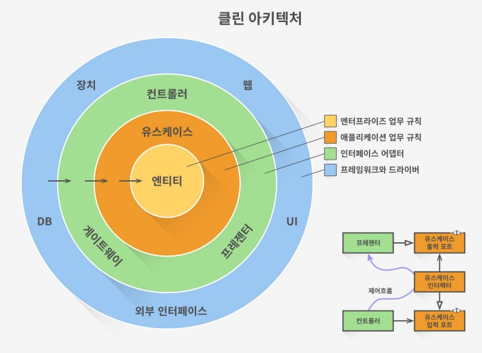

# Architecture
- [Architecture 란?](#architecture-란)
- [아키텍처 패턴](#아키텍처-패턴)
- [MVVM Architecture](#mvvm-architecture)
- [MVP Architecture](#mvp-architecture)
- [MVC Architecture](#mvc-architecture)
- [MVI Architecture](#mvi-architecture)
- [Clean Architecture](#clean-architecture)
- [모바일 클린 아키텍처](#모바일-클린-아키텍처)
- [Clean Code](#clean-code)

---

## [Architecture 란?](https://blog.mindorks.com/mvc-mvp-mvvm-architecture-in-android)
> 몇 가지 규칙을 사용하여 조직화된 방식으로 애플리케이션을 구축하고 적절한 기능을 설명하고 적절한 프로토콜로 구현하는 경우 이를 아키텍처라고 합니다.

### 아키텍처의 역할
> 아키텍처를 사용하지 않고 비조직적인 방식으로 class/activity/fragment 에 코드를 작성하는 생기는 문제
- 코드 라인의 수가 증가하여 이해하기가 복잡해집니다.
- 가독성을 낮추고 버그 수를 늘립니다. 따라서 테스트가 어렵고 제품의 품질이 저하됩니다.

 

따라서 `견고성`, `확장성`, `버그 방지`, `가독성 향상`, `수정 및 생산성 향상`, `고품질 앱 제공`을 위한 명확한 데이터 흐름을 제공합니다. 팀에서 작업하기에 적합한 적절한 아키텍처를 사용해야 합니다.

### Android에서 좋은 아키텍처를 위한 몇 가지 원칙
- Separation of concern: 구성 요소는 필요한 작업을 수행해야 합니다.
- No Hard dependency: 모든 구성 요소가 제한된 수의 종속성에서 작동해야 하는 경우 수정되어야 합니다. 모든 종속성은 외부에서 제공되어야 합니다. 의존성 주입을 사용하십시오.
- Manage lifecycle and data persistence: Architecture Component를 통해 달성할 수 있습니다. 

---

## 아키텍처 패턴
> 소프트웨어 아키텍처 디자인 패턴은 조직화된 프로그래밍을 촉진합니다. 테스트하기 쉽고 낮은 비용으로 유지 보수를 제공하는 기능을 분리합니다. MVC, MVP, MVVM 은 인기 있는 아키텍처 패턴입니다.

---

## [MVVM Architecture](https://blog.mindorks.com/mvvm-architecture-android-tutorial-for-beginners-step-by-step-guide)
> MVVM 아키텍처는 각 구성 요소 간의 긴밀한 결합을 제거하는 Model-View-ViewModel 아키텍처 입니다. 이 아키텍처에서 자식은 부모에 대한 직접적인 참조가 없으며 관찰 가능 항목에 의한 참조만 있습니다.

 

 

### Model
- Android 애플리케이션의 데이터 및 비즈니스 로직을 나타낸다.
- 비즈니스 로직(로컬 및 원격 데이터 소스, 모델 클래스, 리포지토리)으로 구성

### View
- UI Code(Activity, Fragment), XML 로 구성되어 있다.
- 사용자 작업을 ViewModel로 보내지만 응답을 직접 받지는 않습니다.
- 응답을 얻으려면 ViewModel이 노출하는 옵저버블을 구독해야 합니다.
- DataBinding 으로 처리

### ViewModel
- View와 Model(비즈니스 로직) 사이의 다리 역할을 합니다.
- View에 대한 직접적인 참조가 없기 때문에 View에서 사용하는 것을 관여하지 않고 기본적으로 ViewModel은 상호 작용하는 뷰를 인식하지 않아야 합니다.
- Model과 상호 작용하고 View에서 관찰할 수 있는 Observable을 노출합니다.

### 장점
- 보기와 보기 모델 간의 긴밀한 결합 없음
- 보기와 모델 사이에 인터페이스가 없습니다. 
- 단위 테스트가 쉽고 코드는 이벤트 기반입니다.

### 단점
- 각 UI 구성 요소에 대해 관찰 가능 항목을 만들어야 합니다. 
- 코드 크기가 상당히 큽니다.

### 참고
- [Android MVVM Sample](https://github.com/vandanasri/MVVM-Sample-Android)
---

## [MVP Architecture](https://mindorks.com/course/android-mvp-introduction/public/chapter/id/5/page/id/18)
    

> 코드 재사용성과 테스트 가능성을 제공하는 아키텍처입니다. 이 아키텍처를 따르면 향후 코드를 쉽게 업데이트할 수 있고 팀 내에서 작업 하려면 코드 가독성을 위해 모든 아키텍처를 따라야 합니다.

### Model
- 애플리케이션의 데이터 부분을 처리합니다. 
- 뷰와 직접 상호 작용하지 않습니다.
- Presenter에게 데이터를 제공하고, Presenter는 View에 데이터를 전달하고 View에서 제공하는 Presenter로부터 데이터를 받습니다. 
- 모델은 뷰를 인식하지 못하고 그 반대의 경우도 마찬가지입니다.
- 모델은 다양한 부분으로 나뉘며, Presenter와 상호 작용하는 모델의 단일 부분인 DataManager가 있고, 모델의 다른 구성 요소와 추가로 상호 작용하는 데이터 관리자가 있습니다.

### View
- 레이아웃 표시를 처리합니다. 
- Presenter가 제공한 지침에 따라 데이터로 UI를 그리는 것입니다. 
- Activity, Fragment, Dialog, Custom Views 는 애플리케이션의 View 부분입니다.
- 각각의 뷰에는 Presenter 가 있습니다.
- View의 Base는 MvpView와 Activity의 두 부분으로 구성되며, 그 중 MvpView는 인터페이스이고 Activity는 MvpView를 구현하는 클래스입니다.
- View의 기본 부분은 사용 사례에 따라 다양한 부분으로 더 나눌 수 있습니다.

### Presenter
- 서로 직접 상호 작용하지 않으므로 모델과 View 사이를 연결 합니다.
- 모든 데이터는 이 Presenter 를 통과합니다. 
- 모델에서 데이터를 가져와 뷰를 업데이트하고 뷰에서 제공하는 데이터로 모델을 업데이트합니다.
- 프리젠터의 베이스는 또한 최소 두 부분을 가지고 있는데, 그 중 첫 번째는 인터페이스인 MvpPresenter이고 두 번째는 이 인터페이스를 구현하는 클래스인 BasePresenter입니다. 
- 베이스 부분도 사용 사례에 따라 다양한 부분으로 나눌 수 있습니다.

### 장점
- 보기를 쉽게 바꿀 수 있도록 보기를 벙어리로 만듭니다. 
- View 및 Presenter 재사용 가능 
- 코드가 더 읽기 쉽고 유지 관리 가능합니다. 
- UI와 분리된 비즈니스 로직으로 손쉬운 테스트

### 단점
- View와 Presenter의 긴밀한 결합 
- 레이어 간의 상호 작용을 위한 엄청난 양의 인터페이스. 
- 코드 크기가 상당히 큽니다.

### 참고
- [Model-View-Presenter](https://mindorks.com/course/android-mvp-introduction/public/chapter/id/5/page/id/19)
- [Android MVP Sample](https://github.com/vandanasri/MVP-Sample-Android)

---

## [MVC Architecture](https://blog.mindorks.com/mvc-mvp-mvvm-architecture-in-android)
> 가장 일반적으로 사용되는 아키텍처입니다. MVC에서 사용되는 세 가지 구성 요소입니다.

### Model
- 비즈니스 로직 및 데이터 상태입니다. 
- 데이터를 가져오고 조작하고, 컨트롤러와 통신하고, 데이터베이스와 상호 작용하고, 때때로 보기를 업데이트합니다.

### View
- 사용자가 보는 것. 
- 사용자 인터페이스를 구성
- 컨트롤러와 통신하고 때로는 모델과 상호 작용합니다.

### Controller
- 액티비티/프래그먼트입니다. 
- View/REST 서비스에서 사용자 입력을 받고 뷰 및 모델과 통신합니다. 
- 프로세스 요청 모델에서 데이터를 가져와 뷰에 전달합니다.

### 장점
- 모델에서 비즈니스 로직을 별도로 유지합니다. 
- 비동기 기술 지원 
- 수정은 전체 모델에 영향을 미치지 않습니다. 
- 더 빠른 개발 프로세스

### 단점
- 큰 코드로 인해 컨트롤러를 관리할 수 없습니다. 
- 단위 테스트를 방해 
- 복잡성 증가

### 참고
- [Android MVC Sample](https://github.com/vandanasri/MVC-Sample-Android)

---

## [MVI Architecture](https://blog.mindorks.com/mvi-architecture-android-tutorial-for-beginners-step-by-step-guide)
> MVI는 Model-View-Intent의 약자입니다. 이 패턴은 최근 Android에 도입되었습니다. Cycle.js 프레임워크에서 영감을 받은 단방향 및 원통형 흐름의 원칙을 기반으로 작동합니다.

### Model
- 다른 패턴과 달리 MVI Model은 UI의 상태를 나타냅니다. 
- 예를 들어 UI는 데이터 로드, 로드됨, 사용자 작업이 있는 UI 변경, 오류, 사용자 현재 화면 위치 상태와 같은 다양한 상태를 가질 수 있습니다. 
- 각 상태는 모델의 객체와 유사하게 저장됩니다.

### View
- MVI의 보기는 활동 및 조각에서 구현할 수 있는 인터페이스입니다. 
- 다양한 모델 상태를 수용하고 이를 UI로 표시할 수 있는 컨테이너가 있어야 함을 의미합니다. 
- 관찰 가능한 인텐트(참고: 이것은 Android 기존 인텐트를 나타내지 않음)를 사용하여 사용자 작업에 응답합니다.

### Intent
- 이것은 이전부터 Android에서 명명한 Intent가 아니지만 사용자 작업의 결과는 Intents에 입력 값으로 전달됩니다. 
- 차례로, 뷰를 통해 로드할 수 있는 Intent에 대한 입력으로 모델을 보낼 것이라고 말할 수 있습니다.

### MVI 가 동작하는 방식
- 사용자는 Intent가 될 작업을 수행합니다. → Intent는 모델에 대한 입력인 상태입니다. → Model은 상태를 저장하고 View에 요청된 상태를 보냅니다. → View는 Model에서 상태를 로드합니다. → 사용자에게 표시합니다.
- 우리가 관찰하면 데이터는 항상 사용자로부터 흐르고 intent를 통해 사용자와 함께 끝납니다. 
- 다른 방식으로는 불가능하므로 단방향 아키텍처라고 합니다. 
- 사용자가 한 번 더 작업을 수행하면 동일한 주기가 반복되므로 순환됩니다.

### 장점
- 주로 상태에 초점을 맞추기 때문에 이 아키텍처에서는 상태를 유지하는 것이 더 이상 문제가 되지 않습니다.
- 단방향이므로 데이터 흐름을 쉽게 추적하고 예측할 수 있습니다.
- 상태 개체는 변경할 수 없으므로 스레드 안전성을 보장합니다.
- 디버그하기 쉽고 오류가 발생했을 때 개체의 상태를 알고 있습니다.
- 각 구성 요소가 자체 책임을 수행함에 따라 잘 분리됩니다.
- 각 상태에 대한 비즈니스 로직을 매핑할 수 있으므로 앱 테스트도 더 쉬울 것입니다.

### 단점
- 각 사용자 작업에 대한 상태를 유지해야 하므로 많은 상용구 코드로 이어집니다.
- 우리가 알다시피 모든 상태에 대해 많은 객체를 생성해야 합니다. 이로 인해 앱 메모리 관리에 너무 많은 비용이 듭니다.
- 구성 변경을 처리하는 동안 경고 상태를 처리하는 것이 어려울 수 있습니다. 예를 들어 인터넷이 없는 경우 스낵바를 표시하고 구성 변경 시 Intent 의 상태로 스낵바를 다시 표시합니다. 사용성 측면에서 처리해야 합니다.

---

## [Clean Architecture](https://medium.com/@justfaceit/clean-architecture%EB%8A%94-%EB%AA%A8%EB%B0%94%EC%9D%BC-%EA%B0%9C%EB%B0%9C%EC%9D%84-%EC%96%B4%EB%96%BB%EA%B2%8C-%EB%8F%84%EC%99%80%EC%A3%BC%EB%8A%94%EA%B0%80-1-%EA%B2%BD%EA%B3%84%EC%84%A0-%EA%B3%84%EC%B8%B5%EC%9D%84-%EC%A0%95%EC%9D%98%ED%95%B4%EC%A4%80%EB%8B%A4-b77496744616)

> 클린 아키텍처는 Uncle Bob이 2012년 엔터프라이즈 아키텍처에서 논의 되던 내용을 집약시킨 개념입니다. 클린 아키텍처는 두 가지 관점에서 볼 수 있습니다.

- 하나는 `아키텍처 설계의 철학과 원칙`입니다. SOLID 원칙, 단일 책임 원칙(Single Responsibility Principle)을 시작으로 한 다섯 가지 원칙 등을 중심으로 이제까지 SW 설계에서 중요하게 거론되어온 다양한 원칙들을 일목요연하게 정리하고 있습니다.

- 두번째는 과녁 그림으로 유명한 아케텍처의 청사진입니다. 이는 Hexagonal Architecture, Onion Architecture 등 당시 널리 알려진 아키텍처들의 공통된 성과물을 정리한 것입니다. 모바일부터 백엔드까지 모든 소프트웨어에 일반적으로 필요한 내용을 담고 있으며, 각 계층을 어떻게 나누고 어떤 요소로 구성할 것인가에 대한 원칙들을 알려줍니다.
가운데로 갈 수록 높은 수준, 바깥으로 갈 수록 낮은 수준의 컴포넌트로, 이에 대한 효율적인 분리로 효과적인 설계가 가능하다는 점을 설명하고 있습니다.

### 참고
- [The Clean Architecture](https://blog.coderifleman.com/2017/12/18/the-clean-architecture/)

---

## 모바일 클린 아키텍처
> 2012년 이후, 어떻게 하면 모바일 설계에서 클린 아키텍처의 도움을 받을 수 있을까에 대한 많은 논의와 시도가 있었는데, 그중 가장 중요한 영향은 경계(Boundaries)에 대한 것이었습니다. 즉 모듈의 변경이 다른 모듈에 영향을 미치지 않도록, 그리고 같은 모듈 내에서는 일관되고 응집력 있는 결합을 제공할 수 있도록 계층을 구분하는 것입니다.
그 결과, 원래 네 개인 계층을 재구성해서 세 개의 계층으로 분리하는 것으로 일반화되었습니다. 아래의 그림은 모바일 앱에서 전체적으로 받아들여지는 모바일 클린 아키텍처를 설명한 그림들 중, 제가 본 것들 중 가장 직관적으로 정리된 그림입니다.

### 프리젠테이션 계층 (Presentation Layer)
> 화면의 표시, 애니메이션, 사용자 입력 처리 등 UI에 관련된 모든 처리를 갖고 있습니다.

- 뷰(View): 직접적으로 플랫폼 의존적인 구현, 즉 UI 화면 표시와 사용자 입력만 담당합니다. 자기가 화면에 그리는 것이 어떤 의미가 있는지는 전혀 알지 못하고, 다만 프리젠터의 명령을 받아 화면을 어떤 이미지, 어떤 색깔로 그릴까를 결정할 뿐입니다. 데이터도 화면의 좌표와 같은 것만 가집니다.
주의할 점은 View가 꼭 Activity/Fragment(안드로이드의 경우), ViewController(iOS의 경우)를 의미하지는 않는다는 점입니다. 이에 대해서는 나중에 다시 다뤄보겠습니다.
- 프리젠터(Presenter): 단순히 MVP/VIPER에서의 프리젠터만을 의미하는 용어가 아니라 넓은 의미의 단어로 생각하시면 됩니다. 예를 들어 MVVM 구조에서라면 ViewModel과 동일한 의미로 생각할 수 있습니다. 프리젠터는 뷰와는 달리 플랫폼에 직접적으로 의존하지 않는 클래스입니다. 따라서 손쉽게 단위 테스트가 가능합니다. 그리고 프리젠터는 뷰와는 달리 화면에 그리는 것이 어떤 의미를 가지고 있는가를 알고 있습니다. 사용자 입력이 왔을 때 어떤 반응을 해야하는 지에 대한 판단도 역시 프리젠터가 합니다.

### 도메인 계층 (Domain Layer)
- 유스케이스(UseCase): 비즈니스 로직이 여기에 구현됩니다.
- 도메인 모델(Model): 앱의 실질적인 데이터가 여기에 구현됩니다. 도메인 모델은, 물론 REST API 등으로 얻어지는 외부 데이터와 같은 필요도 전혀 없습니다.
- 트랜스레이터(Translater): 데이터 계층의 엔티티 - 도메인 모델을 변환하는 mapper의 역할을 합니다.

### 데이터 계층 (Data Layer)
- 리포지토리(Repository. 관점에 따라 도메인 계층 소속일 수도 있고, 데이터 계층 소속일 수도 있음): 유스케이스가 필요로 하는 데이터 저장/수정 등의 기능을 제공하는 클래스입니다. 데이터 소스를 인터페이스 형태로 참조하기 때문에 이 클래스에서 데이터소스 객체를 갈아끼우는 형태로, 외부 API 호출/로컬 DB 접근/mock object 출력을 전환할 수 있습니다.
- 데이터 소스(Data Source): 실제 데이터의 입출력이 여기서 실행됩니다.
- 엔티티(Entity): 데이터 소스에서 사용되는 데이터를 정의한 모델로, 맨 위의 과녁 그림에서의 엔티티와는 다른 개념입니다. REST API의 요청/응답을 위한 JSON, 로컬 DB에 저장하기 위한 테이블이 대표적입니다.

### 도메인 계층의 유스케이스와 프리젠테이션 계층의 프리젠터는 어떻게 구별하나?
- 많은 경우, 유스케이스의 비즈니스 로직과 프리젠터의 로직은 명확히 구별이 되지만, 가끔은 매우 헷갈리는 경우가 있습니다.
- 이럴 경우, 가장 도움이 되는 질문은, “개발팀 외부의 사업 부서의 사람도 알고 있어야 하는 로직인가?” 여부라고 생각합니다. 비즈니스 로직은 문자 그대로 앱의 사용자 상호작용이 아닌 업무 요구사항을 담고 있는 것이기 때문입니다.
- 다른 케이스로, 앱의 특성상 각 프리텐터에서 자주 사용되는 공통의 로직이 꽤 발생하는 경우가 있습니다. 이 경우, 엄밀히 얘기하면 도메인 로직이라고 할 수는 없지만, ViewUseCase 형태의 클래스로 분리해서 프리젠테이션 계층에 추가하는 것은 좋은 방법이라고 생각합니다.

### 그렇게 계층을 나누면 뭐가 좋은가?
- 이렇게 계층을 분리함으로 인해 얻을 수 있는 가장 큰 이점은, 상당히 분량이 많은 앱이더라도 소스코드 전반을 쉽게 장악할 수 있다는 점입니다.
- 복잡한 수정 사항이 생겼을 때라도, 어떤 부분들을 고치면 되는지 금방 파악할 수 있습니다. 모듈 구성, 그리고 패키지/폴더 구성이 자연스럽게 각 계층별로 일목요연한 트리구조를 이루기 때문에(이 부분은 마지막 글에서 다뤄보겠습니다), 다른 개발자나 혹은 (다른 개발자나 다름없는) 몇 달 뒤의 내가 다시 코드를 들여봐도 금방 코드를 이해하고 수정할 수 있습니다. 정확히 얘기하면, 굳이 지금 수정할 필요가 없는 코드를 보지 않고도 필요한 부분만 보면 됩니다.
그리고 무엇보다 좋은 점은, 특정 계층에 대한 수정이 다른 계층에 거의 영향을 주지 않는다는 점입니다.

### 참고
- [모바일 클린 아키텍처](https://medium.com/@justfaceit/clean-architecture%EB%8A%94-%EB%AA%A8%EB%B0%94%EC%9D%BC-%EA%B0%9C%EB%B0%9C%EC%9D%84-%EC%96%B4%EB%96%BB%EA%B2%8C-%EB%8F%84%EC%99%80%EC%A3%BC%EB%8A%94%EA%B0%80-1-%EA%B2%BD%EA%B3%84%EC%84%A0-%EA%B3%84%EC%B8%B5%EC%9D%84-%EC%A0%95%EC%9D%98%ED%95%B4%EC%A4%80%EB%8B%A4-b77496744616)
---

## [Clean Code](https://blog.mindorks.com/every-programmer-should-read-this-book-6755dedec78d)

- `Writing clean code`는 스스로를 전문가라고 부르기 위해 해야 할 일입니다.  최선을 다하지 못한 것에 대한 합리적인 변명은 없습니다.
- 프로그램을 단순하게 만드는 것이 아니라 언어를 단순하게 만드는 것이다.
- `Single Responsibility Principle`: 모든 모듈 또는 클래스는 소프트웨어에서 제공하는 기능의 단일 부분에 대해 책임을 져야 하며 책임은 클래스에 의해 완전히 캡슐화되어야 한다고 명시되어 있습니다. 모든 서비스는 그 책임과 밀접하게 연계되어야 합니다.
- `Say what you mean. Mean what you say`: 함수 이름은 이 규칙을 따라야 합니다.
- `Open Closed Principle`: 객체 지향 프로그래밍에서 개방/폐쇄 원칙은 소프트웨어 엔티티(클래스, 모듈, 기능 등)가 확장을 위해 열려 있어야 하지만 수정을 위해 폐쇄되어야 한다는 것입니다.
- `Use Descriptive Names`: Ward의 원칙을 기억하십시오. 이 원칙을 달성하기 위한 전투의 절반은 한 가지 작업을 수행하는 작은 함수에 대해 좋은 이름을 선택하는 것입니다. 기능이 작고 집중될수록 설명적인 이름을 선택하기가 더 쉽습니다.
- `DRY(Don’t Repeat Yourself)`: 복제는 코드를 부풀리고 알고리즘을 변경해야 할 때 4배 수정이 필요하기 때문에 문제가 됩니다. 그것은 또한 누락의 오류에 대한 4배의 기회입니다. 복제는 소프트웨어의 모든 악의 근원일 수 있습니다. 이를 통제하거나 제거할 목적으로 많은 원칙과 관행이 만들어졌습니다.
- `Writing software is like any other kind of writing`: 논문이나 기사를 쓸 때 먼저 생각을 정리한 다음 잘 읽힐 때까지 마사지합니다. 첫 번째 초안은 서툴고 무질서할 수 있으므로 원하는 대로 읽을 때까지 편집하고 재구성하고 수정합니다.
- `Use Exceptions Rather Than Return Codes`: Return-Code 접근 방식의 문제는 호출자를 복잡하게 만든다는 것입니다. 호출자는 호출 직후 오류를 확인해야 합니다. 불행히도 잊기 쉽습니다. 이러한 이유로 오류가 발생할 때 예외를 throw하는 것이 좋습니다. 호출 코드가 더 깨끗합니다. 논리는 오류 처리에 의해 가려지지 않습니다.
- `Always Provide Context with Exceptions`: 발생하는 각 예외는 오류의 원인과 위치를 결정하기에 충분한 컨텍스트를 제공해야 합니다. Java에서는 모든 예외에서 스택 추적을 얻을 수 있습니다. 그러나 스택 추적은 실패한 작업의 의도를 알려줄 수 없습니다. 유익한 오류 메시지를 작성하고 예외와 함께 전달하십시오. 실패한 작업과 실패 유형을 언급합니다. 애플리케이션에 로그인하는 경우 catch에 오류를 기록할 수 있도록 충분한 정보를 전달하십시오.
 