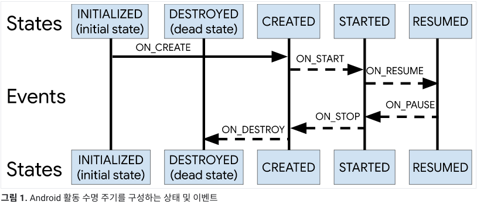

# Core Android

- [Asynchronous IO](#asynchronous-io)
- [ViewBinding 과 DataBinding 차이점](#viewbinding-과-databinding-차이점)
- [ViewModel 과 SharedViewModel 의 차이와 구현 방법](#viewmodel-과-sharedviewmodel-의-차이와-구현-방법)
- [Android Jetpack이란](#android-jetpack이란)
- [Android 애플리케이션의 성능을 최적화하기 위한 전략](#android-애플리케이션의-성능을-최적화하기-위한-전략)
- [안드로이드에서 비동기 처리가 필요한 이유에 및 Rxjava, Coroutine 의 특징과 차이점, 장단점](#안드로이드에서-비동기-처리가-필요한-이유에-및-rxjava-coroutine-의-특징과-차이점-장단점)
- [안드로이드에서 의존성 주입이란?](#안드로이드에서-의존성-주입이란)
- [Android에서 Parcelable 인터페이스의 목적은 무엇이며 Serializable 사용성 차이](#android에서-parcelable-인터페이스의-목적은-무엇이며-serializable-사용성-차이)
- [Android의 콘텐츠 제공자는 무엇이며 주요 목적](#android의-콘텐츠-제공자는-무엇이며-주요-목적은-무엇인가요-콘텐츠-제공자가-유용할-수-있는-예시-시나리오를-제공)
- [안드로이드 어플리케이션 컴포넌트](#안드로이드-어플리케이션-컴포넌트)
- [매니페스트 파일](#매니페스트-파일)
- [안드로이드 어플리케이션의 프로젝트 구조](#안드로이드-어플리케이션의-프로젝트-구조)
- [Android Context](#android-context)
- [What is requireActivity?](#what-is-requireactivity)
- [Pro-guard 의 용도는?](#pro-guard-의-용도는)
- [Pending Intent 를 사용해서 액티비티를 시작하는 방법은?](#pending-intent-를-사용해서-액티비티를-시작하는-방법은)
- [안드로이드 앱 프로세스 분리하기](#안드로이드-앱-프로세스-분리하기)
- [서비스와 액티비티 간에 활용할 수 있는 IPC](#서비스와-액티비티-간에-활용할-수-있는-ipc)
- [Navigation Component](#navigation-component)
- [Lifecycle](#lifecycle)
- [LifecycleOwner](#lifecycleowner)
- [LiveData vs ObservableField](#livedata-vs-observablefield)

---

## Asynchronous IO

비동기 입/출력(IO)은 메인 스레드의 실행을 차단하지 않고 IO 작업을 수행할 수 있는 프로그래밍 모델입니다.

- 파일에서 데이터를 읽거나 네트워크 요청을 하는 것과 같은 IO 작업은 완료하는 데 오랜 시간이 걸릴 수 있으며 작업이 완료되기를 기다리는 동안 기본 스레드를 차단하면 애플리케이션이 응답하지 않을 수 있습니다.

- 비동기 IO를 사용하면 IO 작업이 별도의 스레드 또는 백그라운드에서 실행되므로 기본 스레드가 IO 작업이 완료될 때까지 기다리지 않고 다른 작업을 계속 실행할 수 있습니다. IO 작업이 완료되면 결과는 콜백 함수 또는 Promise을 통해 기본 스레드로 다시 전달됩니다.

- Android에서 비동기 IO는 일반적으로 네트워크 요청 및 데이터베이스 액세스에 사용됩니다. 이러한 작업을 완료하는 데 시간이 오래 걸리고 기본 스레드를 차단해서는 안 되기 때문입니다. 

- 비동기 IO는 스레드, 핸들러, 코루틴, RxJava와 같은 반응형 프로그래밍 라이브러리를 비롯한 여러 접근 방식을 사용하여 구현할 수 있습니다.

---

## ViewBinding 과 DataBinding 차이점

뷰 바인딩과 데이터 바인딩은 안드로이드에서 뷰를 데이터에 바인딩하는 두 가지 기술입니다.

### 뷰 바인딩

뷰 바인딩은 데이터에 뷰를 바인딩하기 위한 경량 솔루션으로, 안드로이드 스튜디오 3.6에 도입되었습니다. 각 레이아웃 파일에 대한 바인딩 클래스를 생성하며, 여기에는 해당 레이아웃의 모든 뷰에 대한 참조가 포함됩니다. 바인딩 클래스를 사용하면 findViewById()를 호출할 필요 없이 뷰에 직접 액세스할 수 있습니다. 이렇게 하면 상용구 코드가 줄어들고 널 포인터 예외를 방지하는 데 도움이 될 수 있습니다. 뷰 바인딩은 뷰를 데이터에 바인딩하는 간단하고 효율적인 방법이지만 데이터 바인딩의 고급 기능을 제공하지는 않습니다.

### 데이터 바인딩

데이터 바인딩은 데이터에 뷰를 바인딩하는 더 강력한 솔루션으로, 안드로이드 스튜디오 1.3에 도입되었습니다. 이 솔루션을 사용하면 데이터를 변경하면 뷰가 자동으로 업데이트되고 뷰를 변경하면 데이터가 자동으로 업데이트되는 양방향 데이터 바인딩이 가능합니다. DataBinding은 특수 구문이 포함된 XML 레이아웃 파일을 사용하여 뷰와 데이터 간의 바인딩을 정의합니다. 각 레이아웃 파일에 대해 바인딩 클래스를 생성하며, 여기에는 바인딩을 수행하는 코드가 포함되어 있습니다. DataBinding은 바인딩 표현식, 사용자 지정 바인딩 어댑터 및 관찰 가능한 데이터 개체와 같은 고급 기능을 제공합니다.

**ViewBinding**과 **DataBinding**의 주요 차이점은 다음과 같습니다:

1. 뷰 바인딩은 더 간단하고 가벼운 솔루션인 반면, 데이터 바인딩은 더 강력하고 복잡한 솔루션입니다.
2. 뷰 바인딩은 각 레이아웃 파일에 대한 바인딩 클래스를 생성하는 반면, 데이터 바인딩은 모든 레이아웃 파일에 대해 단일 바인딩 클래스를 생성합니다.
3. 뷰 바인딩은 뷰에 직접 액세스할 수 있는 반면, 데이터 바인딩은 바인딩 표현식을 사용하여 뷰와 데이터 간의 바인딩을 정의합니다.
4. 뷰 바인딩은 양방향 데이터 바인딩을 지원하지 않지만 데이터 바인딩은 지원합니다.

### 요약

- 뷰 바인딩은 뷰를 데이터에 바인딩하는 간단하고 효율적인 솔루션인 반면, 데이터 바인딩은 고급 기능을 갖춘 보다 강력하고 복잡한 솔루션입니다.
- 개발자는 애플리케이션의 복잡성과 원하는 기능 수준에 따라 필요에 가장 적합한 솔루션을 선택해야 합니다

---

## ViewModel 과 SharedViewModel 의 차이와 구현 방법

A: ViewModel과 SharedViewModel은 안드로이드 개발에서 일반적으로 사용되는 두 가지 컴포넌트로, 비슷한 용도로 사용되지만 몇 가지 주요 차이점이 있습니다.

- ViewModel은 UI 관련 데이터를 저장하고 관리하는 데 사용되는 안드로이드 아키텍처 컴포넌트 라이브러리의 컴포넌트입니다. ViewModel은 화면 회전과 같은 구성 변경에도 견딜 수 있도록 설계되었으며 UI 로직과 비즈니스 로직을 깔끔하게 분리할 수 있습니다. 뷰모델은 단일 Activity 또는 Fragment으로 범위가 지정되며 해당 Activity 또는 Fragment이 소멸될 때 소멸됩니다.

- SharedViewModel은 동일한 Activity 내의 여러 Fragment 간에 데이터를 공유할 수 있는 ViewModel의 변형입니다. SharedViewModel은 두 개 이상의 Fragment이 서로 통신해야 하지만 서로 직접 관련이 없는 경우에 유용합니다. SharedViewModel은 상위 Activity으로 범위가 지정되며 Activity이 소멸될 때 소멸됩니다.

- ViewModel과 SharedViewModel의 주요 차이점은 범위입니다. ViewModel은 단일 Activity 또는 Fragment으로 범위가 지정되는 반면 SharedViewModel은 상위 Activity으로 범위가 지정됩니다. 즉, ViewModel은 연결된 Fragment 또는 Activity에서만 액세스할 수 있는 반면, SharedViewModel은 동일한 Activity 내의 모든 Fragment에서 액세스할 수 있습니다.

Fragment에서 ViewModel 또는 SharedViewModel을 사용하려면 ViewModelProvider를 사용하여 ViewModel의 인스턴스를 만들 수 있습니다:

```kotlin
val viewModel = ViewModelProvider(this).get(MyViewModel::class.java)
val sharedViewModel = ViewModelProvider(requireActivity()).get(MySharedViewModel::class.java)
```

- ViewModelProvider는 Activity 또는 Fragment에 대한 참조를 가져와서 뷰모델의 인스턴스를 반환합니다. SharedViewModel의 경우 Fragment 대신 Activity에 대한 참조를 전달해야 합니다.
- 전반적으로 ViewModel과 SharedViewModel은 모두 안드로이드 앱에서 UI 관련 데이터를 관리하는 데 유용한 컴포넌트이며, 두 컴포넌트 중 어떤 것을 선택할지는 Fragment 간에 공유해야 하는 데이터의 범위에 따라 달라집니다.

---

## Android Jetpack이란

- Android Jetpack은 개발자가 고품질 Android 앱을 더 쉽고 효율적으로 빌드할 수 있도록 Google에서 제공하는 라이브러리, 도구 및 아키텍처 지침 세트입니다.
- 젯팩에는 데이터 저장, UI 디자인, 백그라운드 처리와 같은 일반적인 작업을 위한 라이브러리와 테스트, 디버깅, 프로파일링을 위한 도구가 포함되어 있습니다.
- Jetpack은 모듈식으로 유연하게 설계되어 개발자가 자신의 필요에 가장 적합한 구성 요소를 선택할 수 있습니다.

---

## Android 애플리케이션의 성능을 최적화하기 위한 전략

- 스레드, 코루틴 또는 RxJava와 같은 비동기 프로그래밍 기법을 사용하여 메인 UI 스레드를 차단하지 않기
- 이미지 로딩이나 데이터베이스 쿼리와 같은 메모리 집약적인 작업의 사용 최소화하기
- 화면 크기, 해상도, 하드웨어 구성이 다른 다양한 기기에서 앱 테스트하기
- 레이아웃 계층 구조의 수를 줄이고 가능한 한 플랫 레이아웃 사용
- 불필요한 네트워크 또는 디스크 액세스를 피하기 위해 데이터 및 리소스 캐싱
- 장기 실행 작업에 비동기 처리를 사용하여 UI 스레드 차단 방지
- 리소스가 더 이상 필요하지 않을 때 해제하여 메모리 누수 방지
- 안드로이드 스튜디오의 CPU 프로파일러 및 메모리 프로파일러와 같은 프로파일링 툴을 사용하여 성능 병목 현상을 파악합니다.

## 안드로이드에서 비동기 처리가 필요한 이유에 및 Rxjava, Coroutine 의 특징과 차이점, 장단점

- 비동기 처리는 네트워크 요청이나 데이터베이스 쿼리와 같은 장기 실행 작업으로 인해 UI 스레드가 차단되는 것을 방지하기 위해 안드로이드에서 필요합니다.
- 비동기 처리가 없으면 앱의 UI가 응답하지 않아 사용자 경험이 저하될 수 있습니다.

안드로이드에서 비동기 처리를 구현하는 데 널리 사용되는 라이브러리는 두 가지가 있습니다: RxJava와 코루틴입니다.

RxJava는 개발자가 관찰 가능 패턴을 사용하여 비동기 작업을 처리할 수 있는 반응형 프로그래밍 라이브러리입니다. 데이터 스트림을 필터링, 변환 및 결합하기 위한 연산자 세트를 제공하며, 개발자가 복잡한 비동기 연산을 읽기 쉽고 유지 관리 가능한 방식으로 구성할 수 있도록 합니다.

반면에 코루틴은 Google에서 Kotlin에 도입한 비교적 새로운 라이브러리입니다. 일시 중단 함수와 실행 및 비동기 등의 코루틴 빌더를 조합하여 비동기 작업을 처리하는 더 간단하고 간결한 방법을 제공하여 RxJava에 비해 비동기 작업을 더 쉽게 처리할 수 있습니다. 또한 확장 함수 및 람다 표현식과 같은 다른 Kotlin 기능과도 잘 통합됩니다.

다음은 RxJava와 코루틴의 몇 가지 특징, 차이점, 강점 및 약점입니다:

### RxJava의 특징

- 반응형 프로그래밍
- 데이터 스트림 필터링, 변환, 결합을 위한 연산자 지원
- 대용량 데이터 스트림 처리를 위한 역압력 지원
- 초보자에게는 학습 곡선이 가파를 수 있음

### 코루틴의 특징

- Kotlin에 내장된 코루틴 사용
- 구조화된 동시성 지원
- 간단하고 간결한 구문
- 배우기 쉽고 사용하기 쉬움
- 역압 처리 및 복잡한 스트림 처리와 같은 RxJava의 일부 고급 기능 부족
 
### RxJava의 강점

- 강력하고 유연하며 복잡한 비동기 작업을 쉽게 처리할 수 있습니다.
- 대규모 커뮤니티와 방대한 문서
- 성숙하고 실전에서 검증된 기술

### 코루틴의 강점

- 가볍고 사용하기 쉬움
- 확장 함수 및 람다 표현식 등 Kotlin의 언어 기능과 통합됨
- 구조화된 동시성으로 복잡한 연산을 더 쉽게 추론할 수 있음

### RxJava의 약점

- 가파른 학습 곡선과 복잡한 구문
- 옵저버블 및 연산자 사용으로 인한 오버헤드 발생
- 코루틴에 비해 더 많은 설정과 구성이 필요함

### 코루틴의 약점

- RxJava의 일부 고급 기능 부족
- 제한된 역압 처리 기능

**RxJava**
```kotlin
Observable.fromCallable(() -> {
    return api.getData();
})
.subscribeOn(Schedulers.io())
.observeOn(AndroidSchedulers.mainThread())
.subscribe(data -> {
    // handle data here
}, error -> {
    // handle error here
});
```

**Coroutine**
```kotlin
lifecycleScope.launch {
    try {
        withContext(Dispatchers.IO) {
            val data = api.getData()
            withContext(Dispatchers.Main) {
                // handle data here
            }
        }
    } catch (e: Exception) {
        // handle error here
    }
}
```

### 요약

- Android에서는 UI 차단을 방지하기 위해 비동기 처리가 필요하며, 비동기 작업을 처리하는 데 널리 사용되는 두 가지 라이브러리는 RxJava와 Coroutine입니다.
- RxJava는 복잡한 작업을 처리할 수 있는 강력하고 유연한 솔루션을 제공하는 반면, 코루틴은 Kotlin의 언어 기능과 잘 통합되는 더 간단하고 가벼운 대안을 제공합니다.
- 두 라이브러리 중 어떤 것을 선택할지는 궁극적으로 프로젝트의 요구 사항과 복잡성, 그리고 라이브러리에 대한 팀의 경험과 친숙도에 따라 달라집니다.

---

## 안드로이드에서 의존성 주입이란?

종속성 주입은 애플리케이션의 클래스 간 종속성을 관리하는 데 사용되는 기술입니다. 

안드로이드에서 종속성 주입은 다음과 같은 여러 가지 이유로 필요합니다:

- 상용구 코드 감소: 종속성 주입이 없으면 개발자가 클래스 간의 종속성을 수동으로 생성하고 관리해야 하므로 유지 관리가 어려운 상용구 코드가 대량으로 생성될 수 있습니다.
- 테스트 가능성 향상: 종속성 주입을 사용하면 종속성을 쉽게 모킹하거나 테스트 구현으로 대체할 수 있으므로 테스트가 더 쉬워집니다.
- 리팩토링 간소화: 종속성 주입을 사용하면 클래스 간의 종속성이 더 명확해져 필요에 따라 코드를 식별하고 리팩터링하기가 더 쉬워집니다.

Dagger와 Hilt는 안드로이드 애플리케이션에서 종속성 주입을 구현하는 데 널리 사용되는 두 가지 라이브러리입니다.

### Dagger

- Dagger는 코드 생성을 사용하여 컴파일 타임에 주입 가능한 객체를 생성하는 Google에서 개발한 의존성 주입 라이브러리입니다. 빠르고 가볍고 확장 가능하도록 설계되었으며 필드 및 생성자 주입을 모두 지원합니다.
- Dagger를 사용하려면 개발자가 어노테이션을 사용하여 클래스 간의 종속성을 정의해야 하며, 단검은 런타임에 이러한 종속성을 제공하는 코드를 생성합니다. 처음에는 설정하기가 다소 복잡할 수 있지만, 고도로 최적화되고 유지 관리가 쉬운 코드베이스를 만들 수 있습니다.

### Hilt

- Hilt는 Google에서 개발한 최신 안드로이드용 종속성 주입 라이브러리입니다.
- Dagger를 기반으로 구축되었으며, 종속성 주입 프로세스를 간소화하기 위해 사전 정의된 어노테이션 및 컴포넌트 세트를 제공합니다.
- Hilt는 필드 및 생성자 주입을 모두 지원하며 ViewModels 및 Activity과 같은 Android 전용 클래스에 대한 기본 지원을 제공합니다. 따라서 특히 종속성 주입에 대한 경험이 많지 않은 소규모 프로젝트나 팀에서 Dagger보다 쉽게 설정하고 사용할 수 있습니다.

### 요약

- 종속성 주입은 안드로이드 애플리케이션에서 클래스 간의 종속성을 관리하기 위한 중요한 기술입니다
- 의존성 주입을 구현하는 데 널리 사용되는 두 가지 라이브러리는 Dagger와 Hilt이며, Dagger는 고도로 - 최적화되고 확장 가능한 솔루션을 제공하는 반면, Hilt는 더 간단하고 사용자 친화적인 인터페이스를 제공합니다.
- 두 라이브러리 모두 대규모 Android 애플리케이션의 복잡한 종속성 관리 문제를 해결하기 위해 개발되었으며, 개발자가 보다 모듈화되고 유지 관리가 용이하며 테스트 가능한 코드를 작성하는 데 도움이 될 수 있습니다.

---

## Android에서 Parcelable 인터페이스의 목적은 무엇이며 Serializable 사용성 차이

Android의 Parcelable 인터페이스는 액티비티, 프래그먼트 또는 서비스와 같은 구성 요소 간의 효율적인 전송을 위해 자바 객체를 바이너리 형식으로 평면화할 수 있도록 직렬화하는 데 사용됩니다. Serializable 인터페이스에 대한 최적화된 대안입니다.

### Parcelable과 Serializable의 주요 차이점
1. 성능
    - `Parcelable`은 `Serializable`에 비해 더 빠르고 효율적입니다. `Parcelable`은 Android용으로 특별히 설계되었으며 바이너리 형식을 사용합니다.
    - `Serializable`은 특히 대용량 데이터 세트의 경우 더 느리고 덜 효율적일 수 있는 리플렉션 기반 메커니즘을 사용합니다.
2. 직렬화 제어
    - `Parcelable`을 사용하면 개발자가 직렬화 프로세스를 더 잘 제어할 수 있습니다. 객체를 직렬화 및 역직렬화하는 방법을 지정하려면 `writeToParcel()` 및 `createFromParcel()` 메서드를 명시적으로 구현해야 합니다.
    - `Serializable`은 전체 개체 그래프를 자동으로 직렬화합니다.
3. 호환성
    - `Parcelable`은 Android 전용이며 플랫폼 간 호환성을 지원하지 않습니다.
    - `Serializable`은 Java 표준이며 모든 Java 환경에서 사용할 수 있습니다.

### 요약

Parcelable을 구현하면 구성 요소 간에 개체를 효율적으로 전달할 수 있고 올바르게 직렬화 및 역직렬화되어 `Serializable`을 사용할 때 발생할 수 있는 호환성 또는 성능 문제를 피할 수 있습니다.

---

## Android의 콘텐츠 제공자는 무엇이며 주요 목적은 무엇인가요? 콘텐츠 제공자가 유용할 수 있는 예시 시나리오를 제공

Android의 콘텐츠 제공자는 다양한 애플리케이션이 서로 안전하게 데이터를 공유할 수 있도록 하는 Android 프레임워크의 기본 구성요소입니다. 데이터를 관리하고 다른 애플리케이션에 노출하는 구조화된 방법을 제공하여 데이터 액세스를 적용하고 데이터 작업을 위한 표준화된 인터페이스를 제공합니다.

### 콘텐츠 제공자의 주요 목적

**1. 데이터 공유:** 콘텐츠 제공자는 애플리케이션이 동일한 앱 내에서 또는 다른 앱 간에 데이터를 다른 애플리케이션과 공유할 수 있도록 합니다. 이를 통해 제어된 방식으로 애플리케이션 간의 데이터 교환 및 협업이 가능합니다.
**2. 데이터 액세스 제어:** 콘텐츠 제공자는 액세스 제어 메커니즘을 시행하여 개발자가 데이터 액세스 권한을 지정할 수 있도록 합니다. 이렇게 하면 승인된 애플리케이션만 공유 데이터에 액세스하고 수정할 수 있습니다.
**3. 데이터 지속성:** 콘텐츠 제공자는 구조화된 데이터를 영구적인 방식으로 저장하고 검색하는 데 사용할 수 있습니다. 데이터 저장을 위한 추상화 계층을 제공하여 개발자가 일관된 데이터 액세스 인터페이스를 유지하면서 기본 데이터 저장 메커니즘(예: SQLite 데이터베이스)을 선택할 수 있도록 합니다.
**4. 콘텐츠 URI 매핑:** 콘텐츠 제공자는 다양한 데이터 세트에 대한 고유 식별자 역할을 하는 콘텐츠 URI를 정의합니다. 이러한 URI는 다른 응용 프로그램에서 특정 데이터 항목에 액세스하거나 작업을 수행하는 데 사용됩니다. 다양한 유형의 데이터 또는 데이터 하위 집합을 나타내도록 콘텐츠 URI를 사용자 지정할 수 있습니다.

콘텐츠 공급자가 유용할 수 있는 예제 시나리오는 메시징 응용 프로그램에 있습니다.

- 사용자가 메시지를 교환하고 로컬에 저장할 수 있는 메시징 앱을 구축한다고 가정합니다.
- 콘텐츠 공급자를 사용하면 위젯이나 검색 응용 프로그램과 같은 다른 응용 프로그램에 메시지 데이터를 노출하여 메시지를 표시하거나 검색할 수 있습니다.
- 콘텐츠 제공자는 보안 데이터 액세스를 처리하고 인증된 애플리케이션만 메시지를 검색하거나 수정할 수 있도록 합니다.

```kotlin
class MessageProvider : ContentProvider() {
    // Content provider implementation

    override fun onCreate(): Boolean {
        // Initialize the content provider and set up data storage
        return true
    }

    override fun query(
        uri: Uri,
        projection: Array<String>?,
        selection: String?,
        selectionArgs: Array<String>?,
        sortOrder: String?
    ): Cursor? {
        // Perform a query operation on the messages data and return a Cursor
        // representing the result set
        // ...
    }

    override fun insert(uri: Uri, values: ContentValues?): Uri? {
        // Perform an insert operation to add a new message to the data
        // ...
    }

    override fun update(
        uri: Uri,
        values: ContentValues?,
        selection: String?,
        selectionArgs: Array<String>?
    ): Int {
        // Perform an update operation on the messages data
        // ...
    }

    override fun delete(uri: Uri, selection: String?, selectionArgs: Array<String>?): Int {
        // Perform a delete operation on the messages data
        // ...
    }

    override fun getType(uri: Uri): String? {
        // Return the MIME type of the data represented by the given URI
        // ...
    }
}
```

- 이 예에서 `MessageProvider` 클래스는 `ContentProvider` 기본 클래스를 확장하고 데이터 쿼리, 삽입, 업데이트, 삭제 및 MIME 유형 검색에 필요한 메서드를 재정의합니다. 이렇게 하면 다른 애플리케이션이 적절한 콘텐츠 URI를 사용하여 콘텐츠 공급자를 통해 메시징 앱의 데이터와 상호 작용할 수 있습니다.

---

## [안드로이드 어플리케이션 컴포넌트](https://developer.android.com/guide/components/fundamentals.html#Components)

### Activity
- 화면 하나를 표현하며, 사용자와 상호작용하기 위한 진입점
- 사용자가 현재 관심을 가지고 있는 사항(화면에 표시된 것)을 추적하여 액티비티를 호스팅하는 프로세스를 시스템에서 계속 실행하도록 합니다.
- 이전에 사용한 프로세스에 사용자가 다시 찾을 만한 액티비티(중단된 액티비티)가 있다는 것을 알고, 해당 프로세스를 유지하는 데 더 높은 우선순위를 부여합니다.
- 앱이 프로세스를 종료하도록 도와서 이전 상태가 복원되는 동시에 사용자가 액티비티로 돌아갈 수 있게 합니다.
- 앱이 서로 사용자 플로우를 구현하고 시스템이 이러한 플로우를 조정하기 위한 수단을 제공합니다.

### Service

- 서비스는 여러 가지 이유로 백그라운드에서 앱을 계속 실행하기 위한 다목적 진입점입니다. 
- 백그라운드에서 실행되는 구성 요소로, 오랫동안 실행되는 작업을 수행하거나 원격 프로세스를 위한 작업을 수행
- 서비스는 사용자 인터페이스를 제공하지 않습니다.
- 음악 재생은 사용자가 바로 인식할 수 있는 작업입니다. 따라서 앱은 사용자에게 이와 관련된 알림을 보내고 음악 재생을 포그라운드로 옮기라고 시스템에 지시합니다. 이 경우, 시스템은 이 서비스의 프로세스가 계속 실행되도록 많은 노력을 기울여야 합니다. 이 서비스가 사라지면 사용자가 불만을 느낄 것이기 때문입니다.
- 정기적인 백그라운드 서비스는 사용자가 실행되고 있다고 직접 인식할 수 없는 작업이므로 시스템은 좀 더 자유롭게 프로세스를 관리할 수 있습니다. 사용자와 좀 더 직접적인 관련이 있는 작업에 RAM이 필요할 경우 이 서비스를 종료할 수도 있습니다(그런 다음, 나중에 서비스를 다시 시작할 수도 있습니다).

### Broadcast Receiver

- Broadcast Receiver는 시스템이 정기적인 사용자 플로우 밖에서 이벤트를 앱에 전달하도록 지원하는 구성 요소
- 앱이 시스템 전체의 브로드캐스트 알림에 응답할 수 있게 합니다
- 예를 들어 앱이 사용자에게 예정된 이벤트에 대해 알리는 알림을 게시하기 위한 알람을 예약할 경우, 그 알람을 앱의 Broadcast Receiver에 전달하면 알람이 울릴 때까지 앱을 실행하고 있을 필요가 없습니다
- 화면이 꺼졌거나 배터리가 부족하거나 사진을 캡처했다고 알리는 브로드캐스트
- Broadcast Receiver는 사용자 인터페이스를 표시하지 않지만, 상태 표시줄 알림을 생성하여 사용자에게 브로드캐스트 이벤트가 발생했다고 알릴 수 있습니다.
- JobService를 예약하여 시작하여 JobScheduler가 포함된 이벤트를 기초로 어떤 작업을 수행하게 할 수 있습니다.

### Content Provider
- 콘텐츠 제공자는 파일 시스템, SQLite 데이터베이스, 웹상이나 앱이 액세스할 수 있는 다른 모든 영구 저장 위치에 저장 가능한 앱 데이터의 공유형 집합을 관리
- 다른 앱은 콘텐츠 제공자를 통해 해당 데이터를 쿼리하거나, 콘텐츠 제공자가 허용할 경우에는 수정도 가능
- 시스템의 경우 콘텐츠 제공자는 URI 구성표로 식별되고 이름이 지정된 데이터 항목을 게시할 목적으로 앱에 진입하기 위한 입구
- URI를 할당하더라도 앱을 계속 실행할 필요가 없으므로 URI를 소유한 앱이 종료된 후에도 URI를 유지할 수 있습니다. 시스템은 URI를 소유한 앱이 해당 URI에서 앱의 데이터를 검색할 때만 실행되도록 하면 됩니다.
- 이 URI는 중요하고 조밀한 보안 모델을 제공합니다. 예를 들어 앱은 클립보드에 있는 이미지에 URI를 할당하고 콘텐츠 제공자가 검색하도록 하여, 다른 앱이 자유롭게 이미지에 액세스하지 못하게 막을 수 있습니다. 두 번째 앱이 클립보드에서 해당 URI에 액세스하려고 시도하면 시스템에서는 임시 URI 권한을 부여하여 그 앱이 데이터에 액세스하도록 허용할 수 있습니다. 따라서 두 번째 앱에서는 URI 뒤에 있는 데이터 외에 다른 것에는 액세스할 수 없습니다.
- 콘텐츠 제공자는 앱 전용이어서 공유되지 않는 데이터를 읽고 쓰는 데도 유용합니다.
 
### 구성 요소 활성화

구성 요소 유형 네 가지 중 세 가지(액티비티, 서비스, Broadcast Receiver)는 인텐트라는 비동기식 메시지로 활성화됩니다. 인텐트는 런타임에서 각 구성 요소를 서로 바인딩합니다. 이것은 일종의 메신저라고 생각하면 됩니다. 즉 구성 요소가 어느 앱에 속하든 관계없이 다른 구성 요소로부터 작업을 요청하는 역할을 합니다.
인텐트는 Intent 객체로 생성되며, 이것이 특정 구성 요소(명시적 인텐트)를 활성화할지 아니면 구성 요소의 특정 유형(암시적 인텐트)을 활성화할지 나타내는 메시지를 정의합니다.

각 유형의 구성 요소를 활성화하는 데는 각기 별도의 메서드가 있습니다.

- 액티비티를 시작하거나 새로운 작업을 배정하려면 Intent를 startActivity() 또는 startActivityForResult()에 전달하면 됩니다(액티비티가 결과를 반환하기를 원하는 경우).
- Android 5.0(API 레벨 21) 이상에서는 JobScheduler 클래스를 사용하여 작업을 예약할 수 있습니다. 초기 Android 버전의 경우 Intent를 startService()에 전달하여 서비스를 시작할 수 있습니다(또는 진행 중인 서비스에 새로운 지침을 전달할 수 있습니다). Intent를 bindService()에 전달하여 서비스에 바인딩할 수도 있습니다.
- sendBroadcast(), sendOrderedBroadcast(), 또는 sendStickyBroadcast()와 같은 메서드에 Intent를 전달하면 브로드캐스트를 시작할 수 있습니다.
- 콘텐츠 제공자에 쿼리를 수행하려면 ContentResolver에서 query()를 호출하면 됩니다.

---

## [매니페스트 파일](https://developer.android.com/guide/components/fundamentals.html#Manifest)

모든 앱 프로젝트는 프로젝트 소스 세트의 루트에 AndroidManifest.xml 파일(정확히 이 이름)이 있어야 합니다. 매니페스트 파일은 Android 빌드 도구, Android 운영체제 및 Google Play에 앱에 관한 필수 정보를 설명합니다.

매니페스트 파일은 다른 여러 가지도 설명하지만 특히 다음과 같은 내용을 선언해야 합니다.

- 앱의 패키지 이름(일반적으로 코드의 네임스페이스와 일치). Android 빌드 도구는 프로젝트를 빌드할 때 이 이름으로 코드 엔터티의 위치를 확인합니다. 앱을 패키징할 때 빌드 도구가 이 값을 Gradle 빌드 파일의 애플리케이션 ID로 대체합니다. 이는 시스템과 Google Play에서 고유한 앱 식별자로 사용됩니다. 패키지 이름과 앱 ID에 대해 자세히 알아보세요.
- 앱의 구성 요소(모든 액티비티, 서비스, Broadcast Receiver, 콘텐츠 제공자 포함). 각 구성 요소는 Kotlin이나 Java 클래스의 이름과 같은 기본 속성을 정의해야 합니다. 또한 자신이 처리할 수 있는 기기 구성의 종류, 그리고 구성 요소가 어떻게 시작되는지 설명하는 인텐트 필터와 같은 기능을 선언할 수도 있습니다. 앱 구성 요소에 대해 자세히 알아보세요.
- 앱이 시스템 또는 다른 앱의 보호된 부분에 액세스하기 위해 필요한 권한. 이것은 다른 앱이 이 앱의 콘텐츠에 액세스하고자 하는 경우 반드시 있어야 하는 모든 권한도 선언합니다. 권한에 대해 자세히 알아보세요.
- 앱에 필요한 하드웨어 및 소프트웨어 기능으로, 이에 따라 앱을 Google Play에서 설치할 수 있는 기기의 종류가 달라집니다. 기기 호환성에 대해 자세히 알아보세요.

---

## [안드로이드 어플리케이션의 프로젝트 구조](https://developer.android.com/studio/projects)

---

## [Android Context](https://blog.mindorks.com/understanding-context-in-android-application-330913e32514)

The Context in Android is actually the context of what we are talking about and where we are currently present. This will become more clear as we go along with this.

Few important points about the context:

- It is the context of the current state of the application. (컨텍스트는 애플리케이션의 현재 상태)
- It can be used to get information regarding the activity and application. (액티비티와 애플리케이션의 정보를 가져오는데 사용)
- It can be used to get access to resources, databases, and shared preferences, and etc. (리소스에 접근하거나 데이터베이스, 쉐어드 프리퍼런스 등에 접근할때 사용)
- Both the Activity and Application classes extend the Context class. (액티비티와 애플리케이션 클래스를 구현할때 컨텍스트를 확장)
- Context is almost everywhere in Android Development and it is the most important thing in Android Development, so we must understand to use it correctly.(컨텍스트는 거의 모든 안드로이드 개발에 사용하고 가장 중요하다.)
- Wrong use of Context can easily lead to memory leaks in an android application. (컨텍스트를 잘못 사용하면 안드로이드 애플리케이션에서 메모리 릭이 발생하기 쉽다.)

### Application Context

- 컨텍스트는 애플리케이션의 수명 주기와 연결됩니다. 애플리케이션 컨텍스트는 라이프사이클이 현재 컨텍스트와 분리된 컨텍스트가 필요하거나 Activity 범위를 넘어 컨텍스트를 전달할 때 사용할 수 있습니다.

### Activity Context

- 이 컨텍스트는 액티비티의 수명 주기와 연결됩니다. 액티비티 범위에서 컨텍스트를 전달하거나 현재 컨텍스트에 라이프사이클이 연결된 컨텍스트가 필요할 때 액티비티 컨텍스트를 사용해야 합니다.

## What is requireActivity?

- null이 아닌 Activity 인스턴스를 Fragment 로 반환하거나 예외를 throw하는 requireActivity() 메서드.
- 프래그먼트의 생명 주기에서 액티비티를 사용할때 requireActivity()를 사용. activity 가 null 이면 throw 를 발생 시킨다.
- requireActivity 를 사용하지 않으면 fragment 에서 activity 가 null 이 될 가능성이 있으면 NullPointerException을 피하기 위해 try-catch 블록 안에 넣어야 한다.

---

## Pro-guard 의 용도는?

- 애플리케이션의 크기를 줄입니다.
- Android 애플리케이션의 64K 메서드 개수 제한에 기여하는 사용되지 않는 클래스 및 메서드를 제거합니다.
- 코드를 난독화하여 애플리케이션을 리버스 엔지니어링하기 어렵게 만듭니다.

---

## Pending Intent 를 사용해서 액티비티를 시작하는 방법은?

```java
Intent intent = new Intent(getApplicationContext(), ActivityToLaunch.class);
intent.putExtra(<oneOfThePutExtraFunctions>);
PendingIntent pi = PendingIntent.getActivity(this, 0, intent, 0);
```

---

## [안드로이드 앱 프로세스 분리하기](https://brunch.co.kr/@huewu/4)

> 안드로이드 앱을 구현할 때 경우에 따라 서비스를 별도의 프로세스로 구분하는 것이 유리할 수 있습니다.
프로세스를 분리하면 어떤 장점이 있는지, 그리고 이때 서비스와 액티비티 간 통신을 위해 어떤 방법을 사용할 수 있는지 정리

---

## [서비스와 액티비티 간에 활용할 수 있는 IPC](https://brunch.co.kr/@huewu/4)

> 안드로이드에서 제공하는 IPC(Inter Process Communication) 메커니즘을 이용해 기존 비즈니스 로직을 수정해야 합니다. 안드로이드에서 IPC는 기본적으로 바인더(Binder) 라는 고성능의 RPC(Remote Procedure Call) 메커니즘을 근간으로 구현되어 있습니다.

### Parcel과 Parcelable

> 프로세스를 분리하면, 두 프로세스는 각기 별도의 힙 공간을 부여받으며, 서로 메모리 공간을 공유하지 않습니다.
다시 말해 데이터를 주고 받을 때 객체 인스턴스를 직접 주고받을 수 없고, 프로세스를 건너 객체 인스턴스를 전달하기 위해서는 해당 인스턴스를 직렬화(Serialization) 하여 별도의 포맷으로 변경해야 합니다.
안드로이드는 프로세스를 띄어 넘어 전달될 수 있는 Parcel 객체라는 컨테이너 포맷을 제공하며, 모든 객체는 Parcelable 인터페이스를 구현하여 자신이 Parcel 형태로 변환될 수 있다는 것을 나타낼 수 있습니다.
백그라운드 서비스와 액티비티 간에 주고받아야 하는 객체가 있다면, 해당 클래스는 Parcelable 인터페이스를 구현하고 있어야 하며, 해당 객체를 Parcel 형태로 변환하고 Parcel 형태에서 다시 해당 객체를 생성할 수 있도록 직렬화/역직렬화 방법이 정의되어 있어야 합니다.

**사용법**

1. Parcel 객체를 생성하고 프리미티브 타입의 데이터를 쓴다.
2. Parcel 객체에 저장된 프리미티브 타입의 데이터를 읽어서 화면에 출력한다.
3. Parcel 객체는 직렬화된 데이터 형식으로 저장하므로 꼭 데이터를 추가한 순서대로 읽어야 한다. 많일 쓴 순서대로 읽지 않으면 엉뚱한 값을 참조하게 된다.

### 인텐트(Intent)

> 인텐트는 액션, 카테고리 등등 정해진 형식의 데이터와 번들(Bundle) 형태로 포장된 임의의 데이터를 포함할 수 있습니다. 그리고 플랫폼에서 제공하는 API 를 활용해 프로세스를 건너 다른 애플리케이션 구성요소로 전달될 수 있습니다. 특히, 서비스와 액티비티 간의 통신을 위해서는 인텐트와 startService 그리고 sendBroadcast 메서드를 조합하여 사용할 수 있습니다.

**서비스와 액티비티 간 데이터 통신을 활용하는 예**

- 백그라운드 파일 다운로드처럼 비교적 UI와의 연결고리가 약하고 비동기로 작업을 수행하는 서비스는 이 방법을 활용 가능합니다. 액티비티가 필요한 요청이 있을 때마다 startService 를 통해 다운로드할 파일 정보를 전달하고, 다운로드가 진행될 때마다, 브로드캐스트 인텐트를 통해 액티비티에 다운로드 진척상황을 전달합니다. 특히, 인텐트를 수신해 작업을 처리하는데 특화된 [인텐트 서비스(IntentService)](https://developer.android.com/reference/android/app/IntentService.html) 클래스를 활용하면 좀 더 쉽게 이러한 구조를 갖는 앱을 구현할 수 있습니다.

### Bundle

> IPC 를 위한 직렬화 객체,Parcelable 을 상속받아 구현되었기 때문에 Parcelable 객체이기도 하다.

**장점**

- 번들 클래스는 안드로이드 SDK 에 포함되어 있기 때문에 클래스 파일 자체를 배포할 필요가 없다.
- 번들은 모든 타입의 직렬화 객체를 담을 수 있을 뿐만 아니라 Parcel 과는 달리 읽고 쓰는 순서를 일치시킬 필요가 없다.

### 메신저(Messenger)

> 백그라운드 서비스와 액티비티가 매우 빈번하게 데이터를 주고받아야 하는 경우에 인텐트와 브로드캐스트 리시버를 활용하는 것은 너무 무겁게 느껴질 수 있습니다. 두 구성 요소 간 커뮤니케이션이 빈번하지만, 서로 주고받는 메시지의 종료가 복잡하지 않고 작업 요청과 결과 수신을 비동기식으로 처리할 수 있다면, 안드로이드 플랫폼이 제공하는 또 하나의 IPC 수단인 메신저 객체를 활용할 수 있습니다.
메신저는 안드로이드는 핸들러(Handler)를 활용하여 구현되었습니다. 일반적으로 핸들러는 서로 다른 스레드 간에 메시지를 주고받을 때 사용됩니다. 메신저 객체를 활용해 프로세스의 경계를 넘어 서로 다른 프로세스에 존재하는 핸들러로 메시지를 전달하거나 받을 수 있습니다. 메신저는 특정 핸들러 인스턴스 참조를 갖고 있으면서, 동시에 Parcelable 인터페이스를 구현하고 있고, RPC 형태로 호출될 수 있는 간단한 바인더 메서드를 포함하고 있습니다.
특정 핸들러 인스턴스를 기반으로 메신저 객체를 생성한 후, 해당 객체를 다른 프로세스로 전달하고, 이후 메신저의 send() 메서드를 이용해 프로세스 너머에 있는 핸들러에 메시지를 전달할 수 있습니다.

**구체적인 구현 방법 - API 데모에 포함된 샘플 코드**

- [MessengerService](https://android.googlesource.com/platform/development/+/master/samples/ApiDemos/src/com/example/android/apis/app/MessengerService.java)

- [MessengerServiceActivities](https://android.googlesource.com/platform/development/+/master/samples/ApiDemos/src/com/example/android/apis/app/MessengerServiceActivities.java)

### AIDL(Android Interface Definition Language)

> 백그라운드 서비스와 액티비티 간에 주고받아야 하는 메시지의 종류가 다양하고 특히 동기식으로 함수 호출의 결과를 바로 받아야 할 필요가 있는 경우, 메신저를 활용하는데 어려움이 있을 수 있습니다.
메시지 종류가 많아지면, 필연적으로 이를 처리하는 핸들러 구현도 복잡해지며, 메신저를 통해서는 일반 함수 호출과 같이 바로 특정 함수의 호출 결과를 확인할 수 없습니다. 이런 경우 AIDL을 이용해 바인더 인터페이스를 정의하고, 해당 바인더를 전달받은 액티비티가 다른 프로세스에서 동작하고 있는 서비스에서 제공하는 API를 RPC 형식으로 바로 호출할 수 있도록 구현할 수 있습니다.

- 다양한 종류의 함수와 `동기식/비동기식` 호출 방법을 모두 제공하는 안드로이드 시스템 서비스들이 이러한 방식으로 구현되어 있습니다. 서비스가 제공해야 하는 API 명세를 `AIDL` 스펙에 맞게 정의하면, 안드로이드 개발 도구를 활용해 이를 `바인더 인터페이스와 Stub 추상 클래스로 변환`할 수 있습니다. 이후, `Stub` 클래스를 구현하고 서비스 `bind/unbind` 주기에 맞춰 해당 바인더를 연결된 액티비티에 넘겨주면, 액티비티는 마치 안드로이드 시스템 서비스를 사용하는 것처럼, 자유롭게 프로세스를 건너 `AIDL`에 정의된 함수를 호출할 수 있습니다.

- `AIDL`을 사용하는 데는 어느 정도의 코드 작업이 필요하긴 하지만, 안드로이드 스튜디오에서는 비교적 수월하게 이를 구현할 수 있습니다. `File > NEW > AIDL` 메뉴를 통해 새로운 AIDL 파일을 추가하면 자동으로 필요한 폴더와 참고할 수 있는 코드 Fragment이 포함된 `AIDL` 파일이 생성됩니다. 필요한 인터페이스를 정의한 후 `compileDebugAidl` Gradle Task 를 수행하면 자동으로 Stub 객체가 생성됩니다. 백그라운드 서비스에서 해당 Stub 객체의 실제 로직을 구현하고, onBind 콜백에서 이를 넘겨 줍니다. `AIDL` 을 사용하는 방법에 관해서는 [자세한 가이드](http://developer.android.com/guide/components/aidl.html)가 제공되고 있고 [API Demo 샘플](https://android.googlesource.com/platform/development/+/master/samples/ApiDemos/src/com/example/android/apis/app/RemoteService.java)에도 관련 예제가 첨부되어 있습니다.

### 그 외 영구적으로 저장되는 데이터들

1. [SharedPreference](https://developer.android.com/reference/android/content/SharedPreferences.OnSharedPreferenceChangeListener.html)
2. [FileObserver](https://developer.android.com/reference/android/os/FileObserver.html)
3. [ContentProvider와 ContentObserver](http://developer.android.com/reference/android/database/ContentObserver.html)

---

## Navigation Component

> 탐색은 사용자가 앱 내의 여러 콘텐츠를 탐색하고, 그곳에 들어갔다 나올 수 있게 하는 상호작용을 의미합니다. Android Jetpack의 탐색 구성요소는 단순한 버튼 클릭해서 좀 더 복잡한 패턴(앱바, 탐색 창)에 이르기까지 여러 가지 탐색을 구현하도록 도와줍니다. 탐색 구성요소는 기존의 원칙을 준수하여 일관적이고 예측 가능한 사용자 환경을 보장합니다.

### 탐색 구성요소 세 가지 주요 부분

- 탐색 그래프: 모든 탐색 관련 정보가 하나의 중심 위치에 모여 있는 XML 리소스입니다. 여기에는 대상이라고 부르는 앱 내의 모든 개별적 콘텐츠 영역과 사용자가 앱에서 갈 수 있는 모든 이용 가능한 경로가 포함됩니다.
- NavHost: 탐색 그래프에서 대상을 표시하는 빈 컨테이너입니다. 대상 구성요소에는 프래그먼트 대상을 표시하는 기본 NavHost 구현인 NavHostFragment가 포함됩니다.
- NavController: NavHost에서 앱 탐색을 관리하는 객체입니다. NavController는 사용자가 앱 내에서 이동할 때 NavHost에서 대상 콘텐츠의 전환을 오케스트레이션합니다.

### 참고

- [Navigation](https://developer.android.com/guide/navigation)
- [Navigation Component 시작하기](https://developer.android.com/guide/navigation/navigation-getting-started)
- [Navigation Guide](https://developer.android.com/guide/navigation/navigation-navigate)
- [Safe Arguments](https://developer.android.com/guide/navigation/navigation-pass-data#Safe-args)

---

## Lifecycle

> Android 수명 주기가 있는 개체를 정의합니다. Fragment 및 FragmentActivity 클래스는 Lifecycle에 액세스하기 위한 getLifecycle 메서드가 있는 LifecycleOwner 인터페이스를 구현합니다. 자체 클래스에서 LifecycleOwner를 구현할 수도 있습니다.

- Lifecycle은 Activity이나 프래그먼트와 같은 구성요소의 수명 주기 상태 관련 정보를 포함하며 다른 객체가 이 상태를 관찰할 수 있게 하는 클래스입니다.

- Lifecycle은 두 가지 기본 열거를 사용하여 연결된 구성요소의 수명 주기 상태를 추적합니다.

### 이벤트

> 프레임워크 및 Lifecycle 클래스에서 전달되는 수명 주기 이벤트입니다. 이러한 이벤트는 Activity과 프래그먼트의 콜백 이벤트에 매핑됩니다.

### 상태

> Lifecycle 객체가 추적한 구성요소의 현재 상태입니다.



- 상태를 그래프의 노드로, 이벤트를 이 노드 사이의 가장자리로 생각하세요.
- 클래스는 DefaultLifecycleObserver를 구현하고 onCreate, onStart 등의 상응하는 메서드를 재정의하여 구성요소의 수명 주기 상태를 모니터링할 수 있습니다. 그러면 개발자는 다음 예에 나와 있는 것처럼 Lifecycle 클래스의 addObserver() 메서드를 호출하고 관찰자의 인스턴스를 전달하여 관찰자를 추가할 수 있습니다.

```kotlin
class MyObserver : DefaultLifecycleObserver {
    override fun onResume(owner: LifecycleOwner) {
        connect()
    }

    override fun onPause(owner: LifecycleOwner) {
        disconnect()
    }
}

myLifecycleOwner.getLifecycle().addObserver(MyObserver())
```

- 위 예에서 myLifecycleOwner 객체는 LifecycleOwner 인터페이스를 구현합니다. 이 내용은 다음 섹션에서 설명합니다.

### 참고

- [Lifecycle](https://developer.android.com/reference/androidx/lifecycle/Lifecycle)

---

## LifecycleOwner

> Android 수명 주기가 있는 클래스입니다. 이러한 이벤트는 Activity 또는 프래그먼트 내부에 코드를 구현하지 않고 수명 주기 변경을 처리하기 위해 사용자 지정 구성 요소에서 사용할 수 있습니다.

- LifecycleOwner는 클래스에 Lifecycle이 있음을 나타내는 단일 메서드 인터페이스입니다. 이 인터페이스에는 클래스에서 구현해야 하는 getLifecycle() 메서드가 하나 있습니다. 대신 전체 애플리케이션 프로세스의 수명 주기를 관리하려는 경우 ProcessLifecycleOwner를 참고하세요.

- 이 인터페이스는 Fragment 및 AppCompatActivity와 같은 개별 클래스에서 Lifecycle의 소유권을 추출하고, 함께 작동하는 구성요소를 작성할 수 있게 합니다. 모든 맞춤 애플리케이션 클래스는 LifecycleOwner 인터페이스를 구현할 수 있습니다.

- 관찰자가 관찰을 위해 등록할 수 있는 수명 주기를 소유자가 제공할 수 있으므로, DefaultLifecycleObserver를 구현하는 구성요소는 LifecycleOwner를 구현하는 구성요소와 원활하게 작동합니다.

- 위치 추적 예에서는 MyLocationListener 클래스에서 DefaultLifecycleObserver를 구현하도록 한 후 onCreate() 메서드에서 Activity의 Lifecycle로 클래스를 초기화할 수 있습니다. 이렇게 하면 MyLocationListener 클래스가 자립할 수 있습니다. 즉, 수명 주기 상태의 변경에 반응하는 로직이 Activity 대신 MyLocationListener에서 선언됩니다. 개별 구성요소가 자체 로직를 저장하도록 설정하면 Activity과 프래그먼트 로직을 더 쉽게 관리할 수 있습니다.

```kotlin
class MyActivity : AppCompatActivity() {
    private lateinit var myLocationListener: MyLocationListener

    override fun onCreate(...) {
        myLocationListener = MyLocationListener(this, lifecycle) { location ->
            // update UI
        }
        Util.checkUserStatus { result ->
            if (result) {
                myLocationListener.enable()
            }
        }
    }
}
```

- 일반적인 사용 사례에서는 Lifecycle이 현재 정상 상태가 아닌 경우 특정 콜백 호출을 피합니다. 예를 들어 Activity 상태가 저장된 후 콜백이 프래그먼트 트랜잭션을 실행하면 비정상 종료를 트리거할 수 있으므로 콜백을 호출하지 않는 것이 좋습니다.
- 이러한 사용 사례를 쉽게 만들 수 있도록 Lifecycle 클래스는 다른 객체가 현재 상태를 쿼리할 수 있도록 합니다.

```kotlin
internal class MyLocationListener(
        private val context: Context,
        private val lifecycle: Lifecycle,
        private val callback: (Location) -> Unit
): DefaultLifecycleObserver {

    private var enabled = false

    override fun onStart(owner: LifecycleOwner) {
        if (enabled) {
            // connect
        }
    }

    fun enable() {
        enabled = true
        if (lifecycle.currentState.isAtLeast(Lifecycle.State.STARTED)) {
            // connect if not connected
        }
    }

    override fun onStop(owner: LifecycleOwner) {
        // disconnect if connected
    }
}
```

- 이 구현으로 LocationListener 클래스는 수명 주기를 완전히 인식합니다. 다른 Activity이나 프래그먼트의 LocationListener를 사용해야 한다면 클래스를 초기화하기만 하면 됩니다. 모든 설정과 해제 작업은 클래스 자체에서 관리합니다.

### 참고

- [LifecycleOwner](https://developer.android.com/reference/androidx/lifecycle/LifecycleOwner)

---

## LiveData vs ObservableField

### 유사한점

- 데이터 바인딩과 잘 작동한다.
- 바운드 뷰는 백그라운드에 있을 때 자동으로 구독을 취소합니다.
- POJO 클래스는 변경 사항을 구독할 수도 있습니다.

### 차이점

- LiveData를 사용하면 POJO 가 수명 주기를 인식할 수 있습니다. 즉, A가 변경될 때 업데이트하려는 속성 B가 있는 경우 연결된 View 가 비활성화될 때 업데이트를 수신하지 않도록 할수 있고 이렇게 하면 리소스가 절약됩니다.
- ObservableField<T>의 백그라운드 스레드는 즉각적으로 업데이트를 하고, MutableLiveData 는 백그라운드 스레드에서는 postValue, 메인 스레드에서는 setValue 를 사용 합니다.
- LiveData<T> 및 ObservableField<T>의 값은 항상 null을 허용하지만 ObservableInt, -Float, -Boolean 등의 기본 구현은 null을 허용하지 않습니다.
- MutableLiveData<T>는 초기화 시 설정할 생성자 값을 사용하지 않습니다.

### 언제 어떤것을 사용하는게 좋은가?

- 앱이 백그라운드에 있을 때 ViewModel에서 계단식 데이터 변경을 트리거할 수 있는 외부 이벤트가 있다면 LiveData 를 사용하는 것이 좋을것 같다.
- 즉시 백그라운드 스레드에 대한 값 업데이트가 필요 하다면 Observable 사용하는 것이 좋을것 같다.

### 참고

- https://medium.com/androiddevelopers/android-data-binding-library-from-observable-fields-to-livedata-in-two-steps-690a384218f2
- https://developer.android.com/topic/libraries/data-binding/architecture#observable-viewmodel
- https://developer.android.com/topic/libraries/data-binding/architecture#livedata