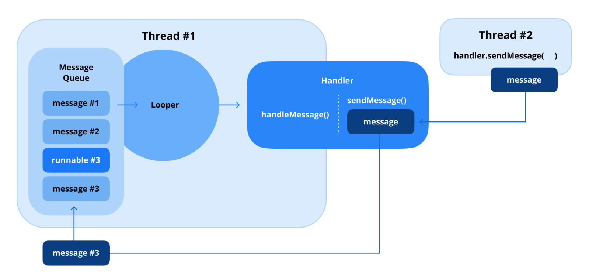

# Looper, Handler, HandlerThread의 역할은 무엇인가요?

Looper, Handler, HandlerThread는 스레드를 관리하고 비동기 통신을 처리하기 위해 함께 작동하는 컴포넌트입니다. 이 클래스들은 UI 업데이트를 위해 메인 스레드와 상호작용하면서 백그라운드 스레드에서 작업을 수행하는 데 필수적입니다.



### Looper (루퍼)

루퍼는 안드로이드 스레딩 모델의 일부로, **메시지 또는 작업 큐를 순차적으로 처리하기 위해 스레드를 계속 활성 상태로 유지**합니다. 안드로이드의 메인 스레드(UI 스레드) 및 다른 작업자 스레드(worker threads)에서 중심적인 역할을 합니다.

* **목적:** 메시지 큐를 지속적으로 모니터링하고, 메시지나 작업을 가져와 적절한 핸들러로 전달(dispatching)합니다.
* **사용법:** 메시지를 처리하는 모든 스레드에는 루퍼가 필요합니다. 메인 스레드에는 자동으로 루퍼가 있지만, 작업자 스레드의 경우 명시적으로 준비해야 합니다.
* **초기화:**
    * `Looper.prepare()`를 사용하여 루퍼를 스레드와 연결합니다.
    * `Looper.loop()`를 사용하여 루프를 시작합니다.

```kotlin
val thread = Thread {
    Looper.prepare() // Attach a Looper to the thread
    val handler = Handler(Looper.myLooper()!!) // Use the Looper to create a Handler
    Looper.loop() // Start the Looper
}
thread.start()
```

### Handler (핸들러)

핸들러는 스레드의 메시지 큐 내에서 **메시지나 작업을 전송하고 처리**하는 데 사용됩니다. 루퍼와 함께 작동합니다.

* **목적:** 한 스레드에서 다른 스레드로 작업이나 메시지를 게시(post)합니다. 예를 들어, 백그라운드 스레드에서 UI를 업데이트하는 경우입니다.
* **작동 방식:** 핸들러가 생성될 때, 핸들러가 생성된 스레드 및 해당 스레드의 루퍼에 연결됩니다. 핸들러로 전송된 작업은 해당 스레드에서 처리됩니다.

```kotlin
val handler = Handler(Looper.getMainLooper()) // Runs on the main thread

handler.post {
    // Code to update the UI
    textView.text = "Updated from background thread"
}
```

### HandlerThread (핸들러스레드)

핸들러스레드는 **루퍼가 내장된 특화된 스레드(Thread)** 입니다. 작업이나 메시지 큐를 처리할 수 있는 백그라운드 스레드를 만드는 과정을 단순화합니다.

* **목적:** 자체 루퍼를 가진 작업자 스레드를 생성하여 해당 스레드에서 작업을 순차적으로 처리할 수 있도록 합니다.
* **생명주기:** `start()`로 핸들러스레드를 시작한 다음, `getLooper()`를 사용하여 루퍼를 가져옵니다. 리소스를 해제하려면 항상 `quit()` 또는 `quitSafely()`를 사용하여 루퍼를 종료해야 합니다.

```kotlin
val handlerThread = HandlerThread("WorkerThread")
handlerThread.start() // Start the thread

val workerHandler = Handler(handlerThread.looper) // Use its Looper for tasks

workerHandler.post {
    // Perform background tasks
    Thread.sleep(1000)
    Log.d("HandlerThread", "Task completed")
}

// Stop the thread
handlerThread.quitSafely()
```

### 주요 차이점 및 관계

* **루퍼**는 메시지 처리의 중추이며, 스레드를 활성 상태로 유지하고 메시지 큐를 처리합니다.
* **핸들러**는 루퍼와 상호작용하여 메시지와 작업을 큐에 추가하거나 처리합니다.
* **핸들러스레드**는 자동 루퍼 설정을 통해 백그라운드 스레드 생성을 단순화합니다.

### 사용 사례

* **루퍼:** 메인 스레드 또는 작업자 스레드에서 연속적인 메시지 큐를 관리하는 데 사용됩니다.
* **핸들러:** 스레드 간 통신, 예를 들어 백그라운드 스레드에서 UI 업데이트를 게시하는 데 이상적입니다.
* **핸들러스레드:** 데이터 처리나 네트워크 요청과 같이 전용 스레드가 필요한 백그라운드 작업에 적합합니다.

### 요약

Looper, Handler, HandlerThread는 안드로이드에서 스레드와 메시지 큐를 관리하기 위한 견고한 프레임워크를 형성합니다. 루퍼는 스레드가 작업을 지속적으로 처리할 수 있도록 보장하는 반면, 핸들러는 작업 통신을 위한 인터페이스를 제공하고, 핸들러스레드는 내장된 메시지 루프를 가진 작업자 스레드를 관리하는 편리한 방법을 제공합니다.

---

## Q. 핸들러는 루퍼와 어떻게 작동하여 스레드 간 통신을 용이하게 하며, 핸들러 사용의 일반적인 사용 사례는 무엇인가요?

### 1. 핸들러(Handler)와 루퍼(Looper)의 스레드 간 통신 방식

`Handler`와 `Looper`는 안드로이드에서 스레드 간의 안전하고 효율적인 통신을 가능하게 하는 핵심 구성 요소입니다. 이들의 상호작용 방식은 다음과 같습니다.

1.  **`Looper`와 `MessageQueue` 준비:**
    * 메시지를 처리하고자 하는 스레드(예: 메인 UI 스레드 또는 특정 작업자 스레드)는 반드시 자신만의 `Looper`를 가져야 합니다. 메인 스레드는 앱 시작 시 자동으로 `Looper`를 가집니다. 작업자 스레드의 경우, `Looper.prepare()`를 호출하여 `Looper`를 생성하고, `Looper.loop()`를 호출하여 메시지 루프를 시작해야 합니다. (또는 `HandlerThread`를 사용하면 이 과정이 자동화됩니다.)
    * 각 `Looper`는 자신과 연결된 하나의 `MessageQueue`를 가집니다. 이 큐에는 처리해야 할 `Message` 객체 또는 `Runnable` 작업들이 순서대로 저장됩니다.

2.  **`Handler` 생성 및 연결:**
    * `Handler` 객체를 생성할 때, 해당 `Handler`는 자신이 생성된 스레드의 `Looper` (그리고 그 `Looper`의 `MessageQueue`)와 자동으로 연결됩니다.
    * 만약 특정 스레드의 `Looper`를 명시적으로 지정하여 `Handler`를 생성하고 싶다면, `Handler(Looper looper)` 생성자를 사용할 수 있습니다.

3.  **메시지 또는 작업 전송:**
    * **다른 스레드**에서 특정 스레드(예: UI 스레드)에게 작업을 요청하고 싶을 때, 대상 스레드의 `Looper`와 연결된 `Handler`의 메서드(예: `handler.post(Runnable)`, `handler.sendMessage(Message)`, `handler.postDelayed(Runnable, long)`)를 호출합니다.
    * 이때 `Handler`는 전달받은 `Runnable`이나 `Message`를 즉시 실행하는 것이 아니라, 자신이 연결된 **`MessageQueue`에 해당 작업/메시지를 추가**합니다.

4.  **`Looper`의 역할 - 메시지 처리 루프:**
    * `Looper.loop()`가 호출된 스레드에서, `Looper`는 자신의 `MessageQueue`를 지속적으로 감시합니다.
    * 큐에 새로운 `Message`나 `Runnable`이 들어오면, `Looper`는 순서대로 하나씩 꺼내어 해당 `Message`/`Runnable`을 보냈던 (또는 `Message`에 지정된 타겟) `Handler`에게 전달(dispatch)합니다.

5.  **`Handler`의 역할 - 실제 작업 수행:**
    * `Looper`로부터 `Message`를 전달받은 `Handler`는 자신의 `handleMessage(Message msg)` 메서드를 호출하여 메시지를 처리하거나, `Runnable`을 전달받았으면 해당 `Runnable`의 `run()` 메서드를 실행합니다.
    * **중요한 점은 이 `handleMessage()` 또는 `run()` 메서드가 `Handler`가 생성될 때 연결되었던 바로 그 스레드(즉, `Looper`가 실행 중인 스레드)에서 실행된다는 것입니다.**

이러한 메커니즘을 통해, 예를 들어 백그라운드 스레드는 UI 스레드의 `Handler`를 통해 UI 업데이트 작업을 `MessageQueue`에 안전하게 전달할 수 있고, UI 스레드의 `Looper`는 이 작업을 받아 UI 스레드에서 `Handler`가 실행하도록 하여 스레드 안전성을 보장하며 통신을 수행합니다.

### 2. 핸들러(Handler)의 일반적인 사용 사례

* **백그라운드 스레드에서 UI 업데이트 (가장 일반적):**
    * 안드로이드 UI 툴킷은 스레드에 안전하지 않으므로, 백그라운드 스레드(네트워크 요청, 데이터베이스 작업, 복잡한 연산 등)에서 직접 UI 요소를 변경할 수 없습니다.
    * 이때 메인(UI) 스레드의 `Looper`와 연결된 `Handler`를 생성하고, 백그라운드 스레드에서 이 `Handler`를 통해 UI 변경 코드가 담긴 `Runnable`을 `post` 하거나 관련 `Message`를 `sendMessage` 합니다. 그러면 해당 작업은 메인 스레드에서 안전하게 실행됩니다.

* **특정 시간 후 작업 예약:**
    * `handler.postDelayed(Runnable r, long delayMillis)`: 지정된 시간(밀리초 단위) 후에 `Runnable` 객체 `r`을 `Handler`와 연결된 스레드에서 실행합니다. 스플래시 화면, 주기적인 UI 업데이트, 타임아웃 구현 등에 사용됩니다.
    * `handler.sendMessageDelayed(Message msg, long delayMillis)`: 특정 시간 후에 `Message`를 전송합니다.

* **타임아웃(Timeout) 구현:**
    * `postDelayed`를 사용하여 특정 작업(예: 네트워크 응답 기다리기)에 대한 타임아웃 로직을 예약합니다. 예상 시간 내에 작업이 완료되면 `removeCallbacks()` 등으로 예약된 타임아웃 로직을 취소하고, 그렇지 않고 타임아웃 로직이 실행되면 타임아웃 상황을 처리합니다.

* **특정 스레드에서 순차적 작업 실행:**
    * `HandlerThread`와 같이 자체 `Looper`를 가진 전용 작업자 스레드가 있을 경우, 해당 스레드의 `Looper`와 연결된 `Handler`를 만들 수 있습니다. 이 `Handler`로 보내는 모든 작업은 해당 작업자 스레드에서 순차적으로 실행됩니다.

* **서비스(Service)와 액티비티(Activity)/프래그먼트(Fragment) 간 이벤트 통신:**
    * 백그라운드 서비스가 작업 상태나 결과를 UI를 가진 컴포넌트(액티비티/프래그먼트)에 알릴 때, 메인 스레드 `Handler`를 통해 메시지를 전달할 수 있습니다. (때로는 `Messenger` 객체를 활용)

* **간단한 게임 루프 또는 애니메이션 단계 관리:**
    * (복잡한 게임 루프는 전용 렌더링 스레드와 타이밍 메커니즘을 사용하지만) 간단한 경우, `postDelayed`를 사용하여 다음 프레임이나 게임 로직 업데이트를 스케줄링하는 데 사용될 수 있습니다.

---

## Q. 핸들러스레드란 무엇이며, `Looper.prepare()`를 사용하여 수동으로 스레드를 생성하는 것과 비교하여 어떻게 백그라운드 스레드 관리를 단순화하나요?

### 1. 핸들러스레드(HandlerThread)란 무엇인가?

`HandlerThread`는 안드로이드에서 제공하는 `Thread`의 하위 클래스로, 자체적으로 **루퍼(Looper)** 를 가지고 있는 특별한 종류의 스레드입니다. 이 클래스의 주요 목적은 백그라운드에서 순차적으로 메시지나 작업을 처리할 수 있는 스레드를 쉽게 만들 수 있도록 하는 것입니다.

`HandlerThread`를 `start()` 메서드로 시작하면, 내부적으로 다음 작업이 자동으로 수행됩니다:

1.  스레드가 시작됩니다.
2.  해당 스레드 내에서 `Looper.prepare()`가 호출되어 메시지 큐(MessageQueue)를 준비합니다.
3.  `Looper.loop()`가 호출되어 메시지 큐를 계속 감시하며 메시지를 처리하는 루프를 시작합니다.

일단 `HandlerThread`가 시작되고 `Looper`가 준비되면, `handlerThread.getLooper()` (또는 Kotlin에서는 `handlerThread.looper`)를 통해 해당 스레드의 `Looper` 객체를 얻을 수 있습니다. 이 `Looper`를 사용하여 `Handler` 객체를 생성하면, 이 `Handler`로 전달되는 모든 메시지나 `Runnable` 작업들은 해당 `HandlerThread`의 컨텍스트(즉, 백그라운드 스레드)에서 순차적으로 실행됩니다.

작업이 모두 끝나거나 더 이상 `HandlerThread`가 필요 없을 때는, 메모리 누수나 리소스 낭비를 막기 위해 반드시 `handlerThread.quit()` 또는 `handlerThread.quitSafely()`를 호출하여 루퍼를 종료하고 스레드가 정상적으로 끝날 수 있도록 해야 합니다.

### 2. `Looper.prepare()`를 사용하여 수동으로 스레드를 생성하는 것과 비교하여 백그라운드 스레드 관리를 어떻게 단순화하나요?

개발자가 직접 `Thread`를 생성하고 그 안에서 `Looper`를 사용하려면 여러 단계를 수동으로 처리해야 합니다. `HandlerThread`는 이 과정을 크게 단순화합니다.

**수동으로 `Looper`를 가진 스레드를 생성하는 경우:**

1.  `Thread` 클래스를 상속받거나 `Runnable`을 구현하여 새 스레드를 만듭니다.
2.  해당 스레드의 `run()` 메서드 내에서 `Looper.prepare()`를 **명시적으로 호출**하여 현재 스레드에 `Looper`와 `MessageQueue`를 설정합니다.
3.  필요하다면 이 스레드의 `Looper`와 연결될 `Handler`를 생성합니다. 이 `Handler` 객체를 다른 스레드에서 사용하려면 외부로 전달하거나 접근 가능하게 만들어야 합니다.
4.  `Looper.loop()`를 **명시적으로 호출**하여 메시지 처리 루프를 시작합니다. 이 호출은 블로킹(blocking) 메서드이므로, 루퍼가 종료될 때까지 `run()` 메서드는 여기서 멈춰 있습니다.
5.  스레드 사용이 끝나면, 다른 스레드에서 해당 `Looper` 객체의 `quit()` 또는 `quitSafely()` 메서드를 호출하여 메시지 루프를 종료하고 스레드가 끝날 수 있도록 **명시적으로 관리**해야 합니다.

**`HandlerThread`를 사용했을 때의 단순화 이점:**

1.  **보일러플레이트 코드 감소:**
    * `HandlerThread`는 `Looper.prepare()`와 `Looper.loop()` 호출을 내부적으로 자신의 `run()` 메서드에 이미 구현해 두었습니다. 따라서 개발자가 이 루틴한 코드를 직접 작성할 필요가 없습니다.

2.  **`Looper` 객체 접근 용이성:**
    * 스레드가 시작된 후 `handlerThread.getLooper()` (또는 `handlerThread.looper`)를 호출하면 준비된 `Looper` 객체를 안전하고 편리하게 가져올 수 있습니다. 수동 방식에서는 `Looper` 객체를 다른 스레드로 전달하는 로직을 직접 구현해야 할 수 있습니다.

3.  **`Looper` 설정의 정확성 및 스레드 안전성 향상:**
    * `Looper.prepare()`는 스레드당 한 번만 호출되어야 하는 등 `Looper` 설정에는 몇 가지 규칙이 있습니다. `HandlerThread`는 이러한 설정을 내부적으로 올바르게 처리하므로, 개발자의 실수로 인한 오류 가능성을 줄여줍니다.

4.  **간단한 루퍼 및 스레드 종료:**
    * `HandlerThread`는 `quit()`와 `quitSafely()` 메서드를 제공합니다. 이 메서드들은 내부적으로 자신의 `Looper`에 대한 종료 요청을 처리하여 루프를 멈추고 스레드가 정상적으로 종료되도록 합니다. 수동 방식에서는 `Looper` 객체에 직접 접근하여 종료 메서드를 호출해야 합니다.

5.  **의도 명확성:**
    * 코드에서 `HandlerThread`를 사용하면, "이 스레드는 메시지 큐를 가지고 순차적으로 작업을 처리하기 위한 전용 백그라운드 스레드이다"라는 의도를 명확하게 표현할 수 있습니다.

결론적으로, `HandlerThread`는 개발자가 `Looper`와 `MessageQueue`를 백그라운드 스레드에 설정하고 관리하는 복잡하고 오류 발생 가능성이 있는 과정을 추상화하여, 백그라운드에서 순차적인 비동기 작업을 처리하는 스레드를 더 쉽고 안전하게 만들 수 있도록 도와줍니다.