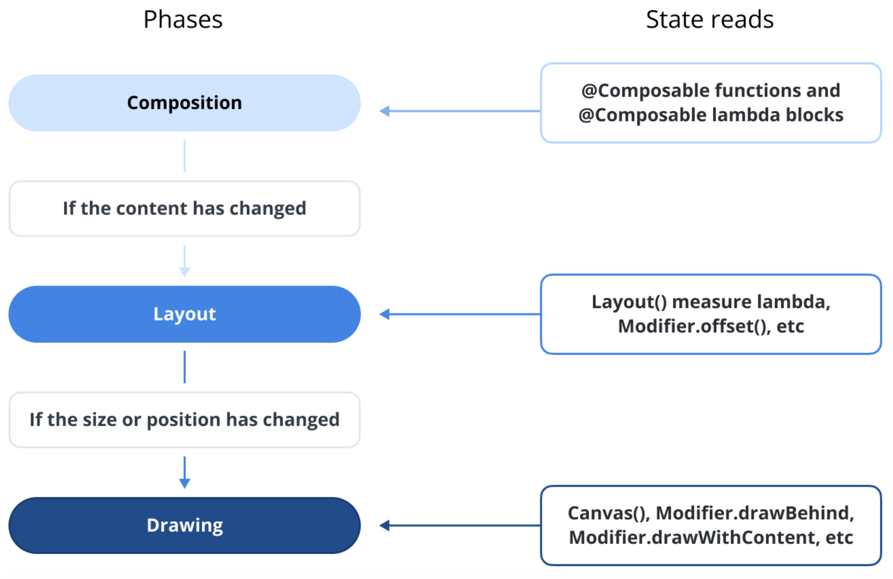
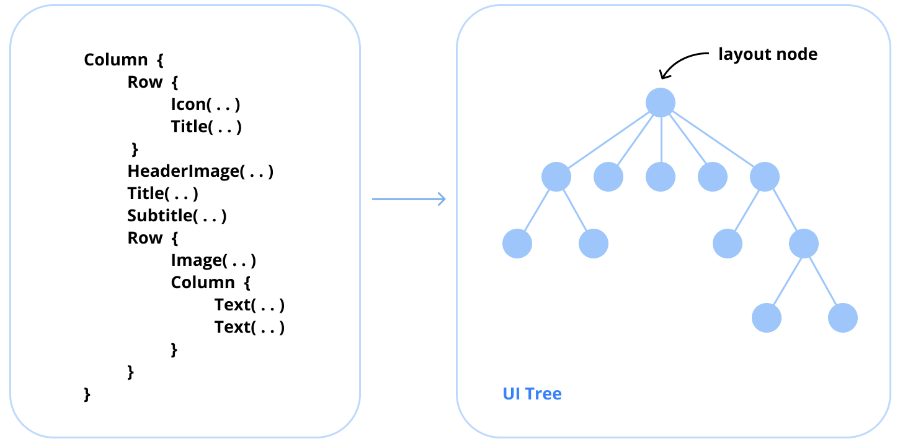
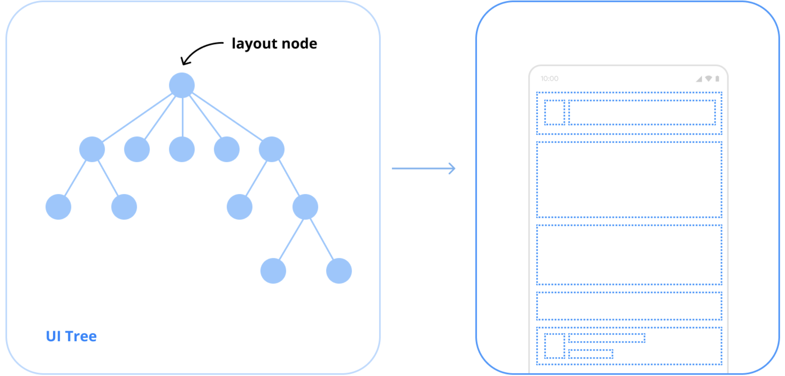
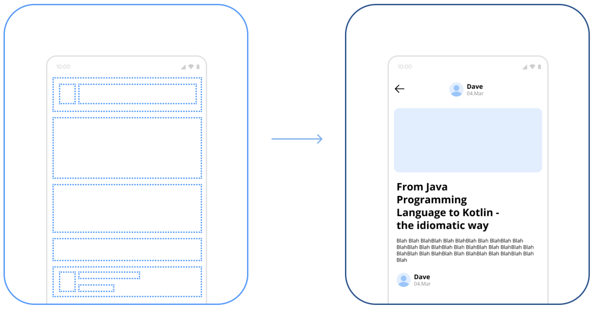

# Compose 단계(Phase)란 무엇인가?

Jetpack Compose는 **컴포지션(Composition)**, **레이아웃(Layout)**, **그리기(Drawing)** 라는 세 가지 핵심 단계로 나뉜 잘 정의된 렌더링 파이프라인을 따릅니다. 이러한 단계들은 UI를 화면에 효율적으로 빌드하고, 배열하며, 렌더링하기 위해 순차적으로 작동합니다.

---
## Compose의 세 가지 핵심 단계

### 1. 컴포지션 (Composition)

컴포지션 단계는 **`@Composable` 함수를 실행하여 UI 트리를 빌드하고 컴포저블 함수에 대한 설명을 생성**하는 책임을 집니다. 이 단계에서 Compose는 초기 UI 구조를 구축하고 **슬롯 테이블(Slot Table)** 이라는 데이터 구조에 컴포저블 간의 관계를 기록합니다. 상태 변경이 발생하면, 컴포지션 단계는 UI의 영향을 받는 부분을 재계산하고 필요한 경우 리컴포지션(recomposition)을 트리거합니다.

#### 컴포지션 단계의 주요 작업
* `@Composable` 함수 실행
* UI 트리 생성 및 업데이트
* 리컴포지션을 위한 변경 사항 추적

### 2. 레이아웃 (Layout)

레이아웃 단계는 컴포지션 단계 이후에 진행됩니다. 이 단계에서는 **제공된 제약 조건(constraints)에 따라 각 UI 요소의 크기와 위치를 결정**합니다. 각 컴포저블은 자신의 자식들을 측정하고, 자신의 치수를 결정하며, 부모에 대한 상대적인 위치를 정의합니다.

#### 레이아웃 단계의 주요 작업
* UI 컴포넌트 측정
* 너비, 높이 및 위치 정의
* 부모 컨테이너 내에 자식 배치

### 3. 그리기 (Drawing)

그리기 단계는 컴포지션되고 레이아웃이 지정된 **UI 요소들이 화면에 렌더링되는** 곳입니다. Compose는 이 과정을 위해 **Skia 그래픽 엔진**을 사용하여 부드럽고 하드웨어 가속이 적용된 렌더링을 보장합니다. 사용자 정의 그리기 로직은 Compose의 `Canvas` API를 사용하여 구현할 수 있습니다.

#### 그리기 단계의 주요 작업
* 시각적 요소 렌더링
* 화면에 UI 컴포넌트 그리기
* 사용자 정의 그리기 작업 적용

---
## 요약

Jetpack Compose의 3단계 렌더링 모델은 깔끔하고 효율적이며 확장 가능한 UI 빌드 과정을 보장합니다. **컴포지션 단계**는 UI 트리를 구축하고, **레이아웃 단계**는 컴포넌트를 배열하며, **그리기 단계**는 모든 것을 시각적으로 렌더링합니다. 더 깊은 이해를 원한다면, Compose의 UI 렌더링 과정에 포함된 핵심 단계에 대한 심층적인 설명을 제공하는 [Jetpack Compose 단계에 대한 안드로이드 공식 문서](https://developer.android.com/develop/ui/compose/phases)를 참조하세요.

---
## Q. 컴포지션 단계에서는 어떤 일이 발생하며, 리컴포지션과는 어떻게 관련되나요?

**컴포지션(Composition)** 단계는 Jetpack Compose가 UI를 그리는 3단계(컴포지션, 레이아웃, 그리기) 중 첫 번째 단계로, **어떤 UI를 보여줄지 결정하는** 핵심적인 과정입니다. **리컴포지션(Recomposition)** 은 컴포지션 단계와 분리된 별개의 단계가 아니라, **상태(State)가 변경되었을 때 컴포지션 단계를 다시 실행하는 과정**을 의미합니다.

---
### 1. 컴포지션(Composition) 단계에서 발생하는 일

초기 컴포지션은 화면이 처음 생성될 때 발생하며, 다음과 같은 작업이 순차적으로 이루어집니다.

#### 1.1. `@Composable` 함수 실행
* `setContent` 블록이나 다른 `@Composable` 함수 내에서 호출된 최상위 `@Composable` 함수부터 시작하여, 그 안의 모든 자식 `@Composable` 함수들을 순서대로 실행합니다.

#### 1.2. UI 트리(UI Tree) 생성
* `@Composable` 함수들이 실행되면서, `Text`, `Image`, `Box`, `Column` 등과 같은 UI 요소를 **방출(emit)**합니다.
* Compose 런타임은 이 방출된 요소들을 기반으로 UI의 구조를 나타내는 **UI 트리(또는 컴포지션 트리)를 구축**합니다. 이 트리는 UI가 어떻게 구성되어 있는지에 대한 "설계도"나 "설명서"와 같습니다.

#### 1.3. 상태 구독(State Subscription) 기록
* 컴포저블 함수가 실행되는 동안, 만약 `State<T>` 객체의 `.value` 속성을 읽는다면(예: `val name by viewModel.nameState`), Compose 런타임은 "이 컴포저블은 이 상태에 의존한다" 또는 **"이 상태를 구독한다"** 는 사실을 기록합니다. 이 기록은 나중에 어떤 컴포저블을 리컴포지션해야 할지 결정하는 데 사용됩니다.

#### 1.4. 슬롯 테이블(Slot Table)에 데이터 저장
* 생성된 UI 트리의 구조와 `remember`를 통해 저장된 값들은 **슬롯 테이블**이라는 내부 데이터 구조에 저장됩니다. 이를 통해 Compose는 리컴포지션이 일어나도 이전 상태를 기억하고, 변경된 부분만 효율적으로 업데이트할 수 있습니다.

요약하자면, 초기 컴포지션 단계는 **코틀린 코드(@Composable 함수)를 실행하여 UI의 구조와 상태를 나타내는 데이터 트리로 변환하는 과정**입니다.

---
### 2. 리컴포지션(Recomposition)과의 관계

리컴포지션은 UI의 상태가 변경되었을 때 화면을 최신 상태로 업데이트하기 위한 메커니즘이며, 컴포지션 단계와 다음과 같이 밀접하게 관련되어 있습니다.

#### 2.1. 리컴포지션의 정의
* 리컴포지션은 **UI의 일부를 업데이트하기 위해 이전에 성공적으로 완료했던 컴포지션 단계를 다시 실행하는 것**을 의미합니다. 중요한 점은 전체 UI 트리에 대해 컴포지션을 처음부터 다시 하는 것이 아니라, **변경이 필요한 부분만 선택적으로 다시 실행**한다는 것입니다.

#### 2.2. 상태 변경이 리컴포지션을 유발하는 과정
1.  **상태 변경:** UI가 관찰하고 있는 `State` 객체의 값이 변경됩니다. (예: `mutableState.value = "New Value"`)
2.  **컴포저블 무효화(Invalidation):** `State` 객체는 자신의 값이 변경되었음을 Compose 런타임에 알립니다. 런타임은 이전에 이 `State`를 구독했던(읽었던) 모든 컴포저블들을 "무효화"시킵니다. 즉, "이 컴포저블들은 이제 오래된 정보를 가지고 있으니 업데이트가 필요하다"고 표시합니다.
3.  **리컴포지션 예약:** Compose 런타임은 무효화된 컴포저블들을 다음 프레임에 다시 그리기 위해 리컴포지션을 **스케줄링**합니다.
4.  **선택적 재실행:** 다음 프레임이 되면, 런타임은 무효화된 컴포저블들만 다시 호출(실행)합니다. 이 과정에서 새로운 상태 값을 기반으로 새로운 UI 트리 일부가 생성됩니다. 상태 변경과 관련 없는 다른 컴포저블들은 실행되지 않고 건너뜁니다(skipped).
5.  **UI 업데이트:** 리컴포지션을 통해 업데이트된 UI 트리 정보는 다음 단계인 **레이아웃(Layout)** 과 **그리기(Drawing)** 단계로 전달되어 최종적으로 화면에 반영됩니다.

#### 2.3. 컴포지션과 리컴포지션의 관계 요약
* **컴포지션**은 **상태를 UI 구조로 변환**하는 초기 빌드 과정입니다.
* **리컴포지션**은 **상태 변경에 대응하여 이 UI 구조를 업데이트**하기 위해 컴포지션 단계를 부분적으로 다시 실행하는 과정입니다.

---
### 3. 결론

결론적으로, 컴포지션 단계는 `@Composable` 함수들을 실행하여 현재 상태에 맞는 UI 구조(UI 트리)를 생성하는 과정입니다. 리컴포지션은 별개의 단계가 아니라, **상태가 변경되었을 때 이 컴포지션 단계를 필요한 부분에 대해서만 다시 수행하여 UI를 최신 상태로 유지하는 효율적인 메커니즘**입니다. 이 관계 덕분에 Jetpack Compose는 선언적으로 UI를 작성하면서도 뛰어난 성능을 유지할 수 있습니다.

## Q. 레이아웃 단계는 어떻게 작동하나요?

**레이아웃(Layout)** 단계는 컴포지션(Composition) 단계 이후에 진행되는 Jetpack Compose 렌더링 파이프라인의 두 번째 단계입니다. 이 단계의 주된 목적은 컴포지션 단계에서 생성된 **각 UI 요소의 크기(너비와 높이)와 화면상의 위치(x, y 좌표)를 결정**하는 것입니다.

---
### 1. 레이아웃 단계의 핵심 원칙: "제약 조건은 아래로, 크기는 위로"

Compose의 레이아웃 시스템은 **"제약 조건은 아래로(Constraints down), 크기는 위로(Sizes up)"** 라는 간단하지만 강력한 단일 패스(single-pass) 모델을 따릅니다.

1.  **제약 조건은 아래로 (Constraints Down):**
    * 부모 컴포저블은 자식 컴포저블에게 "너는 이 정도의 공간 안에서 그려져야 해"라는 제약 조건(`Constraints`)을 전달합니다.
    * 이 제약 조건에는 자식이 가질 수 있는 최소 및 최대 너비와 높이가 포함됩니다.

2.  **크기는 위로 (Sizes Up):**
    * 자식 컴포저블은 부모로부터 받은 제약 조건 내에서 **자신이 원하는 크기를 스스로 측정**합니다.
    * 측정이 끝나면, 자식은 결정된 실제 크기를 부모에게 다시 보고합니다.

이 과정은 UI 트리 최상단에서부터 모든 노드를 거쳐 아래로, 그리고 다시 위로 재귀적으로 반복되어 전체 UI 요소들의 크기와 위치가 결정됩니다.

---
### 2. 레이아웃 단계의 2-패스(Pass) 프로세스

레이아웃 단계는 내부적으로 크게 두 가지 주요 과정으로 나눌 수 있습니다.

#### 2.1. 1단계: 측정 (Measurement Pass)
이 단계는 모든 자식 요소의 크기를 결정하는 과정입니다.

* 부모는 자신의 자식들 각각을 측정해야 합니다.
* 부모는 각 자식에게 제약 조건을 전달하며 `measure`를 요청합니다.
* 만약 자식 또한 다른 자식들을 가진 `ViewGroup`과 같은 컴포저블이라면, 이 자식은 다시 자신의 자식들을 측정하는 과정을 재귀적으로 반복합니다.
* 가장 말단에 있는 자식(예: `Text`, `Image`)이 먼저 자신의 크기를 결정하고, 그 크기를 자신의 부모에게 보고합니다.
* 부모는 자식들의 크기 정보를 바탕으로 자신의 크기를 최종적으로 결정합니다.
* 이 측정 과정의 결과로, 각 UI 요소는 크기가 결정된 **`Placeable`** 객체가 됩니다.

#### 2.2. 2단계: 배치 (Placement Pass)
측정 단계가 완료되어 모든 요소의 크기가 결정되면, 이제 각 요소를 화면의 정확한 위치에 배치합니다.

* 부모는 측정 단계에서 얻은 `Placeable` 객체들을 사용하여 자식들을 배치합니다.
* 부모는 각 자식(`Placeable`)에 대해 `placeAt(x, y)` 메서드를 호출하여 자신의 좌표계 내에서 자식의 x, y 위치를 지정합니다.
* 이 과정 역시 UI 트리를 따라 재귀적으로 수행됩니다.

---
### 3. 주요 관련 API 및 개념

* **`Layout` 컴포저블:** `Row`, `Column`, `Box`와 같은 기본 레이아웃 컴포저블의 가장 기초가 되는 요소입니다. 사용자 정의 레이아웃을 만들 때 사용되며, 측정 및 배치 로직을 직접 구현할 수 있습니다.
* **`MeasurePolicy`:** `Layout` 컴포저블에 전달되는 람다로, 측정(measure) 및 배치(place) 로직을 포함합니다.
* **`Measurable`:** 측정될 수 있는 자식 컴포저블을 나타내는 인터페이스입니다. `measurable.measure(constraints)`를 호출하여 `Placeable`을 얻습니다.
* **`Placeable`:** 측정의 결과물입니다. 측정된 너비와 높이 정보를 가지고 있으며, `placeAt()` 메서드를 통해 화면에 배치될 수 있습니다.
* **`Constraints`:** `minWidth`, `maxWidth`, `minHeight`, `maxHeight` 값을 가진 객체로, 부모가 자식에게 전달하는 크기 제약 조건을 나타냅니다.

---
### 4. 예시: `Row` 컴포저블의 작동 방식 (개념적)

`Row`가 어떻게 작동하는지 상상해보면 레이아웃 단계를 더 쉽게 이해할 수 있습니다.

1.  **측정 단계:**
    * `Row`는 부모로부터 제약 조건을 받습니다.
    * `Row`는 자신의 첫 번째 자식에게 제약 조건을 전달하여 크기를 측정하고, 그 크기를 보고받습니다.
    * 첫 번째 자식이 차지한 너비를 제외하고 남은 너비 제약 조건을 두 번째 자식에게 전달하여 크기를 측정합니다. 이 과정을 모든 자식에 대해 반복합니다.
    * 모든 자식의 측정이 끝나면, `Row`는 모든 자식 너비의 합을 자신의 최종 너비로, 가장 큰 자식의 높이를 자신의 최종 높이로 결정합니다.

2.  **배치 단계:**
    * `Row`는 자신의 크기가 결정된 후, 자식들을 가로 방향으로 차례대로 배치합니다.
    * `child1.placeAt(x=0, y=0)`
    * `child2.placeAt(x=child1.width, y=0)`
    * `child3.placeAt(x=child1.width + child2.width, y=0)`
    * ... 와 같이 배치합니다.

---
### 5. 결론

레이아웃 단계는 컴포지션 단계에서 생성된 UI 구조(UI 트리)를 기반으로, **"제약 조건은 아래로, 크기는 위로"** 라는 명확한 원칙에 따라 각 UI 요소의 크기와 위치를 결정하는 과정입니다. 이 효율적인 단일 패스 측정 및 배치 시스템을 통해 Compose는 복잡한 UI도 빠르고 일관되게 화면에 배열할 수 있으며, 이는 최종적으로 **그리기(Drawing)** 단계에서 시각적으로 렌더링될 준비를 마치는 과정입니다.
