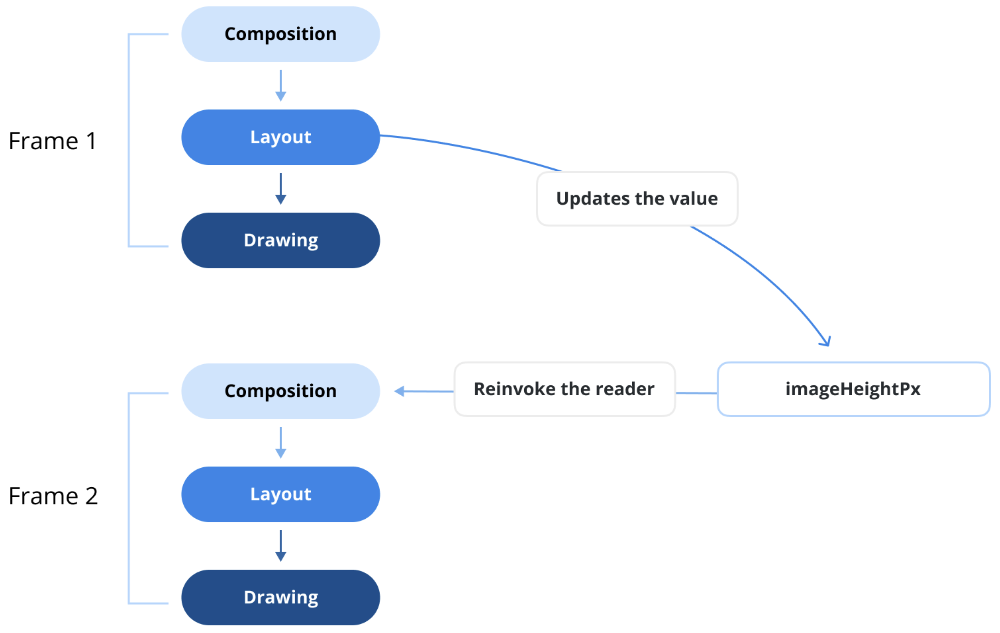
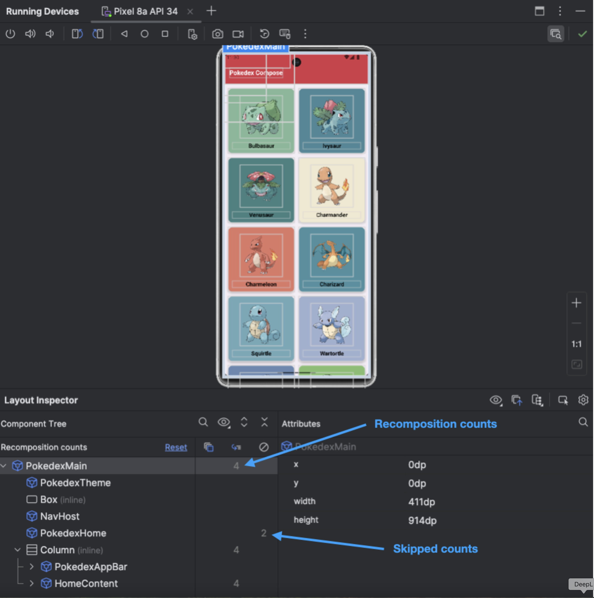

# 리컴포지션(Recomposition)이란 무엇이며 언제 발생하나요? 또한, 앱 성능과는 어떻게 관련되나요?

Jetpack Compose의 세 가지 주요 단계(컴포지션, 레이아웃, 그리기)를 통해 이미 렌더링된 UI 레이아웃을 업데이트하기 위해, 프레임워크는 상태 변경이 발생했을 때 UI를 다시 그리는 메커니즘을 도입합니다. 이 과정을 **리컴포지션(Recomposition, 재구성)** 이라고 합니다. 리컴포지션이 발생하면, Compose는 컴포지션(Composition) 단계부터 다시 시작하며, 컴포저블 노드들은 프레임워크에 UI 변경 사항을 알려 업데이트된 UI가 최신 상태를 반영하도록 보장합니다.



-----

## 리컴포지션을 유발하는 조건

대부분의 모바일 애플리케이션은 앱의 데이터 모델을 인메모리(in-memory)에서 표현하는 상태(state)를 유지합니다. UI가 상태 변경과 동기화된 상태를 유지하도록 하기 위해, Jetpack Compose는 두 가지 주요 메커니즘을 통해 리컴포지션을 트리거합니다.

### 1. 입력값 변경 (Input Changes)

컴포저블 함수는 **입력 파라미터가 변경될 때** 리컴포지션을 트리거합니다. Compose 런타임은 이전 인수와 새로운 인수를 `equals()` 함수를 사용하여 비교합니다. 만약 비교 결과가 `false`이면, 런타임은 변경을 감지하고 리컴포지션을 트리거하여 UI의 관련 부분을 업데이트합니다.

### 2. 상태 변경 관찰 (Observing State Changes)

Jetpack Compose는 일반적으로 `remember` 함수와 함께 사용되는 **`State` API**를 사용하여 상태 변경을 모니터링합니다. 이 접근 방식은 상태 객체를 메모리에 보존하고 리컴포지션 중에 복원하여, UI가 수동 개입 없이도 일관되게 최신 상태를 반영하도록 보장합니다.

-----

## 리컴포지션과 성능

리컴포지션은 Compose의 반응형 특성의 중심이지만, **과도하거나 불필요한 리컴포지션은 앱 성능을 저하**시킬 수 있습니다. 리컴포지션이 어떻게 작동하는지 이해하고 효과적으로 추적하는 것은 Compose 애플리케이션을 최적화하는 데 필수적입니다. 리컴포지션은 이 장의 뒷부분에 있는 "안정성이란 무엇인가요?" 질문에서 더 자세히 탐색할 **안정성(stability)** 과 같은 다양한 요인에 의해 영향을 받습니다. 리컴포지션을 최적화하고 앱 성능을 향상시키려면, [**레이아웃 검사기(Layout Inspector)**](https://developer.android.com/studio/debug/layout-inspector) 를 사용하여 불필요한 리컴포지션 횟수를 추적하여 식별해야 합니다.

### 레이아웃 검사기(Layout Inspector)를 이용한 추적

**레이아웃 검사기**는 에뮬레이터나 실제 기기에서 실행 중인 앱의 Compose 레이아웃을 검사할 수 있게 해줍니다. 이를 통해 컴포저블이 얼마나 자주 리컴포지션되거나 건너뛰어지는지 모니터링하여 잠재적인 성능 문제를 식별하는 데 도움이 됩니다. 예를 들어, 코딩 실수로 인해 과도한 UI 리컴포지션이 발생하여 성능 저하를 유발하거나, 반대로 UI가 리컴포지션되지 않아 시각적 업데이트가 막히는 경우를 찾아낼 수 있습니다.



Android Studio에서 레이아웃 검사기는 리컴포지션이 발생할 때 이를 강조 표시하여, UI의 어느 부분이 리컴포지션을 유발하는지 정확히 찾아내기 쉽게 만듭니다. 이 도구는 리컴포지션 횟수를 추적하고 UI 업데이트를 최적화하는 데 사용하여 Compose 앱이 최적의 성능을 유지하도록 보장하는 데 유용합니다.

### 컴포지션 추적(Composition Tracing) 도구

프로젝트에서 리컴포지션 추적을 시도해 볼 수 있는 또 다른 도구로 [**컴포지션 추적**](https://developer.android.com/develop/ui/compose/tooling/tracing)이 있습니다. 이는 성능 문제를 진단하는 데 유용한 도구로, 낮은 오버헤드 측정을 위한 **시스템 트레이싱(system tracing)** 과, 더 높은 성능 영향을 감수하는 대신 상세한 함수 호출 추적을 위한 **메서드 트레이싱(method tracing)** 을 통해 통찰력을 제공합니다. 시스템 트레이스는 일반적으로 개별 컴포저블 함수를 제외하지만, Compose 작업에 대한 가시성을 향상시키기 위해 시스템 트레이싱의 효율성과 메서드 트레이싱의 세분성을 결합하려는 지속적인 발전이 이루어지고 있습니다.

-----

## 요약

리컴포지션은 Jetpack Compose에서 반응형 UI를 만드는 데 필수적이지만, Compose 단계를 다시 시작하기 때문에 성능 비용이 따릅니다. 앱 성능을 최적화하려면, [앱 성능 최적화를 위한 6가지 Jetpack Compose 가이드라인](https://medium.com/proandroiddev/6-jetpack-compose-guidelines-to-optimize-your-app-performance-be18533721f9)과 [Jetpack Compose에서 안정성을 마스터하여 앱 성능 최적화하기](https://medium.com/proandroiddev/optimize-app-performance-by-mastering-stability-in-jetpack-compose-69f40a8c785d)와 같은 상세 가이드를 읽어보는 것을 고려해 보세요. 이 글들은 불필요한 리컴포지션을 최소화하면서 Compose 앱이 효율적으로 실행되도록 보장하는 모범 사례와 기술을 제공합니다.

-----

## Q. 불필요한 리컴포지션을 줄여 앱 성능을 최적화한 경험이 있나요? 이를 완화하기 위해 어떤 전략을 사용하겠습니까?

Jetpack Compose로 앱을 개발할 때 불필요한 리컴포지션(recomposition)을 줄여 성능을 최적화하는 것은 매우 중요한 과정이자 흔히 마주치는 과제입니다. 이 문제를 해결하기 위해 사용하는 주요 전략들은 **상태를 읽는 범위를 최소화**하고, 컴포저블에 전달되는 **데이터의 안정성(stability)을 보장**하며, **리컴포지션 범위를 현명하게 분리**하는 것에 중점을 둡니다.

-----

### 1. 문제 식별: 최적화의 첫걸음 🧐

최적화를 시작하기 전에, 먼저 어떤 컴포저블이 불필요하게 자주 리컴포지션되는지 식별해야 합니다.

  * **레이아웃 검사기(Layout Inspector) 활용:**
      * Android Studio의 레이아웃 검사기는 실행 중인 앱의 리컴포지션 횟수와 건너뛰기(skipped) 횟수를 시각적으로 보여줍니다. 리컴포지션 횟수가 비정상적으로 높은 컴포저블이 있다면, 그 부분이 최적화 대상입니다.
  * **컴포지션 추적(Composition Tracing) 활용:**
      * 더 심층적인 분석이 필요할 때 사용하는 시스템 트레이싱 기능입니다. 어떤 함수가 리컴포지션을 유발하는지 더 자세히 추적할 수 있습니다.

-----

### 2. 불필요한 리컴포지션을 줄이기 위한 핵심 전략

#### 2.1. 상태 읽기 최소화 및 람다 전달 (가장 중요)

컴포저블은 자신이 직접 읽는(구독하는) `State`가 변경될 때만 리컴포지션됩니다. 따라서 상태 읽기를 최대한 지연시키고 필요한 곳에서만 읽도록 하는 것이 중요합니다.

  * **상태를 아래로, 이벤트를 위로 (State flows down, events flow up):**
    상위 컴포저블이 상태를 소유하고, 하위 컴포저블에는 상태 값 자체 대신 **상태를 변경하는 람다(lambda) 함수를 전달**합니다. 이렇게 하면 하위 컴포저블은 상태를 직접 읽지 않으므로, 해당 상태가 변경되어도 리컴포지션되지 않습니다.

  * **잘못된 예시 (상태 값 직접 전달):**

    ```kotlin
    @Composable
    fun MyScreen(viewModel: MyViewModel) {
        val name by viewModel.name.collectAsState() // name 상태 구독
        // name 상태가 바뀔 때마다 MyScreen 전체가 리컴포지션됨
        ProfileHeader(name = name, onNameChange = { newName -> viewModel.updateName(newName) })
    }

    @Composable
    fun ProfileHeader(name: String, onNameChange: (String) -> Unit) {
        // 이 컴포저블은 name이 바뀔 때마다 불필요하게 리컴포지션될 수 있음
        TextField(value = name, onValueChange = onNameChange)
    }
    ```

  * **올바른 예시 (람다 전달):**

    ```kotlin
    @Composable
    fun MyScreen(viewModel: MyViewModel) {
        // MyScreen은 더 이상 name 상태를 직접 구독하지 않음
        ProfileHeader(onNameChange = { newName -> viewModel.updateName(newName) })
        // ... name을 표시해야 하는 다른 컴포저블이 있다면 그곳에서만 구독 ...
        val name by viewModel.name.collectAsState()
        Text(text = "Current name: $name") // 이 Text만 name 변경 시 리컴포지션됨
    }

    @Composable
    fun ProfileHeader(onNameChange: (String) -> Unit) {
        // ProfileHeader는 이제 name 상태에 의존하지 않으므로,
        // name이 바뀌어도 리컴포지션되지 않음
        // var text by remember { mutableStateOf("") } // 내부 상태 관리
        // TextField(value = text, onValueChange = { text = it; onNameChange(it) })
    }
    ```

#### 2.2. 입력값의 안정성(Stability) 보장

Compose 컴파일러는 컴포저블의 모든 파라미터가 **안정적(Stable)** 이라고 판단될 때만 리컴포지션을 건너뛸 수 있습니다.

  * **안정적인(Stable) 타입:**

      * `Int`, `String`과 같은 기본 타입(primitive), `val`로만 이루어진 데이터 클래스(만약 제네릭 타입이 모두 안정적이라면), 함수 타입(람다).
      * `@Stable` 또는 `@Immutable` 어노테이션이 붙은 클래스.

  * **불안정한(Unstable) 타입:**

      * `var` 프로퍼티를 가진 클래스.
      * `List`, `Set`, `Map`과 같은 표준 컬렉션 인터페이스. 이들은 내용물이 변경될 수 있지만 Compose 컴파일러는 이를 감지할 수 없습니다.

  * **해결 전략:**

      * **불변 컬렉션 사용:** 일반 `List` 대신 `kotlinx.collections.immutable` 라이브러리의 `ImmutableList`를 사용합니다.
      * **`@Immutable` 또는 `@Stable` 어노테이션 사용:** 직접 만든 클래스가 불변임을 컴파일러에게 명시적으로 알려주어 리컴포지션 건너뛰기 최적화를 활성화할 수 있습니다.

#### 2.3. 컴포저블의 역할 분리 및 재구성

하나의 거대한 컴포저블 함수는 여러 상태에 의존하게 되어 사소한 변경에도 전체가 리컴포지션될 수 있습니다.

  * **해결 전략:**
      * 거대한 컴포저블을 더 작고, 각자 하나의 역할만 하는 여러 개의 컴포저블로 분리합니다.
      * 각 작은 컴포저블은 자신에게 필요한 최소한의 상태만 파라미터로 받도록 설계합니다.
      * 이렇게 하면 상태 변경 시 영향을 받는 범위가 최소화되어, 해당 상태를 직접 사용하는 가장 작은 단위의 컴포저블만 리컴포지션됩니다.

#### 2.4. `remember`에 적절한 키(key) 사용

`remember`는 리컴포지션 간에 값을 기억하는 데 사용됩니다. 비용이 많이 드는 계산 결과를 `remember`로 감싸면 불필요한 재계산을 막을 수 있습니다.

  * **해결 전략:**
      * `remember(key1, key2, ...)`와 같이 키를 지정하면, 해당 키 값들이 변경될 때만 `remember` 블록 내부의 계산이 다시 실행됩니다.
      * 예를 들어, `remember(list)`와 같이 사용하여 목록이 변경될 때만 정렬이나 필터링 같은 비싼 계산을 다시 수행하도록 할 수 있습니다.

#### 2.5. `derivedStateOf`를 통한 파생 상태 계산

여러 상태 값으로부터 파생되는 상태를 계산할 때 유용합니다.

  * **문제점:** 스크롤 위치(`firstVisibleItemIndex`)가 변경될 때마다 "맨 위로 가기" 버튼의 표시 여부(`showButton`)를 결정하는 로직이 리컴포지션을 유발할 수 있습니다.
  * **해결 전략:**
      * `val showButton by remember { derivedStateOf { listState.firstVisibleItemIndex > 0 } }`
      * `derivedStateOf`는 내부의 계산 결과가 실제로 변경될 때만 이를 구독하는 컴포저블의 리컴포지션을 트리거합니다. 즉, 스크롤 위치가 계속 바뀌더라도 `firstVisibleItemIndex > 0` 이라는 조건의 결과(`true` 또는 `false`)가 동일하게 유지된다면 리컴포지션이 발생하지 않습니다.

-----

### 3. 결론

불필요한 리컴포지션을 줄여 성능을 최적화하는 것은 **상태가 어디서 읽히고 어떻게 전달되는지를 신중하게 설계**하는 과정입니다. 핵심 전략은 다음과 같습니다.

1.  **상태 읽기를 최소화**하고, 상태 값 대신 **이벤트를 처리하는 람다를 전달**합니다.
2.  컴포저블에 전달되는 데이터가 **안정적인(Stable) 타입**이 되도록 보장합니다 (예: 불변 컬렉션 사용).
3.  거대한 컴포저블을 **작은 단위로 분리**하여 리컴포지션 범위를 좁힙니다.
4.  **`remember(key)`** 와 **`derivedStateOf`** 를 활용하여 불필요한 재계산을 방지합니다.

이러한 전략들을 **레이아웃 검사기**와 같은 도구와 함께 사용하여 병목 지점을 찾아내고 체계적으로 개선해 나가면, 부드럽고 반응성이 뛰어난 고성능 Compose UI를 만들 수 있습니다.