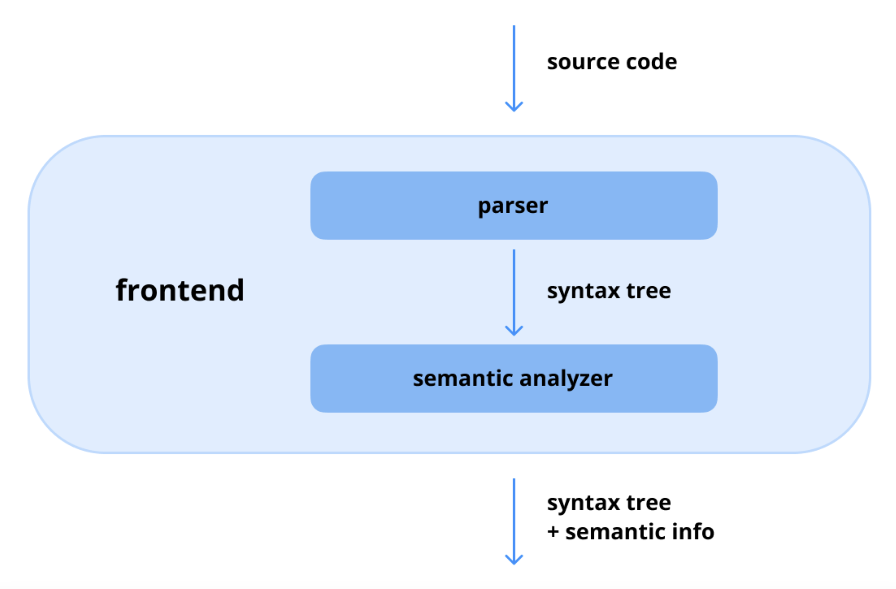

# Jetpack Compose의 구조는 무엇인가?

**Jetpack Compose**는 선언적 접근 방식을 사용하여 네이티브 안드로이드 애플리케이션을 빌드하기 위한 현대적인 UI 툴킷입니다. (JetBrains에서 개발한 Compose Multiplatform은 크로스플랫폼을 지원합니다.) 그 구조는 **Compose 컴파일러**, **Compose 런타임**, **Compose UI**라는 세 가지 핵심 구성 요소로 이루어져 있습니다. 각 구성 요소는 UI 코드를 인터랙티브한 애플리케이션으로 변환하는 데 중요한 역할을 합니다.

---

## 1. Compose 컴파일러 (Compose Compiler)

**Compose 컴파일러**는 코틀린으로 작성된 선언적 UI 코드를 Jetpack Compose가 실행할 수 있는 최적화된 코드로 변환하는 책임을 집니다. 컴파일 중에 `@Composable` 함수를 처리하고 필요한 UI 업데이트 및 리컴포지션(recomposition) 로직을 생성합니다. 컴파일러는 코틀린 컴파일러와 통합되어 효율적인 코드 생성을 보장하며, 상태 관리, 코드 최적화, 성능 향상을 위한 람다 리프팅(lambda lifting)과 같은 기능을 지원합니다.

기존의 [KAPT](https://kotlinlang.org/docs/kapt.html)나 [KSP](https://github.com/google/ksp)와 같은 어노테이션 처리 도구와 달리, Compose 컴파일러 플러그인은 **FIR(Frontend Intermediate Representation, 프론트엔드 중간 표현)** 에 직접 작동합니다. 이러한 고급 통합을 통해 컴파일러는 컴파일 중에 더 깊은 정적 코드 통찰력에 접근할 수 있으며, 이를 통해 코틀린 소스 코드를 동적으로 변환하고 최적화된 자바 바이트코드를 생성할 수 있습니다. `@Composable`과 같은 Compose 라이브러리의 어노테이션은 Compose 컴파일러의 내부 메커니즘과 원활하게 작동하여 코드 생성, 리컴포지션 관리, 성능 최적화와 같은 작업을 조율합니다. 이 독특한 접근 방식은 코틀린 컴파일러 파이프라인과의 긴밀한 통합을 보장하여 개발 효율성과 런타임 성능을 모두 향상시킵니다.

## 2. Compose 런타임 (Compose Runtime)

**Compose 런타임**은 **리컴포지션과 상태 관리**를 지원하는 데 필요한 핵심 기능을 제공합니다. 변경 가능한 상태(mutable states)를 처리하고, 스냅샷(snapshots)을 관리하며, 애플리케이션의 상태가 변경될 때마다 UI 업데이트를 트리거합니다. 이 구성 요소는 Compose의 반응형 UI 시스템을 구동하는 엔진 역할을 하여, 상태 변경에 따라 올바른 UI 요소가 동적으로 업데이트되도록 보장합니다.

Compose 런타임은 **갭 버퍼(gap buffer)** 데이터 구조에서 영감을 받은 **슬롯 테이블(slot table)** 을 사용하여 컴포지션의 상태를 메모아이징(memoizing, 기억)하는 방식으로 작동합니다. 내부적으로는 반응형 UI를 구축하는 데 필수적인 몇 가지 중요한 작업을 수행합니다. 여기에는 부작용(side-effects) 관리, `remember`를 사용한 상태 보존, 상태 변경 시 리컴포지션 트리거, `CompositionLocal`을 사용한 컨텍스트별 데이터 저장, 그리고 UI 계층 구조를 효율적으로 생성하기 위한 Compose 레이아웃 노드 구성이 포함됩니다. 이 동적 관리 시스템은 원활하고 반응적인 사용자 인터페이스 경험을 보장합니다.

## 💡 프로 팁: 갭 버퍼에서 링크 테이블로의 마이그레이션
[AOSP 코드](https://android-review.googlesource.com/c/platform/frameworks/support/+/2644758)를 살펴보면, 안드로이드 팀은 갭 버퍼에서 **링크 테이블(Link Table)** 데이터 구조로 마이그레이션하고 있습니다. 링크 테이블은 연결된 노드(linked nodes)를 사용하여 데이터를 구성하므로 요소의 삽입, 삭제 및 재배열이 효율적입니다. 이러한 변경은 슬롯 테이블을 구축하는 현재의 효율성은 보존하면서 편집 성능을 향상시키는 것을 목표로 합니다.

## 3. Compose UI

**Compose UI** 계층은 애플리케이션을 빌드하기 위한 **고수준 컴포넌트와 UI 위젯**을 제공합니다. 여기에는 텍스트, 버튼, 레이아웃 컨테이너와 같은 기본 요소뿐만 아니라 사용자 정의 UI 컴포넌트를 만들기 위한 더 고급 API도 포함됩니다. Compose UI 모듈은 안드로이드의 UI 시스템과 통합되어 안드로이드 기기에서 Compose 기반 UI가 원활하게 렌더링되도록 합니다.

Compose UI 라이브러리는 Compose 레이아웃 트리를 간단하게 구축하도록 설계된 광범위한 컴포넌트를 제공하며, 이 트리는 Compose 런타임에 의해 처리됩니다. [코틀린 멀티플랫폼](https://kotlinlang.org/docs/multiplatform.html) 지원을 통해, JetBrains는 [**Compose Multiplatform**](https://www.jetbrains.com/compose-multiplatform/)을 안정 버전으로 출시하여 개발자가 안드로이드, iOS, 데스크톱, WebAssembly를 포함한 여러 플랫폼에 걸쳐 동일한 Compose UI 라이브러리를 사용하여 일관된 UI를 만들 수 있게 했습니다. 이러한 크로스플랫폼 호환성은 개발을 간소화하고 통합된 사용자 경험을 보장합니다.

---
## 요약

Jetpack Compose의 구조는 관심사를 효과적으로 분리하도록 설계되었습니다. **Compose 컴파일러**는 UI 코드를 실행 가능한 컴포넌트로 변환하고, **Compose 런타임**은 상태와 리컴포지션을 관리하며, **Compose UI 계층**은 바로 사용할 수 있는 위젯과 UI 컴포넌트를 제공합니다. 이러한 계층화된 아키텍처는 모듈식이고, 효율적이며, 유지보수하기 쉬운 안드로이드 애플리케이션 개발을 보장합니다.

---
## Q. Compose 컴파일러의 역할은 무엇이며, KAPT나 KSP와 같은 전통적인 어노테이션 처리기와 어떻게 다른가요?

Jetpack Compose의 마법과 같은 동작 이면에는 **Compose 컴파일러(Compose Compiler)** 의 핵심적인 역할이 있습니다. Compose 컴파일러는 전통적인 어노테이션 처리기(Annotation Processor)와는 근본적으로 다른 방식으로 작동하여 선언적 UI를 가능하게 합니다.

---
### 1. Compose 컴파일러의 역할

#### 1.1. 핵심 역할: `@Composable` 함수 변환
Compose 컴파일러의 주된 역할은 개발자가 작성한 **`@Composable` 어노테이션이 붙은 코틀린 함수를, Compose 런타임이 이해하고 UI 트리를 생성할 수 있는 최적화된 코드로 변환**하는 것입니다. 이는 단순한 코드 생성을 넘어, 기존 함수의 구조 자체를 변경하는 강력한 변환 작업입니다.

#### 1.2. 주요 변환 작업
컴파일 과정에서 Compose 컴파일러는 `@Composable` 함수에 다음과 같은 작업을 수행합니다.

* **파라미터 추가:**
    개발자가 작성한 코드에는 보이지 않지만, 컴파일러는 모든 `@Composable` 함수에 두 개의 숨겨진 파라미터를 주입합니다.
    1.  **`$composer: Composer`**: 컴포지션을 관리하고, 슬롯 테이블(UI 트리 및 상태 정보 저장소)과 상호작용하며, 상태를 추적하는 중심적인 객체입니다.
    2.  **`$changed: Int`**: 이전 컴포지션 이후 파라미터가 변경되었는지를 추적하는 비트마스크(bitmask)입니다. 이 값을 통해 런타임은 입력값이 변경되지 않은 컴포저블의 재실행(리컴포지션)을 건너뛰는 **스마트한 최적화**를 수행할 수 있습니다.

* **함수 본문 래핑(Wrapping):**
    개발자가 작성한 원래 함수의 본문을, `Composer`와 상호작용하는 코드로 감쌉니다. 이 래핑 코드는 `$changed` 파라미터를 확인하여 리컴포지션이 필요한지 판단하고, UI 트리에 노드를 방출(emit)하며, `remember`와 같은 기능이 올바르게 동작하도록 관리합니다.

* **Compose 핵심 기능 활성화:**
    이러한 컴파일러의 변환 작업 덕분에 다음과 같은 Compose의 핵심 기능들이 가능해집니다.
    * **리컴포지션(Recomposition):** 상태가 변경되었을 때 UI의 일부만 다시 그립니다.
    * **상태 관리(State Management):** `State<T>` 객체의 변경을 감지하고 관련 컴포저블의 리컴포지션을 예약합니다.
    * **위치 기반 메모아이제이션(Positional Memoization):** `remember`를 사용하여 리컴포지션 간에 상태를 유지합니다.

---
### 2. KAPT/KSP와의 주요 차이점

Compose 컴파일러는 Dagger/Hilt에서 사용하는 KAPT나 Moshi에서 사용하는 KSP와 같은 전통적인 어노테이션 처리기와는 근본적으로 다릅니다.

#### 2.1. 어노테이션 처리기 (KAPT/KSP)의 작동 방식
* **핵심:** 기존 코드를 **읽어서(read)**, **새로운 파일을 생성(generate)** 합니다.
* **동작:** 컴파일 과정의 별도 단계에서 실행됩니다. 어노테이션이 붙은 코드를 분석하여, 그 정보를 바탕으로 완전히 새로운 소스 파일(예: Dagger의 `_Factory` 클래스, Moshi의 `JsonAdapter` 클래스)을 생성합니다.
* **한계:** 기존 코드의 내용을 **수정하거나 변경할 수는 없습니다.**

#### 2.2. Compose 컴파일러의 작동 방식
* **핵심:** 코틀린 컴파일러 **플러그인(Plugin)** 으로, 컴파일러의 **내부 동작에 직접 관여**합니다.
* **동작:** 코틀린 컴파일러(Kotlinc)의 파이프라인에 직접 연결되어, 컴파일러의 중간 표현(Intermediate Representation, IR) 단계에서 코드를 분석하고 **기존 코드 자체를 변환(transform)**합니다. `@Composable` 함수의 바이트코드를 재작성하여 숨겨진 파라미터를 추가하고 로직을 래핑합니다.
* **장점:** 기존 코드를 수정할 수 있기 때문에, 개발자가 작성하는 코드(소스 코드)는 간결하게 유지하면서도 컴파일된 결과물(바이트코드)에는 복잡한 상태 관리 및 최적화 로직을 주입할 수 있습니다.

#### 2.3. 차이점 요약표

| 구분 | KAPT / KSP (어노테이션 처리기) | Compose Compiler (컴파일러 플러그인) |
| --- | --- | --- |
| **유형** | 어노테이션 프로세서 (Annotation Processor) | 코틀린 컴파일러 플러그인 (Kotlin Compiler Plugin) |
| **통합 수준** | 컴파일의 별도 단계로 실행 | 주 코틀린 컴파일러 파이프라인에 직접 연결 |
| **핵심 능력** | 기존 코드를 읽고, **새로운 파일을 생성** | 기존 코드를 읽고, 해당 코드를 **수정/변환하여 새로운 바이트코드 생성** |
| **코드 수정** | 기존 함수의 본문을 변경할 수 **없음** | 기존 함수의 파라미터를 추가하고 본문을 래핑하는 등 **수정 가능** |
| **주요 산출물** | `MyClass_Factory.java`, `MyClassJsonAdapter.kt` 등 별도의 파일 | 수정된 `@Composable` 함수의 바이트코드 |
| **주 사용 사례** | 의존성 주입(Dagger/Hilt), 직렬화(Moshi) | 선언적 UI 변환 (Jetpack Compose) |

---
### 3. 결론

**Compose 컴파일러**는 단순한 어노테이션 처리기가 아니라, 코틀린 컴파일러와 깊숙이 통합되어 `@Composable` 함수를 Compose 런타임이 이해하고 실행할 수 있는 코드로 **재창조**하는 강력한 도구입니다. 기존 코드를 수정할 수 있는 이 능력 덕분에, 개발자는 간결한 선언적 코드를 작성하는 것만으로도 복잡한 상태 추적, 조건부 재구성, 그리고 최적화의 이점을 누릴 수 있으며, 이것이 바로 Jetpack Compose의 마법과 같은 동작을 가능하게 하는 핵심 기술입니다.

## Q. Compose 런타임은 리컴포지션과 상태를 어떻게 관리하며, 내부적으로 어떤 데이터 구조를 사용하나요?

Compose 런타임은 Jetpack Compose의 핵심 엔진으로, UI의 **상태(State)** 변경을 감지하고 이에 따라 화면을 효율적으로 다시 그리는 **리컴포지션(Recomposition)** 과정을 관리합니다. 이 모든 과정은 **슬롯 테이블(Slot Table)** 이라는 특별한 내부 데이터 구조를 통해 이루어집니다.

---
### 1. Compose 런타임의 상태(State) 관리 방식

#### 1.1. 상태 관찰 (State Observation)
Compose의 상태 관리는 '관찰'을 기반으로 합니다.
1.  **상태 객체 생성:** UI 상태는 일반적으로 `mutableStateOf()`를 사용하여 `MutableState<T>` 객체로 만들어집니다.
2.  **상태 읽기 및 구독:** `@Composable` 함수 내에서 이 상태 객체의 `.value` 속성을 **읽는 순간**, Compose 런타임은 "이 컴포저블이 이 상태 값을 읽었다"는 사실을 기록합니다. 즉, 해당 컴포저블의 범위(scope)와 상태 객체 간에 암묵적인 **구독 관계**가 형성됩니다.

#### 1.2. 상태 변경 및 리컴포지션 예약
1.  **상태 쓰기 및 알림:** 코드의 어딘가에서 이 상태 객체의 `.value`에 **새로운 값을 할당(쓰기)**하면, `State` 객체는 자신을 구독하고 있던 모든 컴포저블 범위에 "내가 변경되었다"고 알립니다.
2.  **리컴포지션 스케줄링:** 이 알림을 받은 Compose 런타임은 해당 컴포저블들을 즉시 다시 실행하는 것이 아니라, "리컴포지션이 필요함"이라고 표시하고 다음 프레임에 실행되도록 **스케줄링**합니다. 이는 여러 상태 변경이 짧은 시간 안에 발생하더라도 단 한 번의 리컴포지션으로 묶어서 처리하여 효율성을 높입니다.

---
### 2. Compose 런타임의 리컴포지션(Recomposition) 관리 방식

리컴포지션은 상태가 변경된 컴포저블 함수들을 다시 실행하여 UI 트리를 업데이트하는 과정입니다. Compose 런타임은 이 과정을 매우 지능적으로 관리합니다.

#### 2.1. 선택적 및 지능적 리컴포지션
Compose는 상태가 변경되었다고 해서 전체 UI를 다시 그리지 않습니다. 오직 **상태를 읽었던(구독했던) 컴포저블과, 그 컴포저블이 호출하는 다른 컴포저블들만** 리컴포지션의 대상이 됩니다. 이는 불필요한 재계산을 최소화하는 핵심 원리입니다.

#### 2.2. 리컴포지션 건너뛰기 (Skipping)
Compose 런타임은 성능 최적화를 위해 리컴포지션을 건너뛸 수 있는지 적극적으로 판단합니다.
* **안정적인(Stable) 파라미터:** 컴포저블에 전달되는 파라미터가 변경되지 않았다면, 런타임은 해당 컴포저블의 재실행을 건너뛰고 이전 컴포지션 결과를 재사용할 수 있습니다. (Compose 컴파일러는 `$changed`라는 숨겨진 파라미터를 통해 이를 추적합니다.)
* **결과:** 이 "스마트 리컴포지션" 덕분에 개발자는 UI의 특정 부분만 업데이트할 수 있어, 앱의 성능이 크게 향상됩니다.

#### 2.3. 프레임 기반 스케줄링
모든 UI 업데이트는 안드로이드의 `Choreographer`에 의해 다음 프레임에 맞춰 스케줄링됩니다. 이를 통해 부드러운 애니메이션과 일관된 렌더링 주기를 보장합니다.

---
### 3. 내부 핵심 데이터 구조: 슬롯 테이블 (Slot Table)

Compose 런타임이 이 모든 상태와 리컴포지션을 관리하기 위해 내부적으로 사용하는 핵심 데이터 구조는 **슬롯 테이블(Slot Table)** 입니다.

#### 3.1. 슬롯 테이블이란?
슬롯 테이블은 컴포지션의 결과(UI 트리 구조, `remember`로 저장된 값 등)를 저장하는 데이터 구조입니다. UI 트리를 일종의 평평한(flattened) 선형 배열 형태로 저장한다고 생각할 수 있습니다. 각 컴포저블 함수 호출과 그와 관련된 데이터는 테이블의 특정 "슬롯"에 저장됩니다.

#### 3.2. 저장되는 정보 및 역할
* **UI 트리 구조:** 어떤 컴포저블이 어떤 순서로 호출되었는지를 기록합니다.
* **위치 기반 메모아이제이션 (Positional Memoization):** `remember` 키워드는 이 슬롯 테이블을 활용합니다. 컴포저블이 리컴포지션될 때, Compose 런타임은 슬롯 테이블에서 해당 컴포저블의 이전 위치(슬롯)를 찾아 저장되어 있던 값을 다시 반환합니다. 이를 통해 리컴포지션이 일어나도 상태가 유지될 수 있습니다.

#### 3.3. 영감을 받은 데이터 구조 (Gap Buffer → Link Table)
* 초기의 슬롯 테이블은 텍스트 편집기에서 커서 주변의 텍스트 삽입/삭제를 효율적으로 처리하는 데 사용되는 **갭 버퍼(Gap Buffer)** 데이터 구조에서 영감을 받았습니다. 이는 컴포지션 중 UI 요소가 추가되거나 제거될 때 효율적인 처리를 가능하게 했습니다.
* 최근에는 더 복잡한 UI 변경(예: 목록에서 아이템 이동) 시의 성능을 더욱 향상시키기 위해, 연결된 노드(linked nodes)를 사용하는 **링크 테이블(Link Table)** 기반의 구조로 발전하고 있습니다.

#### 3.4. Composer의 역할
`Composer` 객체는 Compose 컴파일러에 의해 모든 `@Composable` 함수에 주입되는 숨겨진 객체로, 컴포지션 중에 이 슬롯 테이블에 데이터를 쓰고 읽는 역할을 수행하는 "작성자"입니다.

---
### 4. 결론

요약하자면, Compose 런타임은 다음과 같은 방식으로 리컴포지션과 상태를 관리합니다.

1.  UI가 **`State`** 객체를 **읽으면(구독하면)**, 런타임은 이 관계를 기록합니다.
2.  **`State`** 객체의 값이 **변경되면**, 런타임은 이를 구독하는 UI에 대한 **리컴포지션을 스케줄링**합니다.
3.  다음 프레임에서 런타임은 변경 사항을 분석하여 **필요한 부분만 선택적으로 다시 실행(리컴포지션)** 하고, 변경되지 않은 부분은 건너뛰어 성능을 최적화합니다.
4.  이 모든 정보(UI 트리 구조, `remember` 상태 등)는 **슬롯 테이블**이라는 내부 데이터 구조에 **`Composer`** 에 의해 효율적으로 저장되고 관리됩니다.

이러한 체계적인 메커니즘을 통해 Jetpack Compose는 선언적으로 UI를 작성하면서도 뛰어난 성능과 반응성을 달성할 수 있습니다.