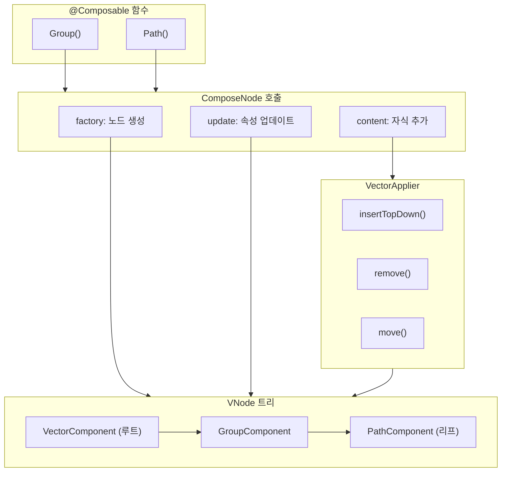

# 벡터 이미지 트리 구축 (Building Vector Image Tree)

벡터 이미지는 **벡터 그래픽의 요구 사항**에 더 잘 맞도록 `LayoutNode`보다 더 간단한 요소로 생성됩니다.

## VNode 트리 구조

### 기본 노드 클래스

```kotlin
// 그림 163. VNode.kt
sealed class VNode {
  abstract fun DrawScope.draw()
}

// 루트 노드
internal class VectorComponent : VNode() {
  val root = GroupComponent()

  override fun DrawScope.draw() {
    // 뷰포트 크기 설정 및 드로잉 캐시
  }
}

internal class PathComponent : VNode() {
  var pathData: List<PathNode>
  // 추가 속성들

  override fun DrawScope.draw() {
    // path 그리기
  }
}

internal class GroupComponent : VNode() {
  private val children = mutableListOf<VNode>()
  // 추가 속성들

  override fun DrawScope.draw() {
    // transform을 적용하여 자식 그리기
  }
}
```

### 노드 유형

위의 노드들은 기존 **벡터 drawable XML**에서 사용되는 트리 구조와 유사한 트리 구조를 정의합니다. 트리는 **두 가지 주요 유형**의 노드로 구성됩니다:

| 노드 타입 | 설명 |
|-----------|------|
| `GroupComponent` | 자식을 조합하고 **공유 변형(transform)** 을 적용 |
| `PathComponent` | 자식이 없는 **리프 노드**로 `pathData`를 그림 |

`fun DrawScope.draw()`는 노드와 그 자식의 내용을 그리는 방법을 제공합니다. 이 함수의 시그니처는 나중에 이 트리의 루트와 통합되는 **Painter 인터페이스**와 동일합니다.

> 기존 안드로이드 시스템의 XML 벡터 drawable 리소스를 표시하는 데 동일한 `VectorPainter`가 사용됩니다. XML 파서(parser)는 일련의 Composable 호출 체인으로 변환되는 비슷한 구조를 생성하는데, 겉으로는 다른 종류의 리소스와 동일한 구현을 가지게 됩니다.

---

## Composable 함수를 통한 노드 생성

위의 트리 노드들은 **내부적으로(internal)** 선언되어 있으며, 생성하는 유일한 방법은 해당하는 `Group`과 `Path`와 같은 `@Composable` 선언을 통하는 것입니다.

```kotlin
// 그림 164. VectorComposables.kt
@Composable
fun Group(
  scaleX: Float = DefaultScaleX,
  scaleY: Float = DefaultScaleY,
  ...
  content: @Composable () -> Unit
) {
  ComposeNode<GroupComponent, VectorApplier>(
    factory = { GroupComponent() },
    update = {
      set(scaleX) { this.scaleX = it }
      set(scaleY) { this.scaleY = it }
      ...
    },
    content = content
  )
}

@Composable
fun Path(
  pathData: List<PathNode>,
  ...
) {
  ComposeNode<PathComponent, VectorApplier>(
    factory = { PathComponent() },
    update = {
      set(pathData) { this.pathData = it }
      ...
    }
  )
}
```

### ComposeNode 매개변수

`ComposeNode` 호출은 **Composition으로 노드를 방출**하여 트리 요소를 생성합니다. 그 외에는 `@Composable` 함수가 트리와 상호 작용을 할 필요가 없습니다.

| 매개변수 | 설명 |
|----------|------|
| `factory` | 트리 노드가 어떻게 **생성**되는지 정의 (예: `PathComponent()` 또는 `GroupComponent()` 생성자 호출) |
| `update` | 이미 생성된 인스턴스의 속성을 **점진적으로 업데이트**하는 방법 제공 |
| `content` | **자식 노드를 부모에 추가**하는 방법 (리프 노드에서는 생략 가능) |

**update 람다 내부 동작:**
- Compose는 헬퍼 함수(`fun <T> Updater.set(value: T)` 또는 `fun <T> Updater.update(value: T)`)를 통해 데이터를 **메모이제이션**
- 제공된 값이 변경될 때만 트리 노드 속성을 새로 고쳐 **불필요한 무효화를 방지**

**content 동작:**
- 노드의 업데이트가 완료된 후 실행
- 방출된 모든 노드는 현재 노드가 **부모로 지정**

---

## VectorApplier를 통한 트리 조립

자식 노드를 부모에 연결하기 위해 Compose는 **Applier**를 사용합니다. `VNode`들은 `VectorApplier`를 통해 결합됩니다:

```kotlin
// 그림 165. VectorApplier.kt
class VectorApplier(root: VNode) : AbstractApplier<VNode>(root) {
  override fun insertTopDown(index: Int, instance: VNode) {
    current.asGroup().insertAt(index, instance)
  }

  override fun insertBottomUp(index: Int, instance: VNode) {
    // 트리가 top-down으로 구축되므로 무시됨
  }

  override fun remove(index: Int, count: Int) {
    current.asGroup().remove(index, count)
  }

  override fun move(from: Int, to: Int, count: Int) {
    current.asGroup().move(from, to, count)
  }

  override fun onClear() {
    root.asGroup().let { it.remove(0, it.numChildren) }
  }

  // VectorApplier는 [GroupComponent]에서만 동작함
  // 설계상 [PathComponent]에는 자식을 추가할 수 없음
  private fun VNode.asGroup(): GroupComponent {
    return when (this) {
      is GroupComponent -> this
      else -> error("Cannot only insert VNode into Group")
    }
  }
}
```

### Applier 인터페이스

`Applier` 인터페이스의 대부분의 메소드는 **리스트 연산(insert/move/remove)** 을 수행합니다.

- `AbstractApplier`는 `MutableList`에 대한 편의 확장을 제공하여 반복적인 재구현을 방지
- `VectorApplier`의 경우, `GroupComponent`에서 이러한 리스트 연산이 구현됨

### 삽입 방법: Top-Down vs Bottom-Up

| 방법 | 설명 |
|------|------|
| **Top-Down** | 노드를 트리에 **먼저 추가**한 다음 그 자식을 하나씩 삽입 |
| **Bottom-Up** | 노드를 생성하고 **모든 자식을 추가한 다음**에야 트리에 삽입 |

이렇게 여러 방법을 제공하는 것은 **성능**과 관련이 있습니다:

- 일부 환경에서는 트리에 자식을 추가할 때 관련 비용이 발생 (예: 이전 안드로이드 시스템에서 `View`를 추가할 때의 재배치)
- 벡터 사용 사례의 경우 이러한 성능 비용이 없으므로 노드는 **하향식(Top-Down)** 으로 삽입

> 자세한 내용은 [Applier 문서](https://cs.android.com/androidx/platform/frameworks/support/+/androidx-main:compose/runtime/runtime/src/commonMain/kotlin/androidx/compose/runtime/Applier.kt)를 참조하세요.

---

## 트리 구축 흐름



---

## 요약

- **VNode**는 벡터 그래픽을 위한 간단한 트리 노드로, `GroupComponent`(자식 조합 및 변형 적용)와 `PathComponent`(리프 노드, 경로 그리기) 두 가지 주요 유형이 있음
- 트리 노드는 `internal`로 선언되어 **`@Composable` 함수(`Group`, `Path`)를 통해서만 생성** 가능
- **`ComposeNode`** 는 `factory`(노드 생성), `update`(속성 업데이트), `content`(자식 추가) 세 가지 매개변수를 통해 트리 요소를 Composition에 방출
- **`VectorApplier`** 는 `Applier` 인터페이스를 구현하여 자식 노드를 부모에 연결하는 역할 수행
- 삽입 방법은 **Top-Down**(먼저 추가 후 자식 삽입)과 **Bottom-Up**(자식 완성 후 추가) 두 가지가 있으며, 벡터의 경우 성능 비용이 없어 **Top-Down** 방식 사용
