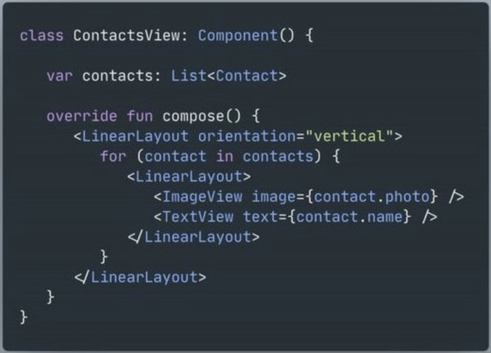
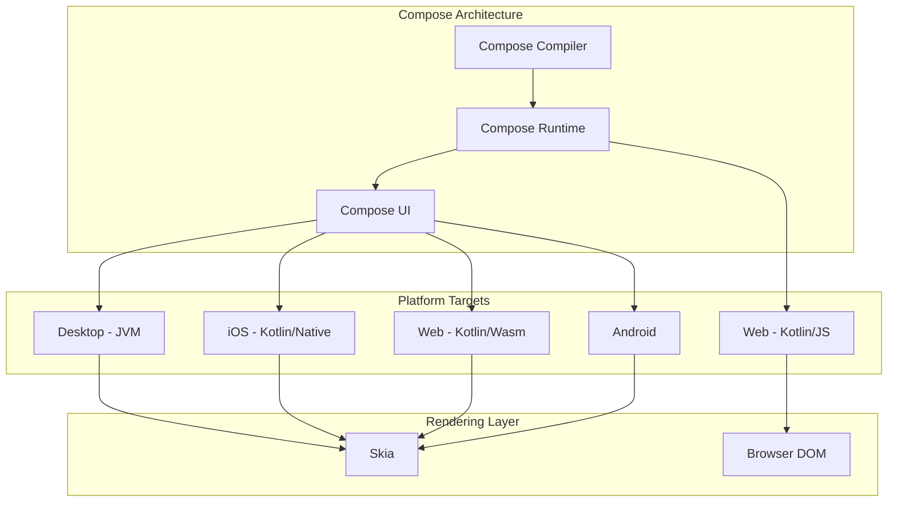

# Compose Runtime vs Compose UI

Compose 내부 구현을 이해하기 위해서는 **Compose UI**와 **Compose Runtime** 사이의 구분을 명확히 하는 것이 중요합니다.

## Compose UI와 Compose Runtime의 차이

| 구분 | 설명 |
|------|------|
| **Compose UI** | 새로운 안드로이드 UI 툴킷으로, 캔버스 위에 `LayoutNode` 트리가 표현하는 내용을 그립니다 |
| **Compose Runtime** | Compose의 기본적인 기계 장치와 다양한 **상태(state)** 및 **Composition** 관련 원시 요소(primitives)를 제공합니다 |

> 참고: [A Jetpack Compose by any other name - Jake Wharton](https://jakewharton.com/a-jetpack-compose-by-any-other-name/)

## Compose Runtime의 범용성

Compose 컴파일러가 **Kotlin 플랫폼 전체 범위**에 대한 지원을 받게 됨에 따라, 이제 거의 모든 곳에서 (Kotlin이 실행되는 한) 런타임을 **UI 또는 다른 트리 계층을 관리하는 용도**로 사용할 수 있게 되었습니다.

### 핵심 특징

- Compose Runtime에서는 **UI(또는 Android)를 직접 언급하는 것이 거의 없음**
- 런타임은 UI(또는 Android) 사용 사례를 지원하도록 생성 및 최적화되었지만, **어떤 종류의 트리 구조라도 구축하기에 충분히 일반적**
- React JS와 매우 유사한 접근 방식 - 웹 UI 외에도 [신테사이저나 3D 렌더러](https://github.com/chentsulin/awesome-react-renderer) 등 다양한 용도로 활용 가능

> Compose 개발자들이 라이브러리를 만들면서 **React로부터 영감**을 받았다는 것은 비밀이 아닙니다. 심지어 첫 번째 프로토타입인 "Kotlin 내의 XML"도 React가 가진 "JS 내의 HTML" 접근 방식을 연상시킵니다. 수년 동안 React로 만들어진 대부분의 서드 파티 작업은 Compose와 Kotlin 멀티플랫폼으로 다시 구현될 수 있습니다.

## Compose 멀티플랫폼 지원

Android 버전의 Compose가 베타를 벗어나기도 전에, **JetBrains**는 이미 Kotlin 멀티플랫폼에 대해 Compose를 적용하기 시작했습니다.

### 플랫폼별 구현 현황

| 플랫폼 | 렌더링 방식 | 재사용 범위 | 비고 |
|--------|------------|------------|------|
| **Desktop (JVM)** | Skia 래퍼 | Compose UI 전체 렌더링 계층 | 마우스/키보드 지원을 위해 이벤트 시스템 확장 |
| **iOS** | Skia | JVM에서 Kotlin/Native로 이식된 기존 로직 대부분 | - |
| **Web (JS)** | 브라우저 DOM | 컴파일러와 런타임만 | HTML/CSS 위에 정의되어 Compose UI와 다른 시스템 |
| **Web (Wasm)** | Skia 기반 | 세 가지 멀티플랫폼 버전 연결 가능성 | 브라우저 Wasm feature 지원 여부에 따라 제한적 |

> **2024년 5월 기준**: JVM Desktop, Kotlin/JS에 더하여 **iOS**, **Kotlin/Wasm**으로 타겟 플랫폼을 확장했습니다. 각 플랫폼별 기술의 안정성은 공식 문서에서 확인할 수 있습니다.

### Kotlin/Wasm 관련 참고사항

- 브라우저 자체에서 Wasm의 feature를 지원하지 않는 부분이 있어 실사용이 제한적
- 브라우저별 feature 지원 여부: [WebAssembly 공식 사이트](https://webassembly.org/features/)
- 각 feature들의 작업 단계: [WebAssembly proposals - GitHub](https://github.com/WebAssembly/proposals)
- **iOS 환경 주의**: Safari와 동일한 브라우저 엔진 사용이 강제되어 iOS Chrome에서도 문제 발생
- [iOS 17.4부터 유럽 사용자 대상 자체 브라우저 엔진 허용](https://www.theverge.com/2024/1/25/24050478/apple-ios-17-4-browser-engines-eu) (2024년 초)

## 모듈 구조 다이어그램

## 요약

- **Compose UI**는 Android UI 툴킷이고, **Compose Runtime**은 상태 관리와 Composition을 위한 핵심 기계 장치를 제공하는 별개의 레이어임
- Compose Runtime은 UI에 종속되지 않으며, **어떤 종류의 트리 구조든 구축할 수 있는 범용적인 런타임**
- Compose는 **React로부터 영감**을 받아 설계되었으며, 유사한 확장성을 가짐
- **Kotlin 멀티플랫폼** 지원을 통해 Desktop, iOS, Web(JS/Wasm) 등 다양한 플랫폼에서 Compose 사용 가능
- 플랫폼별로 **렌더링 계층(Skia/DOM)** 과 **재사용 범위(전체 UI/런타임만)** 가 다름
- Kotlin/Wasm은 브라우저의 Wasm feature 지원 현황에 따라 제약이 있으므로 모니터링 필요
