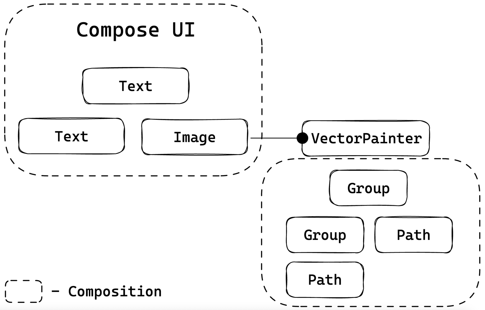

# 벡터 그래픽의 구성 (Composition of Vector Graphics)

Compose에서 벡터 렌더링은 전통적인 Android 시스템의 `Drawable`과 유사한 **Painter** 추상화를 통해 구현됩니다.

## 벡터 Painter 사용 예제

`rememberVectorPainter`를 사용하여 벡터 이미지를 생성할 수 있습니다.

```kotlin
// VectorExample.kt
Image(
  painter = rememberVectorPainter { width, height ->
    Group(
      scaleX = 0.75f,
      scaleY = 0.75f
    ) {
      val pathData = PathData { ... }
      Path(pathData = pathData)
    }
  }
)
```

## 벡터 Composable의 특징

`rememberVectorPainter` 블록 내의 함수들(`Group`과 `Path` 특히)도 **Composable**이지만 다른 종류입니다.

| 구분 | 일반 UI Composable | 벡터 Composable |
|------|-------------------|-----------------|
| **생성 요소** | `LayoutNode` | 벡터 특화 요소 |
| **용도** | UI 레이아웃 구성 | 벡터 트리 구성 후 캔버스에 렌더링 |
| **Composition** | UI Composition | VectorPainter 내부 Composition |



## 분리된 Composition

`Group`과 `Path`는 나머지 UI와는 **다른 Composition**에 존재합니다.

- 해당 Composition은 `VectorPainter` 내에 포함되어 있음
- **벡터 이미지를 설명하는 요소만** 사용 가능
- `Image`, `Box` 등 **일반 UI Composable은 금지**됨

> ⚠️ **주의**: 벡터 Composable의 검사는 **런타임 중에** 이루어집니다. 컴파일러는 `VectorPainter` 블록 내에서 `Image` 또는 `Box`를 사용해도 무시합니다. 이에 따라 이러한 페인터의 작성 방식이 잠재적으로 안전하지 않을 수 있습니다. Compose 컴파일러 팀이 향후 이러한 경우에 대한 **컴파일 시간 안전성**을 개선할 것으로 예상됩니다.

## 상태, 이펙트 및 런타임 규칙 적용

이전에 논의된 **상태**, **이펙트** 및 **런타임**에 관한 대부분의 규칙은 UI Composition에 이어 **벡터 Composition에서도 동일하게 적용**됩니다.

예를 들어, **Transition API**를 사용하여 UI와 함께 벡터 이미지의 변경을 애니메이션화할 수 있습니다.

## 참고 자료

- [VectorGraphicsDemo.kt](https://cs.android.com/androidx/platform/frameworks/support/+/56f60341d82bf284b8250cf8054b08ae2a91a787:compose/ui/ui/integration-tests/ui-demos/src/main/java/androidx/compose/ui/demos/VectorGraphicsDemo.kt)
- [AnimatedVectorGraphicsDemo.kt](https://cs.android.com/androidx/platform/frameworks/support/+/56f60341d82bf284b8250cf8054b08ae2a91a787:compose/animation/animation/integration-tests/animation-demos/src/main/java/androidx/compose/animation/demos/vectorgraphics/AnimatedVectorGraphicsDemo.kt)

---

## 요약

- Compose에서 벡터 렌더링은 **Painter 추상화**를 통해 구현되며, `rememberVectorPainter`로 벡터 이미지를 생성함
- `Group`과 `Path` 같은 벡터 Composable은 `LayoutNode` 대신 **벡터 특화 요소**를 생성함
- 벡터 Composable은 일반 UI와 **분리된 별도의 Composition**에서 동작하며, UI Composable 사용이 금지됨
- 벡터 Composable 검사는 **런타임에서만** 수행되어 잠재적 안전성 문제가 있음
- UI Composition의 상태, 이펙트, 런타임 규칙이 벡터 Composition에도 **동일하게 적용**됨
