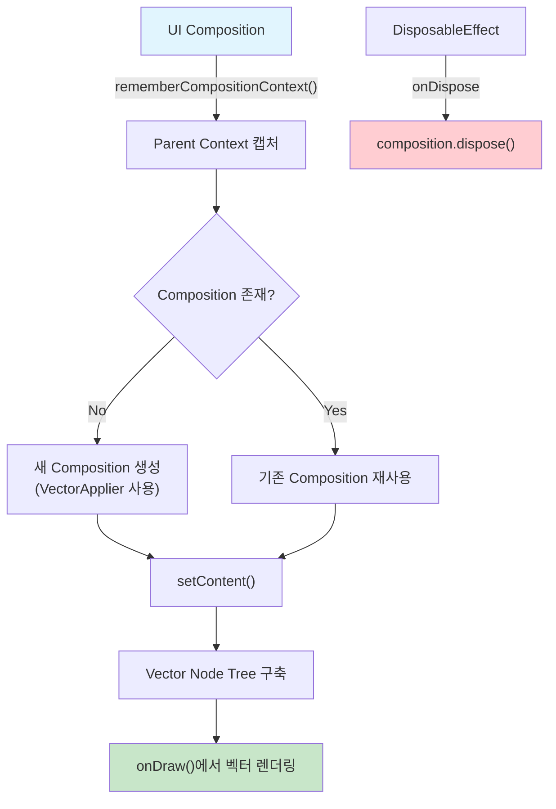

# Compose UI에 벡터 Composition 통합하기 (Integrating vector composition into Compose UI)

> **참고**: 번역 시점 기준, 아래에서 소개하는 `RenderVector`는 존재하지 않습니다. 불필요한 recomposition을 더 줄이기 위한 변경 사항에서 제거되었습니다. 저자와 번역팀이 이전에도 언급했듯이, 이런 구현들은 시간이 지나 변경되었을 확률이 높습니다. 고로, 초기 버전의 Compose를 바탕으로 하는 이 책을 통해서는 **설계의 의도를 파악**하세요. 그리고 변경 사항이 있다면 어떤 문제가 있었는지, 어떤 방식으로 문제를 해결했는지 살펴봄으로써 더 깊은 탐구를 하는 것을 권합니다.

---

## 개요

`Applier`와 함께 벡터 composition의 사용 준비가 거의 완료되었습니다. 마지막으로 남은 것은 **Painter 통합**입니다.

---

## RenderVector를 통한 Composition 연결

### VectorPainter.kt - RenderVector 함수

```kotlin
class VectorPainter internal constructor() : Painter() {
  ...

  // 1. Called in the context of UI composition
  @Composable
  internal fun RenderVector(
    content: @Composable (...) -> Unit
  ) {
    // 2. The parent context is captured with [rememberCompositionContext] 
    // to propagate its values, e.g. CompositionLocals.
    val composition = composeVector(
      rememberCompositionContext(),
      content
    )
    
    // 3. Whenever the UI "forgets" the VectorPainter, 
    // the vector composition is disposed with [DisposableEffect] below.
    DisposableEffect(composition) {
      onDispose {
        composition.dispose()
      }
    }
  }

  private fun composeVector(
    parent: CompositionContext,
    composable: @Composable (...) -> Unit
  ): Composition {
    ...
    // See implementation below
  }
}
```

### 핵심 동작 원리

Painter를 통합하기 위한 첫 번째 단계는 **Compose UI composition과 벡터 이미지 composition을 연결**하는 것입니다.

| 번호 | 설명 |
|:---:|------|
| **1** | `RenderVector`는 **UI composition 컨텍스트** 내에서 호출됩니다 |
| **2** | `rememberCompositionContext()`를 사용하여 **부모 컨텍스트를 캡처**하고, `CompositionLocals` 등의 값을 전파합니다 |
| **3** | UI가 `VectorPainter`를 "잊을" 때 `DisposableEffect`를 통해 벡터 composition이 **정리(dispose)** 됩니다 |

### RenderVector의 주요 특징

- `RenderVector`는 벡터 이미지의 설명이 담긴 `content` composable을 매개변수로 받습니다
- `Painter` 인스턴스는 일반적으로 recomposition 사이에 `remember`를 사용하여 **동일하게 유지**됩니다
- `content`가 변경되면 각 composition마다 `RenderVector`가 호출됩니다

### Composition Context의 역할

composition을 생성하는 것은 항상 **부모 컨텍스트**를 필요로 합니다:

- `rememberCompositionContext`를 사용하여 UI composition에서 부모 컨텍스트를 가져옵니다
- 두 composition이 **동일한 Recomposer에 연결**됩니다
- 모든 내부 값(예: 밀도에 대한 `CompositionLocal`)이 벡터 composition에도 **전파**됩니다

### Composition 생명주기 관리

composition은 업데이트 간 보존되지만, `RenderVector`가 범위를 벗어날 때 **폐기(dispose)** 되어야 합니다. `DisposableEffect`는 다른 종류의 구독을 관리하는 것과 유사하게 이러한 정리 작업을 관리합니다.

---

## 벡터 노드 트리 구축

마지막으로, 벡터 노드의 트리를 만들기 위해 **이미지 콘텐츠를 composition에 채우는 과정**이 있습니다. 벡터 노드 트리는 캔버스에 벡터 이미지를 그리는 데 사용됩니다.

### VectorPainter.kt - 전체 구현

```kotlin
class VectorPainter : Painter() {
  // The root component for the vector tree
  private val vector = VectorComponent()
  // 1. Composition with vector elements.
  private var composition: Composition? = null

  @Composable
  internal fun RenderVector(
    content: @Composable (...) -> Unit
  ) {
    ...
    // See full implementation above
  }

  private fun composeVector(
    parent: CompositionContext,
    composable: @Composable (...) -> Unit
  ): Composition {
    // 2. Creates composition or reuses an existing one
    val composition = 
      if (this.composition == null || this.composition.isDisposed) {
        Composition(
          VectorApplier(vector.root),
          parent
        )
      } else {
        this.composition
      }
      this.composition = composition

    // 3. Sets the vector content to the updated composable value 
    composition.setContent {
      // Vector composables can be called inside this block only
      composable(vector.viewportWidth, vector.viewportHeight)
    }

    return composition
  }

  // Painter interface integration, is called every time the system
  // needs to draw the vector image on screen
  override fun DrawScope.onDraw() {
    with(vector) {
      draw()
    }
  }
}
```

### 구현 세부 사항

| 번호 | 설명 |
|:---:|------|
| **1** | Painter는 **자체 composition**을 유지 관리합니다. `ComposeNode`는 composition에 전달된 `Applier`가 일치하도록 요구되는데, 벡터 노드와 **호환되지 않는 Applier**를 사용하기 때문입니다 |
| **2** | composition은 painter가 **초기화되지 않았거나** composition이 **범위를 벗어난 경우** 새로 생성됩니다 |
| **3** | composition이 생성된 후에는 `ComposeView` 내부에서 사용되는 것과 유사하게 `setContent`를 통해 채워집니다 |

### setContent의 동작

- `RenderVector`가 다른 `content`로 호출될 때마다 `setContent`가 다시 실행되어 **벡터 구조를 새로 고침**합니다
- `content`는 **root 노드에 자식을 추가**하는데, 이는 나중에 Painter의 내용을 그리기 위해 사용됩니다

---

## VectorPainter 통합 흐름



---

## 통합 완료

이로써 통합이 완료되었으며 `VectorPainter`는 이제 **화면에 @Composable 콘텐츠를 그릴 수 있게** 되었습니다.

### VectorPainter의 주요 기능

- 페인터 내부의 composable도 **UI composition에서 상태와 composition locals에 접근**하여 자체적으로 업데이트를 수행할 수 있습니다
- 이미 존재하는 composition에 **사용자 정의 트리를 생성하고 통합**하는 방법을 보여줍니다

> 다음 파트에서는 동일한 원칙을 기반으로 하여 **독립적으로 실행되는 Compose 시스템**을 Kotlin/JS에서 구축하는 방법을 살펴보겠습니다.

---

## 요약

- **VectorPainter**는 Compose UI와 벡터 이미지 composition을 연결하여 벡터 그래픽을 렌더링합니다
- `rememberCompositionContext()`를 통해 **부모 컨텍스트를 캡처**하고, 두 composition이 동일한 `Recomposer`에 연결됩니다
- **DisposableEffect**를 사용하여 composition의 생명주기를 관리하고, 범위를 벗어날 때 정리합니다
- Painter는 **자체 composition을 유지**하며, `VectorApplier`를 사용하여 벡터 노드 트리를 구축합니다
- `setContent`를 통해 벡터 콘텐츠를 설정하고, content가 변경될 때마다 **벡터 구조가 업데이트**됩니다
- 이 통합 패턴은 **사용자 정의 트리를 기존 composition에 통합**하는 방법의 실제 예시입니다
