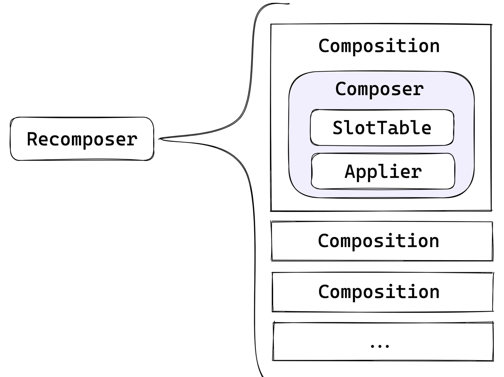
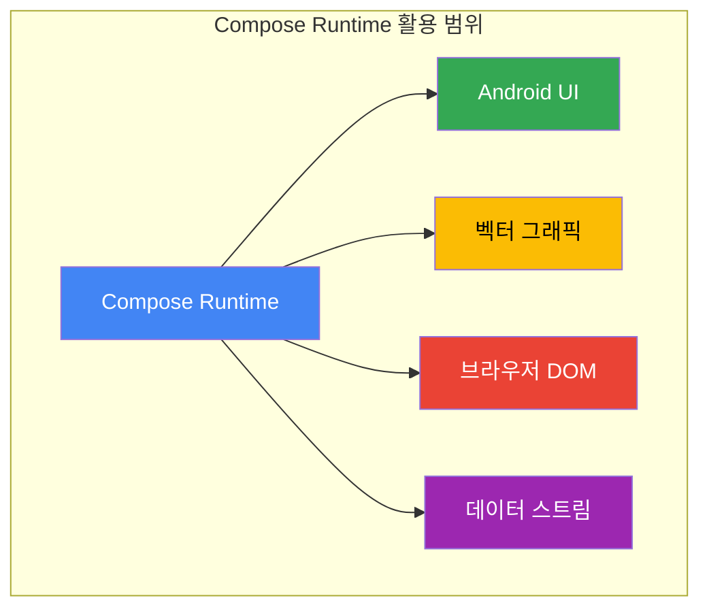

# Composition 재소개 ((Re-) Introducing Composition)

## 개요

**Composition**은 모든 Composable 함수에 대한 **컨텍스트를 제공**합니다. 핵심적으로 다음과 같은 역할을 수행합니다:

- **SlotTable** 기반의 "캐시" 제공
- **Applier**를 통해 사용자 정의 트리를 생성할 수 있는 인터페이스 제공

> **Recomposer**는 Composition을 구동하며, 관련된 무엇인가(예: 상태)가 변경될 때마다 **recomposition**을 발생시킵니다.

일반적으로 Composition은 **프레임워크 자체에 의해 생성**됩니다. 하지만 이 장에서는 일반적이지 않은 사용 사례에 대해 다루며, Composition을 **직접 만들고 관리하는 예시**를 소개합니다.



---

## Composition 생성하기

Composition을 직접 만들려면 제공된 **팩토리 메서드**를 사용할 수 있습니다.

```kotlin
// 그림 160. Composition.kt
fun Composition(
    applier: Applier<*>,
    parent: CompositionContext
): Composition = ...
```

### 매개변수 설명

| 매개변수 | 설명 |
|---------|------|
| `applier` | Composition에 의해 생성된 트리를 **생성하고 연결하는 방법**을 구현해 둔 Applier |
| `parent` | 부모 **CompositionContext** |

---

## CompositionContext 얻기

부모 context는 일반적으로 `rememberCompositionContext()`를 통해 모든 Composable 함수 내에서 사용할 수 있습니다.

```kotlin
// Composable 함수 내에서 context 얻기
val compositionContext = rememberCompositionContext()
```

> **Recomposer**도 `CompositionContext`를 구현하며, 이를 얻거나 자체적으로 생성할 수 있습니다.

---

## 고급 활용: 노드 없는 Composition

재미있는 아이디어를 공유하자면, Composable 함수의 다른 속성에만 관심이 있다면 **아무 일도 하지 않는 Applier 인스턴스**를 제공할 수 있습니다.

### 노드 없이 가능한 것들

노드 없이도 `@Composable` 어노테이션은 다음을 구동할 수 있습니다:
- **데이터 스트림 변환**
- 상태 변경에 반응하는 **이벤트 핸들러**

> 예시: [Cash App의 Molecule](https://github.com/cashapp/molecule) 라이브러리

### 구현 방법

```kotlin
// Applier<Nothing>을 만들고 ComposeNode를 사용하지 않으면 됩니다
val emptyApplier = object : Applier<Nothing> {
    // 아무 작업도 수행하지 않는 구현
}
```

---

## 이 장의 방향성

이 장의 나머지 부분은 **Compose UI 없이 Compose Runtime을 사용하는 데** 초점을 맞춥니다.

### 다룰 예시들

1. **벡터 그래픽 렌더링**
   - Compose UI 라이브러리에서 사용자 정의 트리가 벡터 그래픽을 렌더링하는 데 사용되는 경우

2. **브라우저 DOM 관리**
   - Kotlin/JS에서 Compose를 사용한 브라우저 DOM 관리 라이브러리의 토이 버전 제작



---

## 요약

- **Composition**은 모든 Composable 함수에 대한 컨텍스트를 제공하며, SlotTable 기반의 캐시와 Applier를 통한 트리 생성 인터페이스를 제공한다
- Composition을 직접 생성하려면 `Composition()` 팩토리 메서드에 **Applier**와 **CompositionContext**를 전달한다
- **Recomposer**가 Composition을 구동하며, 상태 변경 시 recomposition을 트리거한다
- 노드 없이 `Applier<Nothing>`을 사용하면 **데이터 스트림 변환**이나 **이벤트 핸들러** 구동에 Composable을 활용할 수 있다
- Compose Runtime은 Android UI 외에도 **벡터 그래픽 렌더링**, **브라우저 DOM 관리** 등 다양한 용도로 활용 가능하다
