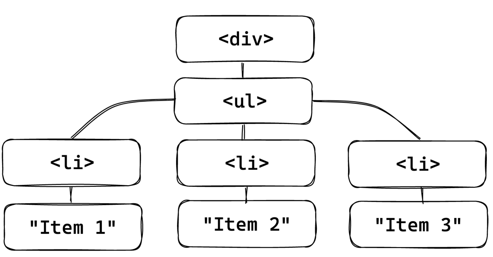
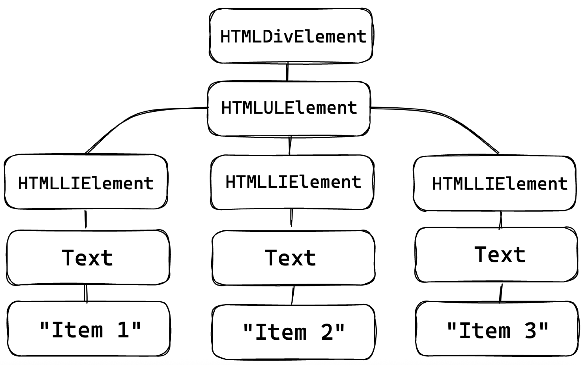
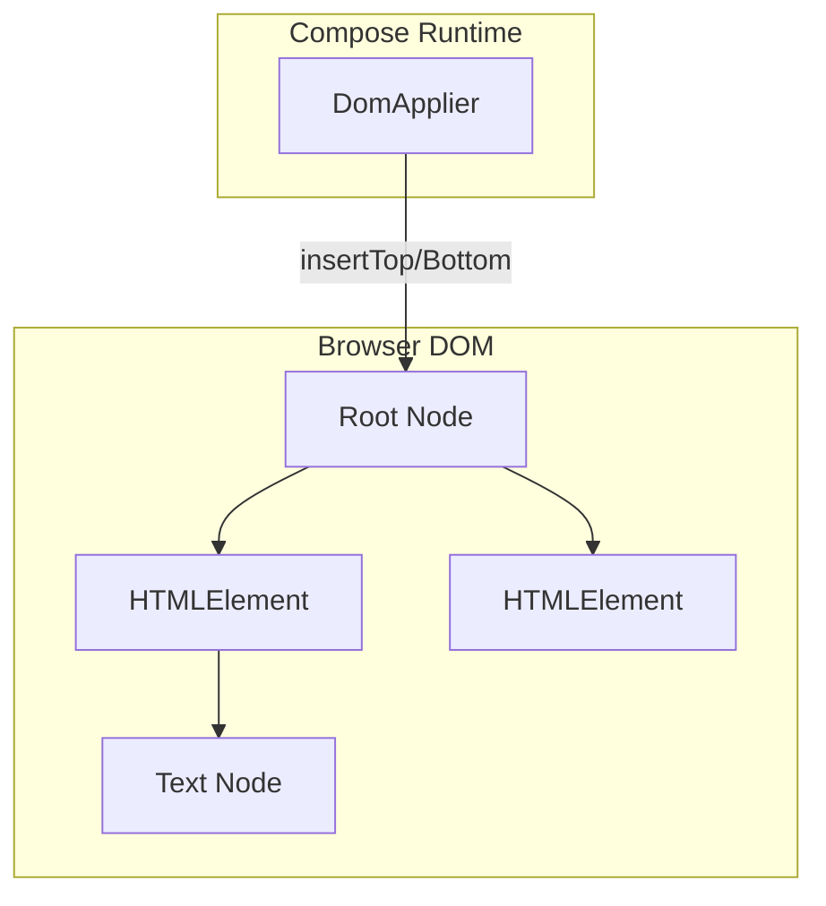

# Compose를 이용한 DOM 관리 (Managing DOM with Compose)

## 개요

**멀티플랫폼 지원**은 Compose에서 아직 새로운 개념으로, JVM 생태계 외부에서는 **런타임**과 **컴파일러**만 사용할 수 있습니다. 하지만 이 두 모듈이 바로 Composition을 만들고 그 안에서 무언가를 실행하는 데 필요한 전부이기 때문에 더 많은 실험이 가능합니다.

> Google의 Compose 컴파일러는 모든 Kotlin 플랫폼을 지원하지만, 런타임은 Android 전용으로 배포됩니다. 그러나 JetBrains는 [자체 버전의 Compose](https://github.com/JetBrains/compose-multiplatform/releases)를 JS 같은 멀티플랫폼 아티팩트를 포함하여 함께 출시하고 있습니다.

## 브라우저의 트리 구조 이해

Compose 사용을 시작하려면 먼저 **운영해야 할 트리**를 파악해야 합니다. 브라우저는 이미 HTML/CSS를 기반으로 한 "뷰" 시스템을 갖추고 있으며, 이 요소들은 Kotlin/JS 표준 라이브러리가 제공하는 **DOM**([Document Object Model](https://developer.mozilla.org/ko/docs/conflicting/Web/API/Document_Object_Model_a0b90593de4c5cb214690e823be115a18d605d4bc7719ba296e212da2abe18ef)) API를 통해 JS에서 조작할 수 있습니다.

### HTML 예시

```html
<div>
  <ul>
    <li>Item 1</li>
    <li>Item 2</li>
    <li>Item 3</li>
  </ul>
</div>
```

위 HTML은 세 개의 항목을 가진 **순서 없는(bulleted) 리스트**를 표시합니다.



## DOM 요소의 구성

DOM은 **트리 형태의 구조**로, Kotlin/JS에서 `org.w3c.dom.Node`로 표현되는 요소로 구성됩니다.

### 주요 DOM 요소

| 요소 타입 | 클래스 | 설명 | 생성 방법 |
|-----------|--------|------|-----------|
| **HTML 요소** | `org.w3c.dom.HTMLElement` 하위 클래스 | `li`, `div` 같은 태그 표현 | `document.createElement(<tagName>)` |
| **텍스트 요소** | `org.w3c.dom.Text` | 태그 사이의 텍스트 (예: "Item 1") | `document.createTextElement(<value>)` |

이러한 DOM 요소들을 사용하여 JS는 트리를 다음과 같이 볼 수 있습니다:



> 이 요소들은 벡터 이미지 Composition에서 사용된 `VNode`와 유사하게, Compose로 관리되는 트리를 구현하기 위한 기반을 제공합니다.

## Compose로 DOM 구현하기

### Tag 및 Text Composable

```kotlin
@Composable
fun Tag(tag: String, content: @Composable () -> Unit) {
  ComposeNode<HTMLElement, DomApplier>(
    factory = { document.createElement(tag) as HTMLElement },
    update = {},
    content = content
  )
}

@Composable
fun Text(value: String) {
  ReusableComposeNode<Text, DomApplier>(
    factory = { document.createTextElement("") },
    update = {
      set(value) { this.data = it }
    }
  )
}
```

### 태그 불변성 주의사항

**태그는 변경될 수 없습니다.** 예를 들어 `<audio>`가 `<div>`와 완전히 다른 브라우저 표현을 가지는 것과 같이, 태그 이름이 변경된 요소는 **재생성**되어야 합니다. Compose는 이를 자동으로 처리하지 않으므로 같은 Composable에 다른 태그 이름을 전달하는 것을 피해야 합니다.

> **노드 재생성 팁**: 각 노드를 별도의 Composable(예: `Div`, `Ul` 등)로 감싸면 컴파일 시점에 다른 그룹을 생성하여, Compose에게 해당 요소를 속성만 업데이트하는 대신 완전히 교체해야 한다는 신호를 줄 수 있습니다.

### ReusableComposeNode 활용

`Text` 요소는 구조적으로 동일하므로 `ReusableComposeNode`로 표시합니다. 이렇게 하면 Compose가 다른 그룹 내에서 이 노드들을 발견하더라도 **인스턴스를 재사용**합니다. 정확성을 보장하기 위해 텍스트 노드는 내용 없이 생성되며, 값은 `update` 매개변수를 사용하여 설정됩니다.

## Applier 구현

트리에 요소들을 조합하기 위해 Compose는 **DOM 요소를 조작하는 Applier 인스턴스**가 필요합니다. 그 로직은 이전의 `VectorApplier`와 매우 유사하지만, 자식을 추가/제거하는 DOM 노드의 메소드가 약간 다릅니다.



> 자세한 참조가 필요하다면 [웹용 Compose에서 사용된 Applier](https://github.com/JetBrains/compose-multiplatform/blob/6d97c6d0555f056d2616f417c4d130e0c2147e32/web/core/src/jsMain/kotlin/org/jetbrains/compose/web/DomApplier.kt#L63-L91)를 확인하세요.

---

## 요약

- **Compose 멀티플랫폼**은 런타임과 컴파일러만으로도 다양한 플랫폼에서 Composition을 생성할 수 있음
- 브라우저의 **DOM(Document Object Model)**은 트리 형태 구조로, `HTMLElement`와 `Text` 노드로 구성됨
- `ComposeNode`를 사용해 HTML 태그를, `ReusableComposeNode`를 사용해 텍스트 요소를 Composable로 표현
- **태그는 불변**이므로, 태그 변경 시 노드 재생성이 필요하며 별도의 Composable로 감싸는 것이 권장됨
- **Applier**는 Compose가 DOM 요소를 조작(추가/제거/이동)하는 데 필요한 핵심 컴포넌트
