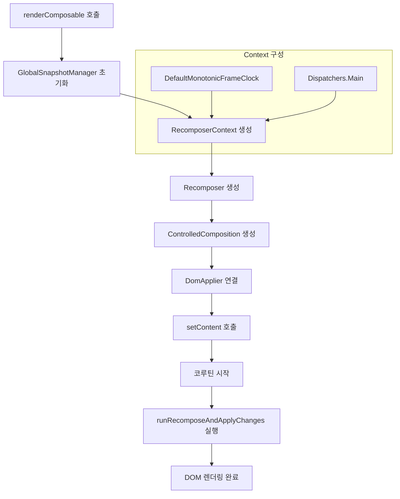

# 브라우저에서의 독립 구성 (Standalone Composition in the Browser)

새로운 composable을 UI로 결합하고자 할 때, Compose는 **활성화된 composition**이 필요합니다. Compose UI에서는 모든 초기화가 이미 `ComposeView`에서 이루어지지만, **브라우저 환경**에서는 이를 처음부터 구축해야 합니다.

> 아래에 설명된 모든 구성 요소는 **"common" 코틀린 코드**에 존재하므로, 다른 플랫폼에서도 동일한 원칙이 적용될 수 있습니다.

---

## renderComposable 함수

`renderComposable`은 composition 시작과 관련된 모든 구현 세부 사항을 숨기고, **DOM 요소에 composable 요소를 렌더링**할 수 있는 방법을 제공합니다.

```kotlin
// renderComposable.kt
fun renderComposable(root: HTMLElement, content: @Composable () -> Unit) {
  GlobalSnapshotManager.ensureStarted()

  val recomposerContext = DefaultMonotonicFrameClock + Dispatchers.Main
  val recomposer = Recomposer(recomposerContext)

  val composition = ControlledComposition(
    applier = DomApplier(root),
    parent = recomposer
  )

  composition.setContent(content)

  CoroutineScope(recomposerContext).launch(start = UNDISPATCHED) {
    recomposer.runRecomposeAndApplyChanges()
  }
}
```

### 설정 과정 상세 분석

| 단계 | 구성 요소 | 설명 |
|:---:|:---|:---|
| 1 | `GlobalSnapshotManager` | 상태 업데이트를 담당하는 **스냅샷 시스템** 초기화. 런타임에서 제외되어 있어 필요시 Android 소스에서 복사 가능 |
| 2 | `recomposerContext` | JS 기본값을 사용한 **Recomposer의 코루틴 컨텍스트** 생성. `MonotonicClock`은 `requestAnimationFrame` 사용, `Dispatchers.Main`은 JS의 단일 스레드 참조 |
| 3 | `ControlledComposition` | **Composition 생성**. Recomposer를 부모로 사용 (최상위 composition의 부모는 항상 recomposer) |
| 4 | `setContent` | **Composition 내용 설정**. 모든 업데이트는 제공된 composable 내에서 발생 |
| 5 | `runRecomposeAndApplyChanges` | 코루틴 시작 후 **recomposition 과정** 시작. Android에서는 Activity/View 생명주기에 연결됨 |

---

## 기본 HTML 렌더링

위의 기본 요소들(Primitives)이 조합되어 HTML 페이지의 내용을 렌더링할 수 있습니다.

```kotlin
// HtmlSample1.kt
fun main() {
  renderComposable(document.body!!) {
    // equivalent of <button>Click me!</button>
    Tag("button") {
      Text("Click me!")
    }
  }
}
```

---

## 이벤트 처리와 상호작용

정적 콘텐츠를 만드는 것은 더 쉬운 방법으로 달성할 수 있지만, **상호 작용**을 구현하기 위해 Compose가 필요합니다. DOM에서는 Android View와 마찬가지로 **클릭 리스너**를 사용하여 이를 달성할 수 있습니다.

> **참고**: Compose UI에서 많은 리스너가 `Modifier` 확장을 통해 정의되지만, 그 구현은 `LayoutNode`에 특정되어 있으므로 이 토이 웹 라이브러리에서는 사용할 수 없습니다. Modifier 동작을 복사하고 노드를 조정하여 더 나은 통합을 제공하는 것은 가능하지만, 이는 독자를 위한 연습 과제로 남겨둡니다.

### Tag Composable에 클릭 리스너 추가

```kotlin
// HtmlTags.kt
@Composable
fun Tag(
  tag: String,
  // this callback is invoked on click events
  onClick: () -> Unit = {},
  content: @Composable () -> Unit
) {
  ComposeNode<HTMLElement, DomApplier>(
    factory = { createTagElement(tag) },
    update = {
      // when listener changes, the listener on the DOM node is re-set
      set(onClick) { 
        this.onclick = { _ -> onClick() }
      }
    },
    content = content
  )
}
```

각 태그는 **람다 매개변수**로 클릭 리스너를 정의할 수 있으며, 모든 `HTMLElement`에 정의된 `onclick` 속성을 사용하여 DOM 노드로 전파됩니다.

---

## 카운터 예제 (상태 관리)

`Tag` composable에 `onClick` 매개변수를 전달하여 **클릭 이벤트를 처리**할 수 있습니다.

```kotlin
// HtmlSampleCounter.kt
fun main() {
  renderComposable(document.body!!) {
    // Counter state is updated on click
    var counterState by remember { mutableStateOf(0) }

    Tag("h1") {
      Text("Counter value: $counterState")
    }

    Tag("button", onClick = { counterState++ }) {
      Text("Increment!")
    }
  }
}
```

---

## 확장 가능성

이 토이 라이브러리를 확장할 수 있는 여러 가지 방법이 있습니다:

- **CSS 지원** 추가
- **더 많은 이벤트** 지원
- **다양한 HTML 요소** 지원

JetBrains 팀은 현재 웹을 위한 더 **고급 버전의 Compose**를 실험 중입니다. 이 버전은 동일한 원칙에 기반을 두고 있지만, 웹에서 구축할 수 있는 다양한 것들을 지원하기 위해 여러 면에서 더 발전되었습니다.

- [기술 데모 (GitHub)](https://github.com/JetBrains/compose-multiplatform/tree/master/html)

> **번역 시점 참고 (2024년 5월)**: 초기 버전의 웹용 멀티플랫폼 라이브러리는 **Compose HTML**이라는 Kotlin/JS를 타겟으로 하는 라이브러리로 분리되었고, 더 이상 멀티플랫폼의 일부분이 아닙니다. 현재는 **Kotlin/Wasm**을 통한 멀티플랫폼 지원에 초점을 맞추고 있습니다.
> - [FAQ 참조](https://kotlinlang.org/docs/multiplatform/faq.html#what-about-future-support-for-web-targets-in-kotlin-and-compose-multiplatform)

---

## Composition 초기화 흐름



---

## 요약

- **브라우저 환경**에서 Compose를 사용하려면 `ComposeView` 없이 composition을 직접 구축해야 함
- `renderComposable` 함수는 **DOM 요소에 composable을 렌더링**하는 진입점 역할
- 초기화 과정: `GlobalSnapshotManager` → `Recomposer` → `ControlledComposition` → `setContent` → `runRecomposeAndApplyChanges`
- `ComposeNode`를 사용하여 **HTML 태그와 이벤트 리스너**를 Compose 방식으로 선언 가능
- `remember`와 `mutableStateOf`를 활용한 **상태 관리**로 반응형 UI 구현 가능
- JetBrains는 **Compose HTML** (Kotlin/JS) 및 **Kotlin/Wasm** 기반 웹 지원을 발전시키고 있음
