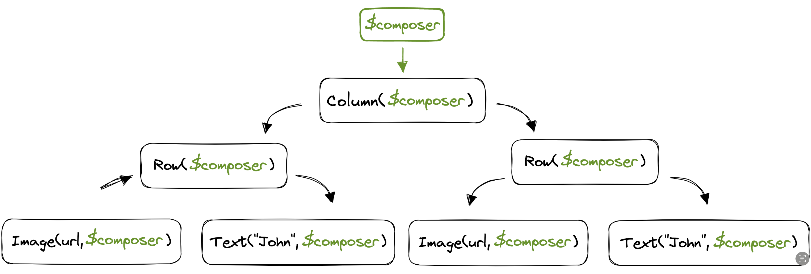

# 호출 컨텍스트 (Calling context)

Composable 함수의 속성은 대부분 Compose Compiler에 의해 활성화됩니다. Kotlin 컴파일러 플러그인인 Compose Compiler는 일반적인 컴파일러 실행단계 중에 동작하며, Kotlin 컴파일러가 액세스할 수 있는 모든 정보에 액세스할 수 있습니다. 이로써 Composable 함수의 중간 표현인 IR을 가로채고 변환하여 원본 소스의 모든 Composable 함수에 추가적인 정보를 부여할 수 있습니다.


각 Composable 함수에 추가된 요소 중 하나는 함수의 매개변수 목록의 끝에 새롭게 추가된 Composer입니다. 이 매개변수는 암묵적이며 개발자는 이에 대해 알아야 할 필요가 없습니다. Composer 매개변수의 인스턴스는 런타임에 주입되며, 모든 하위 Composable 호출로 전달되므로 트리의 모든 수준에서 접근할 수 있습니다.


그림 2. Composable function emits image

아래와 같은 Composable 함수가 있습니다.

```kotlin
@Composable
fun NamePlate(name: String, lastname: String) {
  Column(modifier = Modifier.padding(16.dp)) {
    Text(text = name)
    Text(text = lastname, style = MaterialTheme.typography.subtitle1)
  }
}
```


Compose Compiler는 위의 코드를 아래와 같이 변환합니다.

```kotlin
fun NamePlate(name: String, lastname: String, $composer: Composer<*>) {
  ...
  Column(modifier = Modifier.padding(16.dp), $composer) {
    Text( 
      text = name,
      $composer
    )
    Text(
      text = lastname,
      style = MaterialTheme.typography.subtitle1,
      $composer
    )
  }
  ...
}
```


우리가 볼 수 있듯이 Composer는 트리 내에서 모든 Composable 호출로 전달됩니다. 더불어, Compose Compiler는 Composable 함수에 엄격한 규칙을 부과하는데, Composable 함수는 오로지 다른 Composable 함수에서만 호출될 수 있습니다. 실제로 이 호출 컨텍스트(calling context)는 필수적이며, 이는 트리가 오직 Composable 함수로 구성되도록 보장하고, Composer가 트리를 따라 하향 전달될 수 있도록 합니다.


Composer는 개발자가 작성하는 Composable 코드와 Compose Runtime 간의 중재자 역할을 합니다. Composable 함수는 트리에 대한 변경 사항을 전달하고, 런타임 시에 트리의 형태를 빌드하거나 업데이트하기 위해 Composer를 사용합니다.

## 요약
* **Compose 컴파일러**는 모든 `@Composable` 함수에 개발자에게 보이지 않는 **`Composer`라는 특별한 파라미터를 암묵적으로 추가**하여 변환합니다.
* 이 `Composer` 객체는 컴포저블 트리 전체에 걸쳐 부모에서 자식으로 계속 전달되는데, 이것이 바로 **'호출 컨텍스트(calling context)'** 입니다.
* 이러한 컨텍스트가 반드시 필요하기 때문에, **`@Composable` 함수는 다른 `@Composable` 함수 내에서만 호출될 수 있다**는 규칙이 생깁니다.
* `Composer`는 개발자가 작성한 코드와 Compose 런타임 사이의 **중재자 역할**을 하며, UI 트리를 생성하고 업데이트하는 데 사용됩니다.