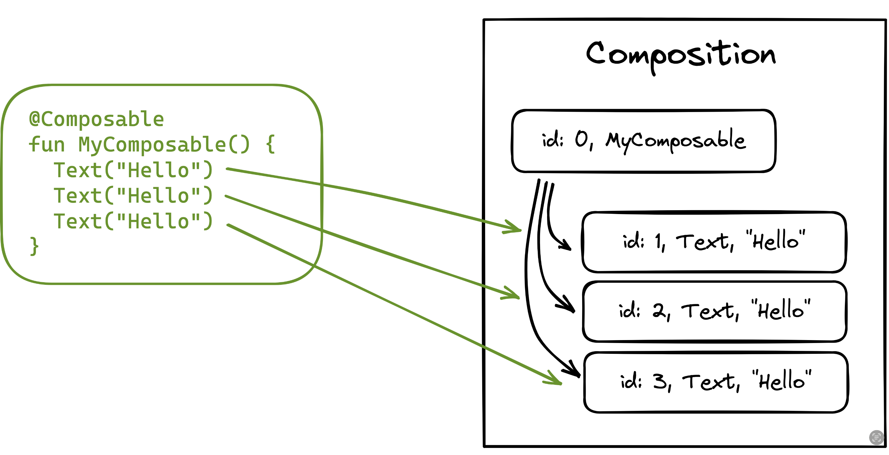

# 위치 기억법 (Positional memoization)

위치 기억법은 `함수 메모이제이션(memoization)`의 한 형태입니다. 함수 메모이제이션은 **함수가 입력값에 기반하여 결과를 캐싱하는 기법**을 일컫습니다. 그래서 동일한 입력값에 대해 함수가 호출될 때마다 다시 계산할 필요가 없습니다. 우리가 이미 전에 다루었던 것처럼, 함수 메모이제이션은 순수한(결정론적) 함수에 대해서만 가능합니다. 왜냐하면 순수한 함수들은 동일한 입력값에 대해 항상 동일한 결과를 반환할 것이라는 확실성이 있기 때문에, 우리는 그 함수의 결과값을 캐싱하고 재사용할 수 있습니다.


> 함수 메모이제이션은 함수형 프로그래밍 패러다임에서 널리 알려진 기술입니다. 이 패러다임에서 프로그램은 순수한 함수들의 구성으로 정의됩니다.


함수 메모이제이션에서, 함수 호출은 그 이름, 타입 및 매개변수 값의 조합을 통해 식별될 수 있습니다. 이러한 요소들을 사용하여 고유한 키를 생성하고, 나중에 호출될 때 캐싱된 결과를 저장, 검색, 읽기 등을 위해 사용할 수 있습니다. Compose의 경우는 추가적인 요소가 고려됩니다. Composable 함수는 소스 코드 내 호출 위치에 대한 불변의 정보를 가지고 있습니다. `Compose Runtime`은 **동일한 함수가 동일한 매개변수 값으로 다른 위치에서 호출될 때, 동일한 Composable 부모 트리 내에서 고유한 다른 ID를 생성**합니다.

```kotlin
@Composable
fun MyComposable() {
  Text("Hello") // id 1
  Text("Hello") // id 2
  Text("Hello") // id 3
}
```

인메모리 트리는 해당 함수들을 세 개의 다른 인스턴스로 저장하게 되고, 각각은 고유한 정체성을 가지게 됩니다.



Composable의 정체성은 recomposition을 거쳐도 유지되므로, Compose Runtime이 이 구조를 활용하여 Composable이 이전에 호출되었는지 여부를 파악하고 가능한 경우 생략할 수 있습니다.


그러나 종종 Compose Runtime 입장에서 Composable 함수에게 고유한 정체성을 할당하는 것이 어려운 경우가 있습니다. 가령, 반복문에서 생성된 Composable의 리스트 형태입니다.

```kotlin
@Composable
fun TalksScreen(talks: List<Talk>) {
  Column {
    for (talk in talks) {
      Talk(talk)
    }
  }
}
```


이 경우, Talk(talk)는 매번 같은 위치에서 호출되지만, 각각의 talk 요소는 리스트 내에서 다른 항목으로 간주되고, 결과적으로 트리에서는 서로 다른 노드로 구성됩니다. 이와 같은 경우에 Compose Runtime은 고유한 ID를 생성하고 여전히 서로 다른 Composable 함수를 구별할 수 있도록 호출 순서에 의존합니다.


이러한 방식이 리스트 끝에 새로운 요소를 추가할 때는 잘 동작하는데, 그 이유는 리스트 내의 기존 Composable 함수들이 여전히 같은 위치에 있기 때문입니다. 하지만, 우리가 리스트 상단이나 중간에 요소를 추가한다면 어떻게 될까요? **Compose Runtime은 요소 삽입이 발생하는 지점 아래의 모든 Talk Composable 함수에 대해서 recomposition을 발생**시키게 됩니다. 이유인 즉, Composable 함수들의 위치가 변경되었기 때문인데, 심지어 해당 함수들의 입력값이 변경되지 않았더라도 해당합니다. 이런 방식은 업데이트가 생략되었어야 할 Composable 함수들에게 맹목적으로 recomposition이 발생했기 때문에 매우 비효율적입니다(특히 리스트 사이즈가 긴 경우).


이 문제를 해결하기 위해서 Compose는 `key`라는 Composable 함수를 제공하는데, 우리는 **이 함수를 이용하여 Composable 함수에게 명시적인 키 값을 지정**할 수 있습니다.

```kotlin
@Composable
fun TalksScreen(talks: List<Talk>) {
  Column {
    for (talk in talks) {
      key(talk.id) { // Unique key
        Talk(talk)
      }
    }
  }
}
```


위의 예제를 살펴보면, 각 Talk Composable에 대한 키 값으로 talk id(고유한)를 사용하고 있으며, 이것은 **Compose Runtime이 Composable 함수의 위치에 상관없이 리스트에 속한 모든 항목의 정체성을 유지**하도록 합니다.

`위치 기반 기억법`은 Compose Runtime이 설계에 따라 Composable 함수를 기억할 수 있게 해 줍니다. **Compose Compiler에 의해 재시작이 가능하다고(Restartable) 추론된 모든 Composable 함수는 recomposition을 생략할 수 있어야 하며, 그 말인즉 인메모리에 자동적으로 기억됨을 의미**합니다. Compose는 이러한 메커니즘으로 구현되어 있습니다.


개발자들은 때로 Composable **함수의 범위보다 더 세밀하게 인메모리 구조에 의존**해야 할 필요가 있습니다. 예를 들어, Composable 함수 내에서 발생하는 **비용이 큰 계산 결과를 캐싱**하고 싶다고 가정해 보겠습니다. 이와 관련하여 Compose Runtime은 `remember` 함수를 제공합니다.

```kotlin
@Composable
fun FilteredImage(path: String) {
  val filters = remember { computeFilters(path) }
  ImageWithFiltersApplied(filters)
}

@Composable
fun ImageWithFiltersApplied(filters: List<Filter>) {
  TODO()
}
```


여기에서 우리는 이미지 필터라는 연산 결과를 사전 계산하고 캐싱하기 위해 `remember`를 사용합니다. **캐싱된 값을 검색하기 위한 키 값은 소스 코드의 호출 위치와 함수의 입력값에(위의 예시 코드에서는 path라는 파일 경로가 사용됨) 기반**으로 합니다. `remember`는 **트리의 상태를 유지하는 인메모리 구조에서 값을 메모리에 읽고 쓰는 역할을 수행하는 Composable 함수**입니다. 이 `위치 기억법` 메커니즘은 오로지 개발자에게만 노출됩니다.


Compose에서 메모이제이션은 애플리케이션 전체에 걸쳐서 적용되지 않습니다. **무언가가 메모리에 기록될 때, 메모이제이션을 호출하는 Composable의 컨텍스트 내에서만 수행**됩니다. 위의 예시 코드에서는 FilteredImage가 방금 이야기한 컨텍스트가 될 것입니다. 실제로 Compose는 인메모리 구조로 이동하여, **해당 메모리에서 Composable의 정보가 저장된 일종의 슬롯 범위 내에서 유효한 값을 탐색**합니다. 이 탐색은 해당 범위 내에서 마치 `싱글톤(singleton)`처럼 동작합니다. 동일한 Composable이 다른 부모로부터 호출되는 경우는 새로운 인스턴스의 값이 반환됩니다.

## 요약
* Jetpack Compose는 **위치 기억법(Positional memoization)** 을 사용하여 컴포저블의 결과를 캐시합니다. 이는 컴포저블이 **코드 내에서 호출된 위치**를 기반으로 그 결과를 기억하여, 입력값이 변경되지 않았다면 리컴포지션을 건너뛰는 최적화를 가능하게 합니다.
* 이 방식은 `for` 루프와 같이 동적인 목록을 다룰 때 문제가 될 수 있습니다. 리스트 중간에 아이템이 추가되면 그 뒤의 모든 아이템 위치가 변경되어, 데이터가 그대로임에도 불구하고 불필요한 리컴포지션이 발생합니다.
* 이 문제를 해결하기 위해 **`key` 컴포저블**을 사용하여 각 아이템에 위치와 무관한 **고유하고 안정적인 식별자**를 제공할 수 있습니다. 이를 통해 Compose 런타임은 아이템의 신원을 정확히 추적하여 효율적으로 UI를 업데이트합니다.
* 개발자는 **`remember` 함수**를 사용하여 이러한 위치 기억법을 직접 활용할 수 있습니다. `remember`는 비용이 많이 드는 계산 결과를 컴포저블의 호출 위치에 기반하여 캐시하고, 리컴포지션 시 불필요한 재계산을 방지하는 데 사용됩니다.