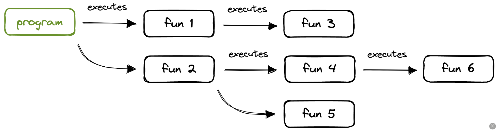
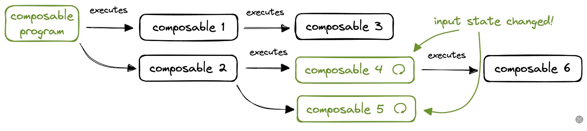

# 재시작 가능 (Restartable)

이미 몇 번 언급했듯이, **Composable 함수는 recomposition 때문에, 콜 스택(call stack)의 일부로서 단 한 번만 호출되는 표준 함수들과는 다릅니다.** 일반적인 콜 스택은 아래의 그림과 같습니다. 각 함수는 한 번씩 호출되며, 하나 또는 여러 다른 함수들을 호출할 수 있습니다.

그림 3. Common Call Stack

반면에, Composable 함수는 recomposition으로 여러 번 다시 시작될 수 있습니다. 그래서 런타임은 함수가 재실행될 수 있도록 해당 함수들에 대한 참조를 유지합니다. 아래의 그림은 Composable 호출 트리에 대한 모습입니다.

그림 4. Compose Restartable Call Stack

Composable 4와 5는 입력값이 변경되면 재실행됩니다.

**Compose는 메모리 내 표현을 항상 최신 상태로 유지하기 위해 트리의 어떤 노드를 재시작할지 선택적으로 판단**합니다. Composable 함수는 **관찰하는 상태(state)의 변화에 기반하여 반작용적으로 재실행**되도록 설계되었습니다.

**Compose Compiler는 일부 상태(state)를 읽는 모든 Composable 함수를 찾아 Compose Runtime에게 재시작하는 방법을 가르치는 데 필요한 코드를 생성**합니다. 상태를 읽지 않는 Composable은 재시작할 필요가 없으므로, Compose Runtime에게 해당 방법을 가르칠 이유가 없습니다.

## 요약
* `@Composable` 함수는 일반 함수와 달리 **재시작 가능(Restartable)** 합니다. 이는 상태(state)가 변경될 때마다 **여러 번 다시 실행(리컴포지션)** 될 수 있음을 의미합니다.
* Compose 런타임은 UI를 최신 상태로 유지하기 위해, 입력값이 변경된 컴포저블만 **선택적으로 재시작**합니다.
* Compose 컴파일러는 **상태를 읽는 컴포저블 함수**를 식별하고, 런타임이 해당 함수를 재시작할 수 있도록 하는 **추가적인 코드를 생성**합니다. 상태를 읽지 않는 함수는 재시작할 필요가 없으므로 이러한 코드가 생성되지 않습니다.