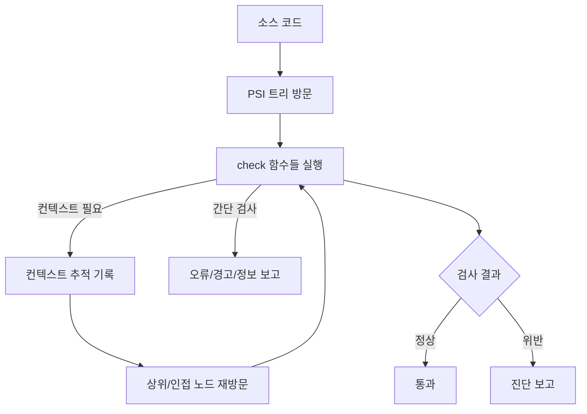

# 호출 검사 (Call Checks)

Jetpack Compose의 **호출 검사기(call checker)** 는 `Composable` 함수가 다양한 컨텍스트에서 올바르게 호출되는지 정적으로 검증하는 **Compose Compiler 확장**입니다. 특히 `@DisallowComposableCalls`, `@ReadOnlyComposable` 과 같은 어노테이션의 제약을 위반하지 않도록 체크합니다.

> 핵심 개념: `PSI` 트리 탐색, **방문자 패턴(visitor pattern)**, **컨텍스트 추적(context trace)**

## 동작 개요

- **호출 검사기**는 코드베이스 전체의 호출을 대상으로 하는 정적 분석을 수행하는 컴파일러 익스텐션입니다.
- 소스에서 호출로 간주되는 모든 `PSI` 요소를 방문하며, 이 과정은 **방문자 패턴**으로 구현됩니다.
- 단일 노드 정보만으로 부족한 경우, **컨텍스트 추적(context trace)** 에 정보를 기록해 더 넓은 범위(상위/인접 노드)를 재방문하며 복합 검증을 수행합니다.

### 컨텍스트 추적이 필요한 이유

일부 검사는 현재 노드보다 더 넓은 문맥(예: 해당 호출이 위치한 람다/함수/try-catch 등)을 알아야 합니다. 이때 검사기는 방문 경로에 **작은 비트 단위의 정보**를 남겨두고, 이후 방문에서 이를 참조하여 더 정밀한 판단을 내립니다.

## 컨텍스트 추적 예시 (Kotlin)

아래는 `@DisallowComposableCalls` 로 마킹된 컨텍스트에서 `Composable` 함수 호출이 감지될 때, 컨텍스트 추적에 기록하고 오류를 보고하는 예시입니다.

```kotlin
  if (arg?.type?.hasDisallowComposableCallsAnnotation() == true) {
    context.trace.record(
      ComposeWritableSlices.LAMBDA_CAPABLE_OF_COMPOSER_CAPTURE,
      descriptor, // reference to the function literal
      false
    )
    context.trace.report(
      ComposeErrors.CAPTURED_COMPOSABLE_INVOCATION.on(
        reportOn,
        arg,
        arg.containingDeclaration
      )
    )
    return
  }
```

## 검사 흐름 (Mermaid)



## 주요 검사 항목

아래 표는 Compose Compiler가 수행하는 대표적인 호출 검사를 요약합니다.

| 검사 대상 | 규칙/조건 | 위반 시 결과 | 비고 |
|---|---|---|---|
| `@DisallowComposableCalls` 컨텍스트 | 이 범위 안에서는 `Composable` 호출 금지 | 오류 보고 | 인라인 람다에서 `Composable` 어노테이션을 피하려는 목적의 마킹 케이스 포함 |
| 인라인 함수/람다 | 호출 스택의 특정 수준에서 `Composable` 로 둘러싸여 있어야 `Composable` 호출 허용 | 충족하지 않으면 오류 | 인라인 람다의 호출자가 `Composable` 인지 확인 필요 |
| `@ReadOnlyComposable` 함수 | 다른 `@ReadOnlyComposable` 만 호출 가능 | 최적화 계약 위반으로 오류 | composition 내 읽기 전용 보장 |
| `Composable` 함수 참조 사용 | Compose에서 지원하지 않는 참조 사용 금지 | 오류 보고 | 함수 레퍼런스 형태의 사용 제한 |

## 상세 동작 설명

- 각 `Composable` 호출에 대해 컴파일러는 호출자 및 상위 호출자까지 확인하기 위해 `PSI` 트리를 탐색합니다. 호출자는 람다, 함수, 프로퍼티/접근자, `try/catch` 블록, 클래스, 파일 등 다양한 형태일 수 있습니다.
- `PSI`는 프론트엔드 컴파일러 단계의 언어 구조를 모델링하므로, 이해 방식은 철저히 **구문적·정적**입니다.
- 일부 검사는 현재 노드 정보만으로 충분하여 즉시 결과를 보고하고 **return** 합니다. 복합 검사는 컨텍스트 추적에 기록을 남기고 상위/이웃 노드로 재귀 탐색을 이어갑니다.
- 정적 분석 결과는 개발자 경험 개선을 위해 **가이드**로도 사용됩니다. 예를 들어 람다 내부에서 `Composable` 호출이 감지되면, 해당 람다에 `Composable` 어노테이션을 **추가하도록 제안**하기도 합니다.

## 모범 사례

- `@DisallowComposableCalls` 범위에서는 `Composable` 호출을 피하고, 필요한 경우 구조를 재설계합니다.
- 인라인 람다에서 `Composable` 을 호출해야 한다면, 호출 스택 상에 적절한 `Composable` 컨텍스트가 존재하도록 합니다.
- `@ReadOnlyComposable` 내에서는 상태 쓰기나 비읽기 전용 호출을 피하고, 필요한 읽기 연산만 수행합니다.
- `Composable` 함수의 참조 사용은 지양합니다.

## 요약
- **호출 검사기**는 `PSI` 탐색과 **컨텍스트 추적**을 활용해 `Composable` 호출의 적합성을 정적으로 검증합니다.
- `@DisallowComposableCalls`, `@ReadOnlyComposable`, 인라인 람다 등 **컨텍스트 제약**을 위반하면 오류를 보고합니다.
- 간단한 검사는 즉시 결과를 반환하고, 복합 검사는 기록을 남겨 **재방문 검증**을 수행합니다.
- `@ReadOnlyComposable` 은 읽기 전용 호출만 허용하여 **composition 최적화 계약**을 보장합니다.
- Compose에서 지원하지 않는 `Composable` 함수 **참조 사용은 금지**됩니다.