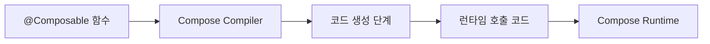

# 코드 생성 (Code Generation)

> Compose Compiler의 최종 단계인 코드 생성 과정에 대한 개요

## 개요

**Compose Compiler**의 마지막 단계는 **코드 생성** 단계입니다. 이는 **어노테이션 프로세서**와 **컴파일러 플러그인**의 공통점 중 하나로, 둘 다 **런타임 라이브러리**들이 사용할 수 있는 편리한 코드를 생성하거나 합성하는 데 자주 활용됩니다.

## 주요 특징

- **목적**: `@Composable` 함수들을 런타임에서 이해할 수 있는 형태로 변환
- **역할**: 컴파일 시점에 **Compose Runtime**이 요구하는 코드 형태로 생성
- **공통 패턴**: 어노테이션 프로세서와 컴파일러 플러그인에서 널리 사용되는 접근법

## 코드 생성 과정

## 활용 목적

코드 생성은 다음과 같은 목적으로 사용됩니다:

- **편의성**: 런타임 라이브러리가 쉽게 사용할 수 있는 코드 제공
- **자동화**: 개발자가 수동으로 작성해야 할 보일러플레이트 코드 자동 생성
- **최적화**: 런타임 성능을 위한 최적화된 코드 생성

## 요약

- **코드 생성**은 Compose Compiler의 최종 단계로, `@Composable` 함수를 런타임이 이해할 수 있는 형태로 변환합니다
- **어노테이션 프로세서**와 **컴파일러 플러그인**에서 공통적으로 사용되는 패턴입니다
- **Compose Runtime**이 효율적으로 동작할 수 있도록 최적화된 코드를 생성하는 것이 주요 목적입니다