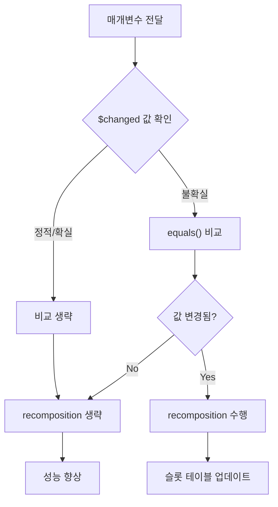

# 비교 전파 (Comparison Propagation)

우리는 컴파일러가 `$composer` 매개변수를 어떤 식으로 주입하고, 어떻게 **Composable 호출**에게 전달하는지를 배웠습니다. Composable 함수마다 추가되는 몇 가지 추가 메타데이터가 더 있는데, 그중 하나가 **`$changed` 매개변수**입니다. 이 매개변수는 현재 Composable의 입력 매개변수가 **이전 composition 이후에 변경된 적이 있는지**에 대한 단서를 제공하는데, 런타임은 이를 통해 **recomposition을 생략**할 수 있습니다.

## $changed 매개변수의 구조

```kotlin
@Composable
fun Header(text: String, $composer: Composer<*>, $changed: Int)
```

`$changed` 매개변수는 함수의 입력 매개변수 각각에 대하여 **특정 조건을 가지는 비트의 합성**으로 구성됩니다.

### 매개변수 상태와 비트 정보

| 매개변수 상태 | 설명 | 비트 값 | 런타임 동작 |
|---|---|---|---|
| **정적 (Static)** | 컴파일 타임에 알 수 있는 상수 | 특정 비트 | `equals()` 비교 생략 |
| **확실하게 변경 없음** | 상위 트리에서 이미 비교 완료 | 특정 비트 | 재비교 불필요 |
| **불확실** | 런타임에 비교 필요 | `0` (기본값) | `equals()` 비교 수행 |

### 매개변수 수량에 따른 처리

- **일반적인 경우**: 모든 n개의 입력 매개변수(최대 대략 10개 정도)에 대한 조건을 인코딩하는 **단일 `$changed` 매개변수**
- **매개변수 수가 많은 경우**: 제한 수보다 더 많은 매개변수가 있으면 **2개 이상의 `$changed` 매개변수**가 추가

> **비트 연산을 사용하는 이유**: 프로세서 구조상 비트 연산으로 처리하는 것이 수월하기 때문입니다.

## 최적화 메커니즘

이러한 메타데이터를 전달함으로써 **런타임 최적화**가 가능합니다:

### 1. 정적 매개변수 최적화

입력 매개변수가 최신에 저장된 값(이전 composition)에서 변경되었는지 확인하기 위한 `equals()` 함수를 통한 비교를 생략할 수 있습니다. 

- **조건**: 입력 매개변수가 **정적(static)** 인 경우 (예: String 리터럴, 상수)
- **효과**: `$changed` 비트마스크 매개변수가 런타임에게 "이 값은 컴파일 타임에 알 수 있으므로 비교하지 않아도 된다"는 정보 제공

### 2. 상위 트리 비교 완료 최적화

매개변수가 마지막 composition 수행 이후 **"항상" 변경되지 않았거나**, 상위 트리의 Composable에 의해 **매개변수 변경 비교가 이미 수행된 것으로 보장**되는 경우:
- 다시 비교할 필요가 없음
- 매개변수 상태가 **"확실하게"** 변경될 필요가 없는 것으로 간주

### 3. 불확실한 상태 처리

매개변수의 상태가 **"불확실"** 한 경우:
- 런타임이 지속적으로 `equals()` 함수를 이용하여 매개변수 값을 비교
- **슬롯 테이블**에 저장하여 언제나 최신 상태의 값을 가져올 수 있음
- 비트 값은 **기본값인 0**
- `$changed` 매개변수에 0이 전달되면, 런타임에게 **모든 매개변수 비교 작업을 수행**하도록 지시

## 실제 코드 변환 예제

다음은 Composable 함수의 본문에 `$changed` 매개변수와 이를 처리하기 위한 로직을 주입한 이후의 모습입니다:

```kotlin
@Composable 
fun Header(text: String, $composer: Composer<*>, $changed: Int) {
  var $dirty = $changed
  if ($changed and 0b0110 === 0) {
    $dirty = $dirty or if ($composer.changed(text)) 0b0010 else 0b0100
  }
  if ($dirty and 0b1011 xor 0b1010 !== 0 || !$composer.skipping) {
    f(text) // executes body
  } else {
    $composer.skipToGroupEnd()
  }
}
```

### 코드 분석

- **`$dirty` 변수**: 매개변수가 변경되었는지에 대한 여부를 저장
- **비트마스킹**: `$changed` 매개변수의 비트마스킹과 슬롯 테이블에 저장된 이전 값에 의해 결정
- **Recomposition 결정**: 
  - 매개변수 값이 **"dirty"(변경됨)** 로 간주되면 → 함수 본문 호출 및 **recomposition 발생**
  - 그렇지 않은 경우 → **recomposition 생략**

## 성능 최적화 효과



recomposition이 여러 번 발생할 수 있다는 점을 감안할 때, 입력 상태 변화 정보를 전달하면 **잠재적으로 상당한 계산 시간과 메모리를 절약**할 수 있습니다:

- 매개변수가 수많은 Composable 함수를 거쳐서 자주 전달되는 경우
- Compose는 매개변수를 매번 저장하고 비교하기를 원하지 않는 경우
- 매개변수 비교 동작마다 **슬롯 테이블의 공간을 차지**하기 때문

## 비교 전파 (Comparison Propagation)

Composable 함수가 호출자에 의해 전달된 `$changed` 매개변수를 전달받는 것과 마찬가지로, **모든 Composable 함수는 트리 아래로 전달된 모든 매개변수에 대한 정보를 전달해야 할 책임**이 있습니다. 

이것을 **"비교 전파(Comparison Propagation)"** 라고 합니다:

- 해당 정보는 **composition 중에** Composable 함수의 본문에서 사용
- 입력값이 변경되었거나, 값이 정적이거나, 매개변수에 대한 정보를 사전에 알고 있다면
- 그 매개변수를 재사용하는 **하위 Composable 함수에게** `$changed` 매개변수를 통해 해당 정보를 전달

## 안정성 추론 (Stability Inference)

`$changed` **비트마스크 매개변수**는 함수에 전달된 매개변수들이 **안정적(stable)** 인지 **불안정(unstable)** 한지에 대한 정보를 인코딩합니다:

**광범위한 타입** (예: `List<T>`)을 가지는 함수의 매개변수가 `listOf(1, 2)`와 같이 **안정적인 타입을 가지고 있다**는 추론 바탕으로 **recomposition을 생략**할 수 있습니다

## 추가 학습 자료

> 비교 전파에 대해 더 자세히 학습하고 싶으시다면, Leland Richardson이 안정성 추론에 대해 설명하는 [유튜브 영상](https://www.youtube.com/watch?v=bg0R9-AUXQM)을 시청해 보시길 바랍니다.

## 요약

- **`$changed` 매개변수**는 Composable 함수의 입력 매개변수 변경 상태를 **비트마스크**로 인코딩
- **정적 매개변수**의 경우 `equals()` 비교를 생략하여 **성능 최적화**
- **비교 전파**를 통해 상위에서 하위 Composable로 매개변수 상태 정보를 전달
- **불확실한 상태**의 매개변수는 런타임에 `equals()` 비교를 수행하여 **recomposition 결정**
- **슬롯 테이블**을 활용한 메모리 최적화로 불필요한 비교 작업을 방지
- **안정성 추론**을 통해 더 정교한 recomposition 최적화가 가능