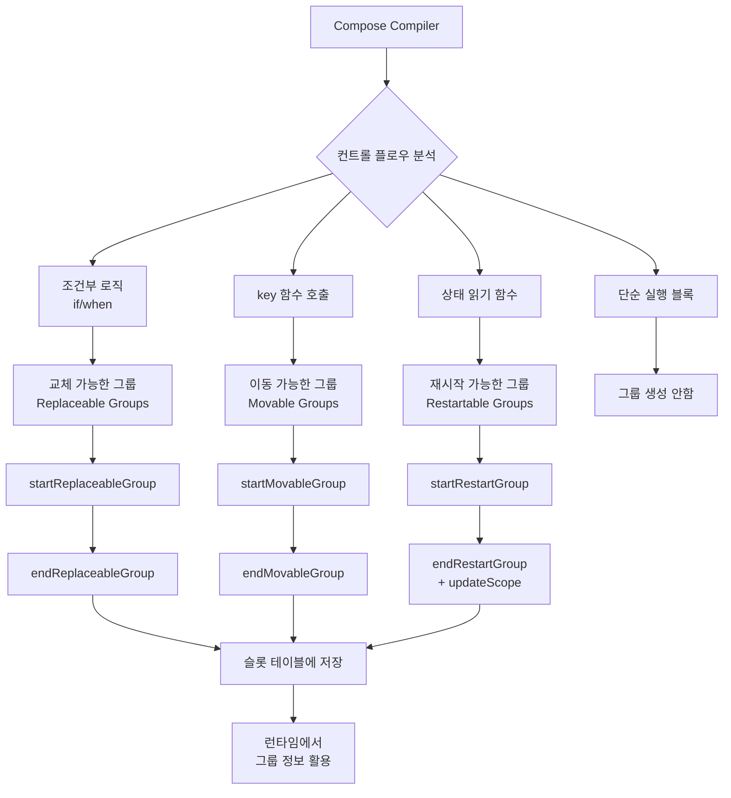
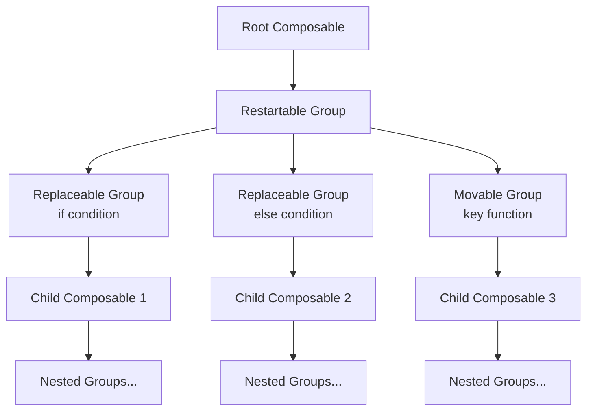

# 컨트롤 플로우 그룹 생성 (Control Flow Group Generation)

**Compose Compiler**는 각 `Composable` 함수의 본문에 **그룹(group)** 을 삽입합니다. 본문 내에서 찾을 수 있는 **컨트롤 플로우** 구조에 따라 아래와 같은 **3가지 유형의 그룹**이 생성됩니다.

## 그룹의 종류

| 그룹 타입 | 설명 | 사용 목적 |
|----------|------|-----------|
| **교체 가능한 그룹 (Replaceable Groups)** | 조건부 로직에 따라 교체될 수 있는 그룹 | 조건문, 람다 처리 |
| **이동 가능한 그룹 (Movable Groups)** | 정체성을 유지하며 재정렬 가능한 그룹 | `key()` 함수 내부 |
| **재시작 가능한 그룹 (Restartable Groups)** | 리컴포지션 시 재시작할 수 있는 그룹 | 상태 읽기 함수 |

`Composable` 함수는 **런타임 시에 그룹을 생성**하며, 생성된 그룹들은 Composable 함수의 현 상태에 대한 모든 정보를 감싸고 보존합니다. 이를 통해 composition은 다음과 같은 상황에서 데이터를 어떻게 처리해야 할지 알 수 있습니다:

- 그룹에 **교체가 필요할 때** (교체 가능한 그룹)
- Composable의 **정체성을 항상 유지하면서 데이터를 이동시킬 때** (이동 가능한 그룹)  
- **리컴포지션 중에 함수를 재시작할 때** (재시작 가능한 그룹)

> 결국, 런타임은 composition이 메모리에 저장한 정보를 바탕으로 컨트롤 플로우를 어떻게 다루어야 하는지 알아야 합니다.

또한, 그룹은 **Composable 함수의 호출 위치에 대한 정보**를 가지고 있습니다. 그룹이 생성될 때:
- 작성된 **소스 코드의 텍스트 범위**를 지정하여 감쌈
- **호출 위치 정보**를 바탕으로 생성된 **키(key)** 를 가짐
- 이를 통해 그룹을 저장하고 **위치 기억법(Positional Memoization)** 을 가능하게 함

## 교체 가능한 그룹 (Replaceable Groups)

**"Composable 람다식 기억법"** 섹션에서 살펴본 바와 같이, `Composable` 람다식의 본문에 다음과 같은 매개변수를 받는 **Composable 팩토리 함수 호출**을 삽입함으로써 Composable 람다식이 자동으로 감싸집니다:
- `$composer`
- `$key`  
- Composable 람다식의 실체

### Composable Lambda Factory 함수 예시

```kotlin
fun composableLambda(
    composer: Composer,
    key: Int,
    tracked: Boolean,
    block: Any
): ComposableLambda {
    composer.startReplaceableGroup(key)
    val slot = composer.rememberedValue()
    val result = if (slot === Composer.Empty) {
        val value = ComposableLambdaImpl(key, tracked)
        composer.updateRememberedValue(value)
        value
    } else {
        slot as ComposableLambdaImpl
    }
    result.update(block)
    composer.endReplaceableGroup()
    return result
}
```


위의 팩토리 함수는 Composable 함수에서 사용되는 것과 같이 **Composable 람다식을 위해 호출**됩니다. 

**핵심 동작 과정:**
1. **`startReplaceableGroup(key)`** 로 교체 가능한 그룹을 시작
2. **모든 텍스트의 범위를 감싸고** composition을 관련성 있는 정보로 업데이트  
3. **`endReplaceableGroup()`** 로 그룹을 종료

> 이것이 우리가 **래핑하는 람다식**입니다.

### NonRestartableComposable 함수 변환 예시

방금 살펴본 예시는 Composable 람다식에 대한 것이지만, 다른 **Composable 함수의 호출** 또한 동일하게 처리됩니다. 아래는 `@NonRestartableComposable` 어노테이션으로 **재시작이 불가능하다고 마킹된** Composable 함수의 코드가 어떻게 변환되는지 보여줍니다.

```kotlin
// Before compiler (sources)
@NonRestartableComposable
@Composable
fun Foo(x: Int) {
    Wat()
}

// After compiler
@NonRestartableComposable
@Composable
fun Foo(x: Int, %composer: Composer?, %changed: Int) {
    %composer.startReplaceableGroup(<>)
    Wat(%composer, 0)
    %composer.endReplaceableGroup()
}
```


위의 Composable 함수 또한 **composition에 저장하기 위한 교체 가능한 그룹**을 생성합니다.

### 그룹의 트리 구조

그룹은 **일종의 트리**와 같습니다. 각 그룹은 원하는만큼 그 어떠한 수의 그룹도 **자식으로 가질 수 있습니다**. 위의 예시에서 `Wat()` 함수 또한 Composable 함수라면, 컴파일러는 해당 함수에 대해서도 그룹을 삽입할 것입니다.

### 조건부 논리와 교체 가능한 그룹

**"Composable 어노테이션"** 섹션에서 살펴본 바와 같이, Composable 호출은 **위치에 기반**하기 때문에 정체성이 보존될 수 있습니다. 런타임은 아래의 서로 다른 두 `Text` 호출이 다르다는 것을 이해할 수 있습니다.

```kotlin
if (condition) {
    Text("Hello")
} else {
    Text("World")
}
```

이와 같은 **조건부 논리를 수행하는 Composable 함수** 또한 교체 가능한 그룹을 발행하는데, **조건(condition)이 전환되면 교체될 수 있는 그룹**을 **슬롯 테이블**에 저장합니다.


## 이동 가능한 그룹 (Movable Groups)

**이동 가능한 그룹**은 **정체성을 잃지 않고 재정렬이 가능한 그룹**입니다. 이 그룹은 현재까지는 `key` 함수의 내부에서 **Composable 함수를 호출하는 경우에만** 활용됩니다.

### Key 함수를 활용한 예시

```kotlin
@Composable
fun TalksScreen(talks: List<Talk>) {
    Column {
        for (talk in talks) {
            key(talk.id) { // Unique key
                Talk(talk)
            }
        }
    }
}
```


`key` 함수로 `Talk` 함수를 감싸면:
- **Talk Composable 함수마다의 고유한 정체성이 보장됨**
- **이동 가능한 그룹이 생성됨**
- 호출된 각 Composable 함수마다 **정체성을 해치지 않으면서 호출 순서를 변경**할 수 있게 됨

### Key 함수 사용 시 컴파일러 변환 예시

```kotlin
// Before compiler (sources)
@Composable
fun Test(value: Int) {
    key(value) {
        Wrapper {
            Leaf("Value $value")
        }
    }
}

// After compiler
@Composable
fun Test(value: Int, %composer: Composer?, %changed: Int) {
    // ...
    %composer.startMovableGroup(<>, value)
    Wrapper(composableLambda(%composer, <>, true) { %composer: Composer?, %changed: Int ->
        Leaf("Value $value", %composer, 0)
    }, %composer, 0b0110)
    %composer.endMovableGroup()
    // ...
}
```

**핵심 동작:**
- **`startMovableGroup(<>, value)`** 로 이동 가능한 그룹 시작
- **고유한 키 값**(`value`)을 사용하여 정체성 보장
- **`endMovableGroup()`** 로 그룹 종료


## 재시작 가능한 그룹 (Restartable Groups)

**재시작 가능한 그룹**은 아마 **가장 흥미로운 그룹** 중 하나입니다. 이 그룹들은 **재시작 가능한 Composable 함수에만** 삽입됩니다. 

재시작 가능한 그룹 또한 해당 Composable 호출들을 감싸지만, 여기서 **end 함수 호출**을 약간 확장하여 **nullable한 값을 반환**합니다.

### 반환 값의 의미

| 반환 값 | 조건 | 의미 |
|--------|------|------|
| **null** | Composable 함수가 **어떠한 상태(state)도 읽지 않을 때** | **리컴포지션이 필요하지 않음** |
| **null이 아닌 값** | Composable 함수가 **상태를 읽을 때** | **리컴포지션을 위한 람다식 생성** |

> null이 아닌 값을 반환하는 경우, 컴파일러는 composition을 업데이트하기 위해 **람다식을 생성**하는데, 그 람다식은 Composable을 **"재시작" (다시 실행)** 하는 방법을 런타임에 가르칩니다.

### 재시작 가능한 그룹 변환 예시

```kotlin
// Before compiler (sources)
@Composable 
fun A(x: Int) {
    f(x)
}

// After compiler
@Composable
fun A(x: Int, $composer: Composer<*>, $changed: Int) {
    $composer.startRestartGroup()
    // ...
    f(x)
    $composer.endRestartGroup()?.updateScope { next -> 
        A(x, next, $changed or 0b1) 
    }
}
```


`A()`라는 Composable 함수에 대해 동일한 새 호출을 감싸고, **리컴포지션을 트리거하기 위한 범위**를 `updateScope()`를 통해 어떻게 갱신하는지 살펴보시길 바랍니다.

**핵심 동작:**
- **`startRestartGroup()`** 로 재시작 가능한 그룹 시작
- **`endRestartGroup()?.updateScope`** 로 리컴포지션 스코프 업데이트
- **상태를 읽는 모든 Composable 함수**에 대해 생성되는 그룹 타입

## 컴파일러의 그룹 생성 규칙

이 섹션을 마무리하기 전에, **다양한 유형의 그룹을 생성하기 위해** 컴파일러가 실행 가능한 블록에 적용하는 몇 가지 추가적인 논리에 대해 살펴보겠습니다. 

### 그룹 생성 규칙 (공식 문서 기준)

| 조건 | 그룹 타입 | 설명 |
|------|-----------|------|
| **블록이 항상 정확하게 1회만 실행** | **그룹 불필요** | 그룹이 필요하지 않음 |
| **조건부 논리** (`if`, `when` 등) | **교체 가능한 그룹** | 각 블록 주위에 교체 가능한 그룹 삽입 |
| **`key` 함수 호출** | **이동 가능한 그룹** | `key` Composable 함수 호출의 본문에서만 사용 |

## 그룹 생성 프로세스



## 그룹의 트리 구조



## 요약

- **Compose Compiler**는 Composable 함수의 **컨트롤 플로우 구조**에 따라 **3가지 유형의 그룹**을 생성합니다
- **교체 가능한 그룹 (Replaceable Groups)**: 조건부 로직과 람다 처리를 위한 그룹으로, `startReplaceableGroup`과 `endReplaceableGroup`으로 감쌉니다
- **이동 가능한 그룹 (Movable Groups)**: `key` 함수 내부에서 정체성을 유지하며 재정렬이 가능한 그룹으로, 고유한 키를 사용합니다
- **재시작 가능한 그룹 (Restartable Groups)**: 상태를 읽는 함수에 대해 생성되며, 리컴포지션 시 `updateScope`를 통해 재시작됩니다
- 그룹은 **트리 구조**로 구성되어 각 그룹이 여러 자식 그룹을 가질 수 있으며, **슬롯 테이블**에 저장되어 런타임에서 활용됩니다
- **위치 기반 정체성**과 **키 기반 정체성**을 통해 Composable의 상태와 정체성을 보존합니다
- 컴파일러는 **실행 블록의 특성**에 따라 적절한 그룹 타입을 선택하여 최적화된 리컴포지션을 가능하게 합니다