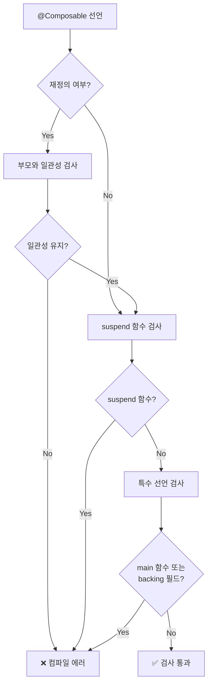

# 선언 검사 (Declaration Checks)

> **Compose Compiler**는 `@Composable` 함수들의 **선언 위치**에서 발생할 수 있는 문제들을 컴파일 단계에서 미리 검증합니다.

## 개요

호출 위치와 타입에 대한 검사만으로는 충분하지 않습니다. **엘리먼트의 선언 위치** 역시 모든 Compose 코드베이스의 중요한 부분입니다. 다음과 같은 요소들이 분석되어야 합니다:

- **`properties`** (프로퍼티)
- **`property accessors`** (프로퍼티 접근자)  
- **`function declarations`** (함수 선언)
- **`function parameters`** (함수 매개변수)

## 주요 검사 항목

### 1. 재정의 일관성 검사

프로퍼티, 프로퍼티의 `getter` 및 함수들은 `@Composable`로 어노테이션되어 있어도 **재정의**될 수 있습니다. 

**Compose Compiler**는 이러한 `KtElements` 중 어느 것이든 재정의될 경우 `@Composable`로 어노테이션되어 있는지를 확인하여 **일관성을 유지**하는 검사를 수행합니다.

```kotlin
// ❌ 잘못된 재정의 - 일관성 없음
interface MyInterface {
    @Composable fun content()
}

class MyImpl : MyInterface {
    override fun content() { // @Composable 누락!
        // ...
    }
}

// ✅ 올바른 재정의 - 일관성 유지
class MyImpl : MyInterface {
    @Composable override fun content() {
        // ...
    }
}
```

### 2. Suspend 함수 비호환성 검사

**중요한 제약사항**: `@Composable` 함수는 `suspend` 함수가 될 수 없습니다.

- `suspend`와 `@Composable`은 **완전히 다른 의미**를 가집니다
- 두 개념 모두 언어의 기본형으로 이해할 수 있지만, **서로 다른 목적**으로 설계되었습니다
- 현재까지도 이 두 개념은 **함께 지원되지 않습니다**

```kotlin
// ❌ 금지됨 - Composable + suspend 조합
@Composable suspend fun invalidFunction() {
    // 컴파일 에러 발생!
}

// ✅ 허용됨 - 각각 별도 사용
@Composable fun composableFunction() { /* ... */ }
suspend fun suspendFunction() { /* ... */ }
```

### 3. 금지된 선언들

다음과 같은 선언들은 **선언 검사를 통해 금지**됩니다:

- **`main` 함수를 `@Composable`로 선언**
- **`@Composable` 속성의 backing 필드 선언**

```kotlin
// ❌ 금지됨 - main 함수는 Composable이 될 수 없음
@Composable fun main() {
    // 컴파일 에러!
}

// ❌ 금지됨 - Composable 속성의 backing 필드
@get:Composable
val myProperty: String = "value" // backing 필드 금지
```

## 검사 흐름도



## 검사 유형별 정리

| 검사 유형 | 목적 | 위반 시 결과 |
|-----------|------|--------------|
| **재정의 일관성** | 상위 클래스/인터페이스와 `@Composable` 어노테이션 일치 | 컴파일 에러 |
| **suspend 비호환성** | `@Composable`과 `suspend` 동시 사용 방지 | 컴파일 에러 |
| **금지된 선언** | `main` 함수, backing 필드 등 특수 케이스 방지 | 컴파일 에러 |

## 요약

- **선언 검사**는 `@Composable` 함수의 선언 위치에서 발생할 수 있는 문제들을 컴파일 단계에서 미리 방지합니다
- **재정의 시 일관성 검사**를 통해 상위 클래스나 인터페이스와의 `@Composable` 어노테이션 일치를 보장합니다
- **`suspend` 함수와의 비호환성**을 검사하여 두 개념의 혼용을 방지합니다
- **특정 선언들**(`main` 함수, backing 필드 등)은 `@Composable`과 함께 사용할 수 없도록 제한됩니다
- 이러한 검사들은 모두 **컴파일 단계**에서 수행되어 런타임 오류를 사전에 방지합니다