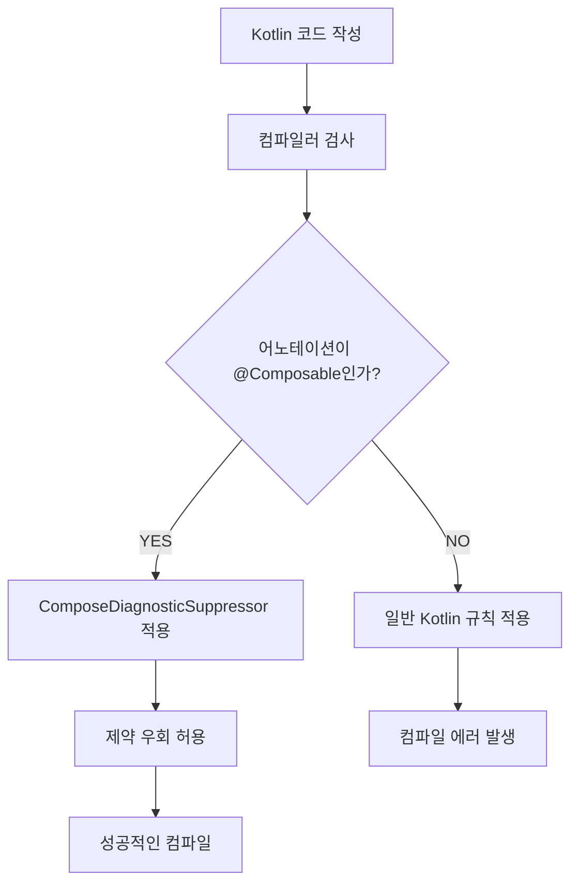

# 진단 억제기 (Diagnostic Suppression)

## 개요

컴파일러 플러그인은 **진단 억제기**를 익스텐션으로 등록할 수 있으므로 기본적으로 일부 특정 상황에 대한 진단을 음소거할 수 있습니다. 이는 컴파일러 플러그인이 일반적으로 **Kotlin 컴파일러가 허용하지 않는 코드**를 생성하거나 지원하여, 해당 검사를 우회하고 동작하도록 할 때 흔히 발생합니다.

**Compose**는 `ComposeDiagnosticSuppressor`를 등록하여 컴파일에 실패할 수 있는 일부 **언어적인 제한을 우회**하기 때문에 특수한 유즈 케이스를 활성화할 수 있습니다.

## 인라인 람다에서의 어노테이션 제약

### Non-Source 어노테이션 문제

이러한 제약이 적용되는 사례 중 하나는, 호출 위치에서 **"non-source 어노테이션"** 으로 어노테이션된 인라인 람다의 경우입니다. 

| 어노테이션 유형 | 정보 보존 위치 | 바이너리 포함 여부 |
|---------------|-------------|------------------|
| `SOURCE` | 소스 코드에만 | ❌ |
| `BINARY` | 바이너리 출력 | ✅ |
| `RUNTIME` | 런타임 | ✅ |

`BINARY` 또는 `RUNTIME`에 정보가 보존되는 어노테이션들은 `SOURCE` 어노테이션과는 달리 **바이너리 출력 결과에도 정보가 포함**됩니다. 

주어진 인라인 람다는 **컴파일 타임에 실제 호출자 쪽으로 인라인**되므로 그 어디에도 저장되지 않으며, 해당 시점에는 더 이상 **어노테이션할 대상이 사라집니다**. 이 때문에 Kotlin은 `BINARY` 혹은 `RUNTIME` 유형의 보존 타입을 가진 어노테이션이 인라인 람다에 사용되는 것을 금지합니다. 

> **오류 메시지**: "해당 람다식은 인라인된 매개변수이므로, 이 어노테이션은 어디에도 저장할 수 없습니다."

### 일반적인 Kotlin 코드에서의 오류 예시

아래 예시는 평범한 Kotlin 문법을 사용하여 오류를 발생시키는 사례를 보여줍니다:

```kotlin
@Target(AnnotationTarget.FUNCTION)
annotation class FunAnn

inline fun myFun(a: Int, f: (Int) -> String): String = f(a)

fun main() {
  myFun(1) @FunAnn { it.toString() } // Call site annotation - 오류 발생!
}
```

### Compose Compiler의 해결책

**Compose Compiler**는 사용된 어노테이션이 `@Composable`인 경우에만 해당 검사를 억제하므로 다음과 같은 코드를 작성할 수 있습니다:

```kotlin
@Composable
inline fun MyComposable(@StringRes nameResId: Int, resolver: (Int) -> String) {
  val name = resolver(nameResId)
  Text(name)
}

@Composable
fun Screen() {
  MyComposable(nameResId = R.string.app_name) @Composable {
    LocalContext.current.resources.getString(it)
  }
}
```

### 유연한 계약의 장점

위의 예시에서 볼 수 있듯이, **호출자 쪽에서 람다 매개변수에 `@Composable` 어노테이션을 추가**할 수 있으므로, 인라인 함수의 경우 반드시 **선언할 때만 `@Composable` 어노테이션을 붙여줘야 할 필요가 없습니다**. 이를 통해 함수가 보다 **유연한 계약**을 가져갈 수 있습니다.

## 함수 유형에서의 매개변수 명명

### 기본적인 Kotlin 제한

억제기로 우회할 수 있는 또 다른 언어적 제약은 **Kotlin 컴파일러가 지원하지 않는 위치에 매개변수의 이름을 지을 수 있다는 것**입니다. 해당 매개변수가 속한 함수에 `@Composable` 어노테이션이 붙어있는 경우에만 해당됩니다.

우리가 살펴볼 수 있는 한 가지 예시는 **함수 유형**입니다. Kotlin은 인수에 명명하는 것을 허용하지 않지만, Compose에서는 함수가 `@Composable`로 어노테이션 처리된 경우 이를 가능하게 합니다.

### Compose에서의 가능한 예시

```kotlin
interface FileReaderScope {
  fun onFileOpen(): Unit
  fun onFileClosed(): Unit
  fun onLineRead(line: String): Unit
}

object Scope : FileReaderScope {
  override fun onFileOpen() = TODO()
  override fun onFileClosed() = TODO()
  override fun onLineRead(line: String) = TODO()
}

@Composable
fun FileReader(path: String, content: @Composable FileReaderScope.(path: String) -> Unit) {
  Column {
    //...
    Scope.content(path = path)
  }
}
```

만약 여기서 `@Composable` 어노테이션을 제거한다면 아래와 같은 에러를 마주하게 됩니다:

> **오류 메시지**: "함수 유형에는 매개변수에 명명하는 것이 허용되지 않습니다."

## 멀티플랫폼 지원

**Kotlin 멀티플랫폼**의 `expect` 클래스의 멤버와 같은 경우에는 동일한 요구 사항이 억제됩니다. **Jetpack Compose**는 멀티플랫폼을 목표로 하므로 `Compose Runtime`은 `@Composable`로 어노테이션된 `expect` 함수와 프로퍼티에 대해서 위와 같은 사용성을 확실하게 허용해야 합니다.

## 진단 억제 과정 다이어그램



## 요약

- **진단 억제기**는 Compose 컴파일러가 일반적인 Kotlin 언어 제약을 우회할 수 있게 해주는 핵심 기능입니다
- **인라인 람다 어노테이션**: `@Composable` 어노테이션이 붙은 인라인 람다에서 호출 위치 어노테이션 사용 가능
- **함수 유형 매개변수 명명**: `@Composable` 함수에서 함수 유형의 매개변수에 이름을 지정할 수 있음
- **멀티플랫폼 지원**: `expect` 함수와 프로퍼티에 대한 제약도 우회하여 크로스플랫폼 개발 지원
- **유연성 제공**: 보다 유연하고 표현력 있는 Compose API 설계가 가능해짐