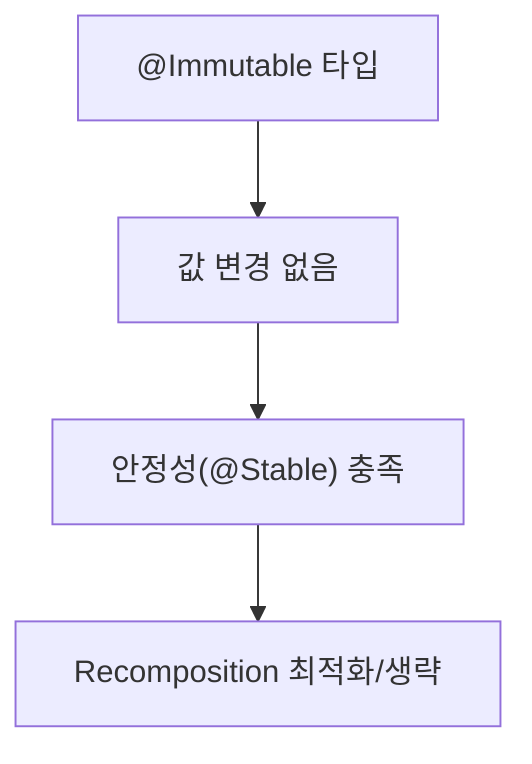

# @Immutable

`@Immutable`은 클래스를 대상으로 적용하며, 해당 클래스의 인스턴스가 생성된 이후에는 외부로 노출된 모든 프로퍼티의 필드가 변경되지 않음을 컴파일러와 **엄격하게 약속**합니다. 이는 Kotlin의 `val` 키워드보다 **훨씬 강력한 보장**입니다. `val`은 재할당만 막을 뿐, 내부적으로 **가변 자료구조**를 참조할 수 있어 값이 실질적으로 변할 수 있습니다. Kotlin은 언어 차원에서 불변성을 강제하는 타입/키워드를 제공하지 않으므로, Compose에서는 `@Immutable`이 **필수적인 신호**가 됩니다.

### Compose Runtime 최적화와의 관계
Compose Runtime은 어떤 타입에서 읽은 값이 초기화 후에는 변경되지 않는다고 가정할 수 있을 때, **스마트 recomposition** 및 **recomposition 생략**을 더 공격적으로 최적화할 수 있습니다.

### 사용 지침
- **좋은 예시**: 모든 속성이 `val`인 데이터 클래스. 모든 프로퍼티는 원시 타입(primitive) 혹은 `@Immutable`로 표시된 타입이어야 합니다.
- **주의 사항**: 어떠한 프로퍼티도 사용자 정의 `getter`를 가지지 않아야 합니다. 호출 시마다 다른 값을 반환할 수 있어 **안정적이지 않은 API**가 될 수 있습니다.

### 예시
```kotlin
  import androidx.compose.runtime.Immutable

  @Immutable
  data class User(
    val id: Long,
    val name: String
  )
```

비권장 예시(내부 가변 상태 포함):
```kotlin
  import androidx.compose.runtime.Immutable

  @Immutable // 내부에 가변 컬렉션이 있어 불변을 위반할 수 있음
  data class UserGroup(
    val members: MutableList<User>
  )
```

### `@StableMarker`와의 관계
`@Immutable`은 `@StableMarker`이기도 하므로, 그 요구사항을 **모두 상속**합니다. 불변으로 간주되는 타입은 외부로 노출된 값이 절대 변경되지 않으므로, `@StableMarker`에 명시된 기준을 **항상 충족**합니다. `@Immutable`은 이미 불변인 타입을 Compose Runtime에 **더 강하게 안정적(stable)** 임을 전달하기 위해 존재합니다.

> 추가 지침: 불변 타입은 값이 변경되지 않으므로 composition에 변경 사실을 **알릴 필요가 없습니다**. 이는 `@StableMarker`의 요구 사항을 자연스럽게 충족합니다.

### 다이어그램


### 권장/비권장 요약
| 분류 | 내용 |
|---|---|
| 권장 | 모든 프로퍼티 `val`, 원시 타입 또는 `@Immutable` 타입, 사용자 정의 `getter` 없음 |
| 비권장 | `MutableList`/`MutableSet` 등 가변 컬렉션 보유, `var` 프로퍼티, 호출마다 결과가 달라지는 사용자 정의 `getter` |

---

### 요약
- `@Immutable`은 `val`보다 강한 **불변성 보장**을 제공하여 Compose의 **recomposition 최적화**를 가능하게 합니다.
- 모든 프로퍼티는 `val`이어야 하며, **원시 타입 또는 `@Immutable` 타입**만 사용하고 **사용자 정의 getter**는 지양합니다.
- `@Immutable`은 `@StableMarker`의 요구사항을 모두 만족하며, **안정성 향상**과 **recomposition 생략**에 기여합니다.