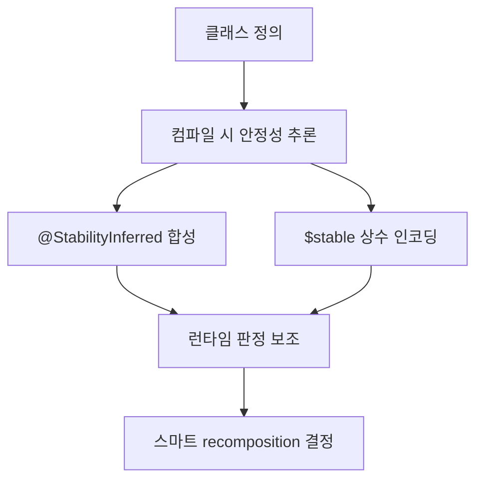

# 클래스 안정성 추론 (Inferring Class Stability)

> `스마트 recomposition`은 `@Composable`의 입력이 변경되지 않았고 그 입력이 `안정적(stable)`일 때, 해당 `Composable`의 `recomposition`을 생략하는 최적화입니다. 안정성은 런타임이 입력을 안전하게 읽고 비교할 수 있음을 의미하며, 궁극적으로 `Compose Runtime`의 성능을 돕습니다.

## 안정적인 타입의 조건

- **일관된 동치성 보장**: 동일한 두 인스턴스에 대한 `equals` 호출 결과가 항상 같아야 합니다.
- **변경 알림 보장**: 타입의 `public` 프로퍼티가 변경되면 composition이 항상 이를 인지해야 합니다. 그렇지 않으면 입력과 실제 상태 간 비동기화가 발생합니다.
- **안정적 속성 타입**: 모든 `public` 프로퍼티는 원시 타입(문자열 포함) 또는 안정적인 타입이어야 합니다.

> 원시 타입과 함수형 타입은 정의상 불변으로 간주되어 기본적으로 안정적입니다.

## 어노테이션과 기본 규칙

- `@Immutable`: 완전 불변 타입임을 약속합니다.
- `@Stable`: 내부적으로 변경 가능성이 있으나, 변경 시 Compose에 확실히 알릴 수 있음을 약속합니다. 예: `MutableState<T>`.
- 커스텀 타입은 위 조건을 충족한다는 판단하에 `@Immutable` 또는 `@Stable`로 표시할 수 있습니다. 단, **개발자 약속만에 의존하면 위험**하므로 컴파일러가 가능한 한 안정성을 `추론`합니다.

## 컴파일러의 추론 방식

- 컴파일러는 자격을 갖춘 클래스에 합성 주석 `@StabilityInferred`를 추가하고, 클래스에 안정성 정보를 인코딩한 합성 상수 `static final int $stable`을 생성합니다.
- 런타임은 이 정보를 이용해 해당 클래스를 인자로 받는 `Composable`의 recomposition 생략 여부를 판단합니다.



## 추론 대상과 예외

> 안정성 추론은 모든 클래스에 적용되지 않습니다.

- 적용: `public` 일반 클래스(예: 일반 클래스, `data class`) 중 `@Immutable`/`@Stable`이 없는 타입
- 제외: `enum`, `enum entry`, `interface`, `annotation`, `anonymous object`, `expect` 요소, `inner class`, `companion`, `inline class`, 그리고 이미 관련 어노테이션이 적용된 경우

## 필드 불변성에 따른 판정

- 모든 필드가 `readonly`이며 안정적이면 클래스는 안정적입니다. 여기서의 "필드"는 JVM 바이트코드 관점의 필드입니다.

예시:

```kotlin
  class Foo
```

```kotlin
  class Foo(val value: Int) // 안정적 필드만 보유 → 안정적
```

```kotlin
  class Foo(var value: Int) // 가변 필드 보유 → 불안정
```

## 제네릭 타입 매개변수의 영향

제네릭 매개변수는 클래스 안정성에 영향을 줍니다.

```kotlin
  class Foo<T>(val value: T)
```

- `T`의 안정성에 의존합니다. `T`는 런타임 전에는 실체화되지 않으므로, 컴파일러는 `@StabilityInferred`에 비트마스크를 기록하여 런타임 판정을 보조합니다.
- 제네릭이 있다고 항상 불안정한 것은 아닙니다. 예를 들어 아래는 안정적으로 취급될 수 있습니다.

```kotlin
  class Foo<T>(val a: Int, b: T) {
    val c: Int = b.hashCode() // 동일 인스턴스에 대해 일관된 결과 기대
  }
```

## 합성 타입의 재귀적 판정

다른 안정성에 의존하는 경우, **모든 매개변수의 안정성 조합**으로 재귀적으로 판정합니다.

```kotlin
  class Foo(val bar: Bar, val bazz: Bazz)
```

## 내부 가변 상태가 있는 경우

클래스 내부에서만 변경하더라도, 시간이 지나며 상태가 변하는 타입은 **불안정**합니다.

```kotlin
  class Counter {
    private var count: Int = 0
    fun getCount(): Int = count
    fun increment() { count++ }
  }
```

## 인터페이스·컬렉션 타입에 대한 기본 가정

- 컴파일러는 **증명 가능한 것만** 안정적이라 간주합니다. 구현을 알 수 없는 `interface`는 기본적으로 불안정합니다.
- `List<T>`는 `ArrayList` 같은 가변 구현을 가질 수 있으므로, 기본적으로 **불안정**으로 가정됩니다.

```kotlin
  @Composable
  fun <T> MyListOfItems(items: List<T>) {
    // ...
  }
```

## public 프로퍼티 불가변성의 불확실성

타입의 `public` 프로퍼티가 불가변일 수도 있는 경우, 컴파일러는 안전을 위해 **불안정**으로 간주합니다. 그러나 실무에서는 해당 프로퍼티들이 실제로 불변인 경우가 많습니다. 이런 경우 개발자가 더 많은 정보를 갖고 있다면 **명시적으로 `@Stable`을 부여**해 스마트 recomposition을 유도할 수 있습니다.

### 명시적 안정성 부여 예시

```kotlin
  // Mark the type as stable to favor skipping and smart recomposition
  @Stable
  interface UiState<T : Result<T>> {
    val value: T?
    val exception: Throwable?

    val hasError: Boolean
      get() = exception != null
  }
```

## 더 알아보기

- 컴파일러의 안정성 추론 사례는 매우 다양합니다. 세부 동작은 Compose Compiler의 `ClassStabilityTransform` 관련 테스트를 참고해도 좋습니다.

> 컴파일러의 안정성 추론 방식과 내부 동작은 시간이 지남에 따라 **변화/개선**될 수 있으며, 이러한 변화는 라이브러리 사용자에게 **투명**하게 제공됩니다.

## 요약
- **핵심 개념**: 안정성은 스마트 `recomposition` 생략을 가능케 하며 런타임 최적화의 기반입니다.
- **판정 기준**: 일관된 `equals`, 변경 알림 보장, 안정적 속성 타입.
- **추론 메커니즘**: `@StabilityInferred`, `$stable` 합성 정보로 런타임 판정 보조.
- **주의점**: 제네릭·인터페이스·컬렉션·가변 필드는 기본적으로 불안정 가정.
- **대응 방법**: 불가피하게 불안정으로 판정되는 모델은 `@Stable`/`@Immutable`로 명시해 의도를 전달.

