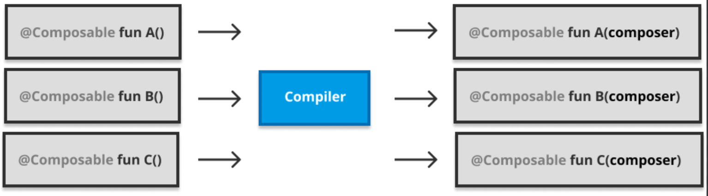
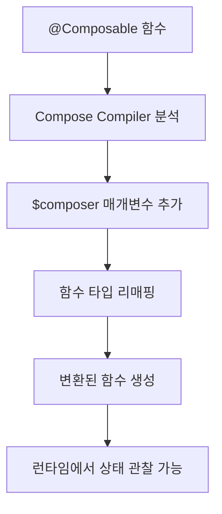

# Composer 주입하기 (Injecting the Composer)

## 개요

**Compose Compiler**의 핵심 동작 중 하나는 모든 `@Composable` 함수에 `Composer`라는 **합성 매개변수**를 자동으로 추가하는 것입니다. 이 과정을 통해 기존의 Composable 함수들이 **완전히 새로운 형태로 변환**되며, 런타임에서 상태 관찰과 재구성을 가능하게 합니다.

## 주요 특징

- **전역 접근성**: `$composer` 매개변수는 Composable 트리의 **어느 지점에서나 항상 사용** 가능
- **람다식 포함**: Composable 람다식에 대한 호출에도 동일하게 적용
- **타입 변환**: 매개변수 추가로 인한 **함수 타입 리매핑(remapping)** 작업 수행



> 이와 같은 주입 작업은 `Composer`를 모든 하위 트리에서 사용할 수 있게 하고, Composable 트리를 구체화하여 **업데이트된 상태로 유지**하는 데 필요한 모든 정보를 제공합니다.

## Composer 주입 과정



## 코드 변환 예시

### 변환 전 (원본 코드)
```kotlin
@Composable
fun NamePlate(name: String, lastname: String) {
    Column(modifier = Modifier.padding(16.dp)) {
        Text(text = name)
        Text(
            text = lastname,
            style = MaterialTheme.typography.subtitle1
        )
    }
}
```

### 변환 후 (컴파일러가 생성한 코드)
```kotlin
fun NamePlate(name: String, lastname: String, $composer: Composer) {
    $composer.start(123)
    Column(modifier = Modifier.padding(16.dp), $composer) {
        Text(
            text = name,
            $composer
        )
        Text(
            text = lastname,
            style = MaterialTheme.typography.subtitle1,
            $composer
        )
    }
    $composer.end()
}
```

## 주입 예외 사항

### 변환되지 않는 경우

1. **인라인 람다**
   - 컴파일 타임에 호출자 쪽으로 **인라인되면서 사라짐**
   - 별도의 `Composer` 주입이 불필요

2. **expect 함수**
   - 타입 해결(type resolution) 시 `actual` 함수로 처리
   - `actual` 함수에서 변환 작업 수행

## 핵심 동작 원리

| 구성요소 | 역할 | 특징 |
|---------|------|------|
| `$composer` | 상태 관찰 및 재구성 관리 | 모든 Composable 함수에 자동 주입 |
| `start()` | Composable 시작 지점 표시 | 고유한 키 값으로 식별 |
| `end()` | Composable 종료 지점 표시 | 트리 구조 완성 |

## 요약

- **자동 주입**: Compose Compiler가 모든 `@Composable` 함수에 `$composer` 매개변수를 자동 추가
- **전역 접근**: 트리의 모든 지점에서 Composer에 접근하여 상태 관찰 및 재구성 수행
- **타입 변환**: 매개변수 추가로 인한 함수 타입 리매핑 작업 필요
- **예외 처리**: 인라인 람다와 expect 함수는 변환 대상에서 제외
- **핵심 목적**: Composable 트리의 구체화와 상태 기반 업데이트 지원