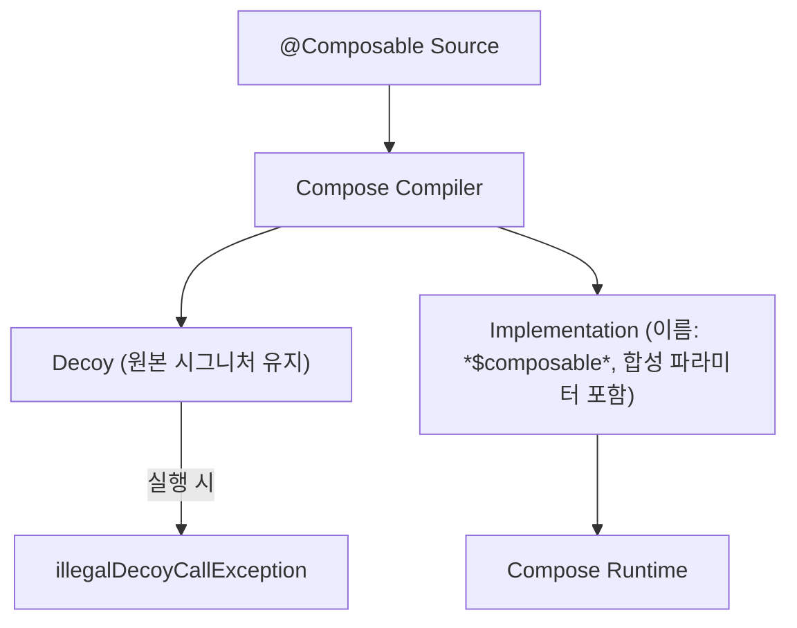

# Klib과 미끼 생성 (Klib and Decoy Generation)

> Kotlin Multiplatform의 `.klib` 및 `Kotlin/JS`에서 `IR` 역직렬화와 `@Composable` 시그니처 변환 차이로 인해 필요한 **Decoy(미끼) 함수 생성 전략**을 정리합니다.

## 배경

- **문제 원인**: JS/KMP 환경에서는 의존성의 `IR`이 역직렬화됩니다. Compose 컴파일은 `@Composable` 함수와 호출에 합성 매개변수(예: `composer`, `changed`)를 추가하여 시그니처가 **원본과 달라질 수** 있습니다.
- **불일치 위험**: 이미 배포된 바이너리와의 타입 시그니처 불일치로 인해 링크/호출 문제가 발생할 수 있습니다.

## 해결 전략: 교체 대신 복사본(Decoy) 생성

- JVM과 동일하게, **기존 선언을 교체하지 않고 복사본을 생성**합니다.
- 원본 선언은 유지되어 **Kotlin 메타데이터와 IR 간 연결**이 보존되고, 기존 **모든 참조가 안정적으로 동작**합니다.
- 변환된 구현은 별도의 함수로 두고, **런타임에서 구분**하기 위해 구현 함수 이름에 `$composable` 접미사를 부여합니다.

## 예시 코드

아래는 컴파일 전후의 구조입니다.

```kotlin
// Before compiler (sources)
@Composable
fun Counter() {
  // ...
}

// Transformed
@Decoy(/* metadata */)
fun Counter() { // signature is kept the same
  illegalDecoyCallException("Counter")
}

@DecoyImplementation(/* metadata */)
fun Counter$composable( // signature is changed
  $composer: Composer,
  $changed: Int
) {
  // ... transformed code ...
}
```

## 요소 요약

| 항목 | 설명 |
| --- | --- |
| `@Decoy` | 원본과 동일한 시그니처를 유지하는 "껍데기" 함수. 직접 호출 시 `illegalDecoyCallException` 유도 |
| `@DecoyImplementation` | 변환된 구현을 담는 실제 함수. `$composable` 접미사로 구분 |
| `Kotlin 메타데이터` | 원본 선언 유지로 메타데이터-IR 매핑과 바이너리 호환성 확보 |
| 합성 매개변수 | `composer`, `changed` 등 런타임이 요구하는 파라미터를 구현 함수에 삽입 |

## 동작 흐름



## 참고 자료

- [Andrei Shikov: Kotlin compiler plugins and binaries on Multiplatform](https://dev.to/shikasd/kotlin-compiler-plugins-and-binaries-on-multiplatform-139e)

## 요약
- **핵심 아이디어**: 교체가 아닌 **복사본(Decoy) 생성**으로 시그니처 불일치 해결.
- **구분 방법**: 구현 함수에 `$composable` 접미사, 원본과 구현을 명확히 분리.
- **안정성**: 메타데이터-IR 연결 유지로 **의존성/바이너리 호환성** 보장.
- **대상 환경**: `.klib`, `Kotlin/JS`에서 특히 중요하며 JVM에도 동일 개념 적용.