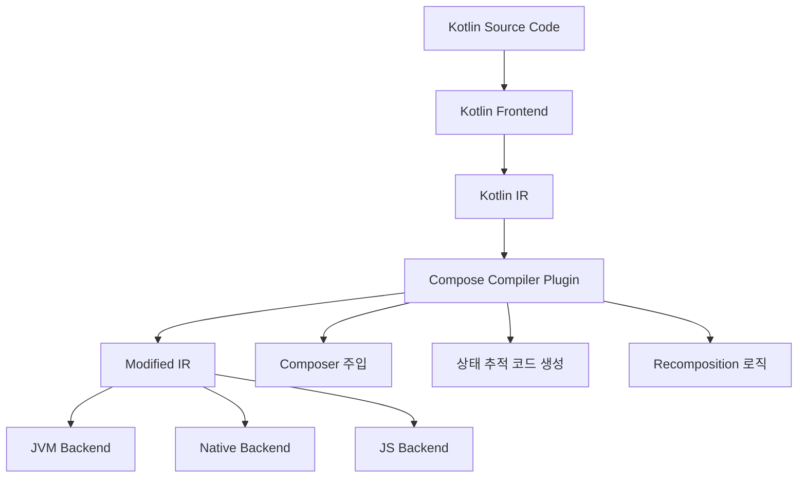

# 코틀린 IR (The Kotlin IR)

## 개요

**컴파일러 플러그인**은 목표로 하는 플랫폼에 대해 최종적인 코드를 생성하기 전에 언어의 **중간 표현(IR, Intermediate Representation)** 에 액세스할 수 있습니다. 이를 통해 새로운 코드를 생성할 뿐만 아니라 개발자가 작성한 소스 코드를 수정할 수 있습니다.

## 컴파일러 플러그인의 역할

### 코드 변환 기능

컴파일러 플러그인은 다음과 같은 작업을 수행할 수 있습니다:

- **매개변수 조작**: 개발자 몰래 매개변수를 삽입하고 교체
- **새 매개변수 추가**: 필요에 따라 추가적인 매개변수 삽입  
- **코드 구조 재구성**: 코드를 "커밋"하기 전에 전체 구조 변경

이러한 작업들은 **Kotlin 컴파일러의 백엔드(backend) 단계**에서 발생합니다.

### Compose에서의 활용

Jetpack Compose는 이러한 기능을 활용하여 각 `@Composable` 호출에 대해 **암시적인 추가 매개변수**인 `Composer`를 "주입"합니다.

```kotlin
// 개발자가 작성한 코드
@Composable
fun MyComposable(name: String) {
  Text("Hello, $name")
}

// 컴파일러가 변환한 코드 (개념적)
fun MyComposable(name: String, $composer: Composer, $changed: Int) {
  // Composer를 활용한 실제 구현
}
```

## IR 생성의 중요성

### 멀티플랫폼 지원

컴파일러 플러그인은 다양한 형태로 코드를 생성할 수 있습니다:

| 접근 방식 | 특징 | 제한사항 |
|----------|------|----------|
| **JVM 바이트코드** | Java와 호환되는 코드 생성 | JVM 플랫폼에만 제한 |
| **Kotlin IR** | 플랫폼 독립적인 중간 표현 | 모든 플랫폼 지원 가능 |

### Kotlin IR의 장점

**IR(Intermediate Representation)** 은 목표로 하는 플랫폼에 관계없이 언어 요소의 표현으로 존재합니다. 이는 다음과 같은 이점을 제공합니다:

- **플랫폼 독립성**: 하나의 IR로 여러 플랫폼 지원
- **일관성**: 모든 플랫폼에서 동일한 동작 보장
- **확장성**: Jetpack Compose 코드의 멀티플랫폼 가능성

## 구현 방식

`Compose Compiler` 플러그인은 **Kotlin 컴파일러의 공통 IR 백엔드**에서 제공하는 확장 포인트를 활용합니다:

```kotlin
// 개념적인 구현 방식
class ComposeIrGenerationExtension : IrGenerationExtension {
  override fun generate(moduleFragment: IrModuleFragment, pluginContext: IrPluginContext) {
    // Composable 함수 변환 로직
  }
}
```

### 아키텍처 다이어그램



## 추가 학습 자료

> **참고**: Kotlin IR을 심도 있게 학습하는 것은 고급 주제입니다. 추가적인 학습을 원하신다면 **Brian Norman의 연재물**을 확인하실 것을 권장합니다. 이 연재물은 Kotlin IR과 컴파일러 플러그인 생성에 대한 주제를 전반적으로 다룹니다.

### 관련 링크

- [Kotlin IR 공식 문서](https://kotlinlang.org/docs/whatsnew17.html#stable-jvm-ir-backend)
- [Brian Norman's Compiler Plugin Series](https://blog.bnorm.dev/writing-your-second-compiler-plugin-part-2)

## 요약

- **Kotlin IR**은 플랫폼 독립적인 중간 표현으로, 컴파일러 플러그인이 코드를 변환할 수 있는 지점을 제공합니다
- **Compose Compiler**는 IR 레벨에서 `@Composable` 함수에 `Composer` 매개변수를 자동으로 주입합니다  
- **멀티플랫폼 지원**을 위해 JVM 바이트코드 대신 Kotlin IR을 사용하는 것이 더 효과적입니다
- **IrGenerationExtension**을 통해 Kotlin 컴파일러의 IR 백엔드에 플러그인을 등록할 수 있습니다
- 컴파일러 플러그인은 개발자가 작성한 코드를 자동으로 변환하여 Compose의 상태 관리 및 재구성 기능을 구현합니다