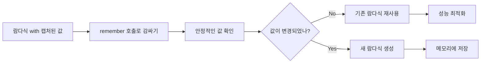
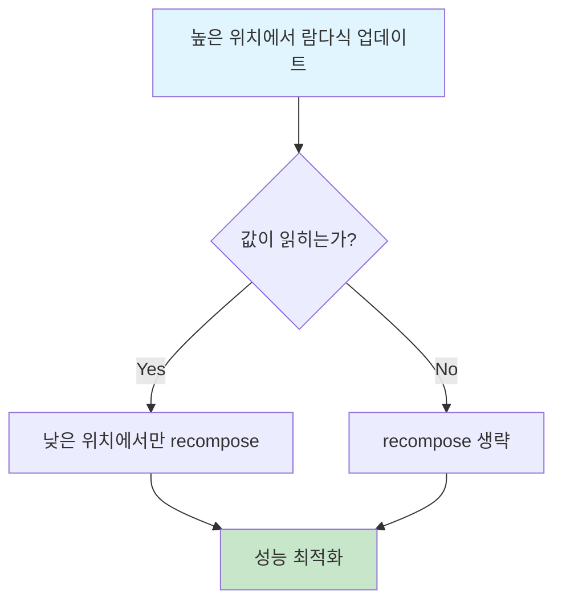

# Compose 람다식 기억법 (Compose lambda memoization)

이 단계에서는 **Composable 함수에 전달된 람다식의 실행을 최적화**하는 방법을 런타임에 알려주기 위해 IR을 생성합니다. 해당 작업은 아래 두 가지 유형의 람다식에 대해 수행됩니다.

## 람다식 유형별 최적화 방식

| 람다식 유형 | 최적화 방식 | 사용 예시 |
|------------|------------|----------|
| **Non-composable lambdas** | `remember` 호출로 감싸서 메모이제이션 | Composable 함수에 전달하는 콜백 |
| **Composable lambdas** | `composableLambda()` 팩토리 함수 사용 | Compose UI 노드에 전달하는 Composable 람다식 |

- **Non-composable lambdas**: 컴파일러는 이 유형의 람다식을 `remember` 호출로 감싸서 인메모리에 저장하기 위한 IR을 생성합니다. 예를 들어, Composable 함수에 전달하는 콜백을 떠올려 볼 수 있습니다. 여기서 `remember`는 **슬롯 테이블**을 사용하여 해당 람다식을 저장하고 나중에 읽을 수 있도록 합니다.

- **Composable lambdas**: 컴파일러는 Composable 람다식에 대해서도 IR을 생성하는데, 이는 람다식을 감싸고 **composition에 람다식을 저장하고 읽는 방법**을 런타임에 가르치기 위한 정보를 추가하기 위함입니다. 이 작업은 최종적으로 `remember`를 사용하는 것과 동일한 목표를 가지고 있지만, `remember`를 사용하지는 않습니다.

## Non-composable lambdas

이 작업은 Composable 함수에 매개변수 형태로 전달된 **람다식 호출을 최적화**하여, 재사용할 수 있도록 합니다. 

### Kotlin의 기본 최적화 vs Compose의 스마트 최적화

- **Kotlin 기본 최적화**: 값을 `캡처(capture)` 하지 않는 람다식을 **싱글톤**으로 모델링하여, 전체 프로그램에 대해 하나의 재사용 가능한 인스턴스로 최적화합니다.
- **Compose 스마트 최적화**: 람다식이 변수 값을 캡처하는 경우에도 더 효율적으로 처리합니다.

> 캡처된 변수 값은 호출 시마다 달라질 수 있으므로, 고유하게 만들어 람다별로 다른 인스턴스가 사용되어야 합니다.

### 예시 코드

```kotlin
@Composable
fun NamePlate(name: String, onClick: () -> Unit) {
    // ...
    // onClick()
    // ...
}
```


여기서 `onClick`은 Composable 함수에 전달되는 표준 Kotlin 람다식입니다. 

### 람다식 메모이제이션 동작 원리

호출 지점에서 전달하는 람다가 어떤 변수 값을 **캡처**한다면, Compose는 런타임에게 이를 기억하도록 가르칩니다.



**람다식을 기억하는 과정**:
1. `remember` 함수로 람다식을 감싸기 (IR 생성을 통해 수행)
2. 캡처하는 값이 **안정적인 한**, 해당 값을 기반으로 람다식을 기억
3. 캡처하는 값이 일치하면 기존 람다식을 재사용, 그렇지 않으면 새 람다식 생성

### 중요한 제약사항

> **캡처된 값이 안정적이어야 하는 이유**: `remember` 호출의 조건 인자로 사용되기 때문에 값 비교를 위해 신뢰할 수 있어야 합니다.

> **기억된 람다식은 인라인될 수 없음**: 컴파일 타임에 호출자에서 인라인된 후 기억할 것이 없기 때문입니다.

**최적화 적용 범위**: 이 최적화는 **값을 캡처하는 람다식에만** 적합합니다. 그렇지 않은 경우 Kotlin의 기본 최적화(싱글톤으로 모델링)로도 충분합니다.

### IR 생성 과정

표현식에 대한 IR을 생성할 때, 컴파일러는 다음 순서로 처리합니다:

```kotlin
// 1. 반환 타입에 맞는 remember 호출 생성
remember<T>

// 2. 캡처된 값들을 조건 인수로 추가
remember<T>(arg1, arg2...)

// 3. 표현식을 후행 람다로 추가
remember<T>(arg1, arg2..., expression)
```

**캡처된 값의 역할**: 조건 인자로 사용되어 표현식 결과를 기억하기 위한 **키**로 사용되므로, 값이 달라질 때마다 invalidation됩니다.

**결과**: Composable 함수에 전달된 람다식을 자동으로 기억하면 `recomposition`이 발생할 때 재사용이 가능해집니다.

## Composable lambdas

Compose Compiler는 **Composable 람다식을 기억**할 수 있습니다. Composable 람다가 구현되는 "특별한" 방식 때문에, Non-composable 람다식과는 기억하는 방식의 세부적인 요소만 다를 뿐입니다. 

**최종 목표는 동일**: 람다식을 **슬롯 테이블에 저장하고 읽어내는 것**

### 예시 코드

```kotlin
@Composable
fun Container(content: @Composable () -> Unit) {
    // ...
    // content()
    // ...
}
```

### composableLambda() 팩토리 함수

이를 위해 람다식의 IR이 수정되었고, 몇 가지 특수한 매개변수를 사용하여 **Composable 팩토리 함수**인 `composableLambda(...)`를 호출합니다.

#### 매개변수 구성

| 순서 | 매개변수 | 설명 | 예시 |
|-----|---------|-----|-----|
| 1 | `$composer` | 현재 컨텍스트의 Composer | `composableLambda($composer, ...)` |
| 2 | `$key` | 해시코드와 위치 조합으로 생성된 고유 키 | `composableLambda($composer, $key, ...)` |
| 3 | `$shouldBeTracked` | 추적 여부를 결정하는 boolean | `composableLambda($composer, $key, $shouldBeTracked, ...)` |
| 4 | `$arity` (선택적) | 매개변수가 22개 초과시 필요 | `composableLambda($composer, $key, $shouldBeTracked, $arity, ...)` |
| 5 | `expression` | 후행 람다식 자체 | `composableLambda(..., expression)` |

#### 매개변수 상세 설명

1. **`$composer`**: 현재 컨텍스트의 Composer 객체
2. **`$key`**: Composable 람다식의 **정규화된 이름**으로 생성한 해시코드와 표현식이 파일 내에서 위치하는 지점의 조합으로 얻은 키. **위치 기억법**을 사용할 때 고유성을 부여
3. **`$shouldBeTracked`**: 이 Composable 람다 호출이 **추적되어야 하는지** 여부를 결정
   - Kotlin은 람다식에서 `캡처하는 값이 없을 때` 해당 람다식들이 결코 변경되지 않을 것을 알기 때문에 **싱글톤 인스턴스**로 최적화
   - 이는 Compose에 의해 추적될 필요가 없음을 의미
4. **`$arity`**: 표현식의 개수에 대한 선택적 매개변수. 매개변수(매직 넘버)가 **22개가 넘어가는 경우**에만 필요
5. **`expression`**: 후행 람다식 자체

### Composable 팩토리 함수의 목적

**Composable 팩토리 함수의 역할**은 명확합니다:
- 람다식을 저장하기 위해 생성된 **키를 사용**하여 composition에 **교체 가능한 그룹(replaceable group)** 을 추가
- Compose는 런타임에 **Composable 람다식을 저장하고 검색하는 방법**을 학습

### ComposableSingletons 최적화

값 캡처를 하지 않는 Composable 람다식의 경우, Kotlin에서 처리하는 것과 동일하게 **싱글톤을 이용한 최적화**를 수행합니다.

**구현 방식**:
- Composable 람다식이 발견된 **파일마다** `"ComposableSingletons"`라는 **내부 객체(internal object)** 생성
- 해당 객체는 Composable 람다식에 대한 **정적 참조(static reference)** 를 보유
- 람다식의 결과 값을 반환하는 **getter 함수**를 생성

### MutableState와 유사한 구현

Composable 람다식은 **MutableState와 유사한 방식**으로 구현되어 최적화를 수행합니다.

```kotlin
// Composable 람다식
@Composable (A, B) -> C

// 다음과 동등하게 구현
State<@Composable (A, B) -> C>

// 호출 방식
lambda(a, b) ≡ lambda.value.invoke(a, b)
```

### "도넛 홀 생략하기" 최적화

**핵심 개념**: 모든 Composable 람다식에 대한 **스냅샷 상태 객체**를 생성하여, 람다식의 변화에 기반해 서브 계층 구조를 더 지능적으로 recompose



**"도넛 홀 생략하기(donut-hole skipping)"**:
- 트리의 **"높은" 위치**에서 람다식을 업데이트
- Compose가 실제로 이 값이 **읽히는 트리의 "낮은" 위치**에서만 recompose
- Compose 계층 구조에서 람다식이 **하향 전달되는 빈도가 높은** 자연스러운 사례에서 효과적
- 계층 구조의 "낮은" 위치로 전달되지만 실제로 해당 값을 **"읽지 않는"** (호출하지 않는) 경우에 최적화

## 요약

- **Non-composable lambdas**는 `remember` 호출로 감싸서 캡처된 값을 키로 사용한 메모이제이션을 수행
- **Composable lambdas**는 `composableLambda()` 팩토리 함수를 통해 composition에 저장되고 관리됨
- 값 캡처 없는 람다식은 싱글톤 최적화를 통해 성능 향상
- 람다식 메모이제이션을 통해 recomposition 시 재사용이 가능하여 성능이 최적화됨
- "도넛 홀 생략하기" 최적화로 불필요한 recomposition을 방지하여 효율성 극대화
- IR 생성을 통해 컴파일러가 자동으로 최적화 코드를 삽입하여 개발자가 명시적으로 처리할 필요 없음