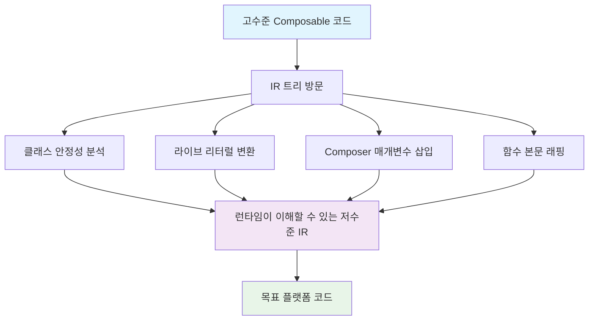

# 낮추기 (Lowering)

## 개요

> **낮추기(Lowering)** 란 컴파일러가 **고수준 프로그래밍 개념**을 **저수준의 원자적(atomic) 개념** 조합으로 변환하는 작업을 의미합니다.

**낮추기**는 Kotlin에서 매우 흔한 개념으로, 언어의 **중간 표현(IR: Intermediate Representation)** 에서 고급 개념을 표현한 후, 목표 플랫폼(JVM 바이트코드, JavaScript, LLVM IR 등)으로 변환하기 전에 코드를 **가장 낮은 수준의 형태로 변환**하는 과정입니다.

낮추기는 **정규화(Normalization)** 의 한 형태로도 이해할 수 있습니다.

## Compose Compiler에서의 낮추기

**Compose Compiler**는 라이브러리가 지원하는 개념들의 수준을 낮춰 **런타임이 이해할 수 있는 표현**으로 정규화해야 합니다.

### 낮추기 과정

낮추기 과정은 **Compose Compiler 플러그인의 코드 생성 단계**에서 진행됩니다:

1. **IR 트리**의 모든 요소를 방문
2. **런타임 요구사항**에 따라 필요한 요소에 맞게 IR을 조정
3. 고수준 개념을 저수준 개념으로 변환

## 낮추기 단계에서 수행되는 주요 작업들

### 1. 클래스 안정성 메타데이터 추가
- **클래스 안정성**을 추론
- 런타임에서 이를 이해하는 데 필요한 **메타데이터** 추가

### 2. 라이브 리터럴 변환
- **라이브 리터럴 기능**을 위해 소스 코드 변경사항을 리컴파일 없이 런타임에 반영
- 라이브 리터럴 표현식을 **가변적인 상태(State) 인스턴스** 접근으로 변환

### 3. Composer 매개변수 삽입
- **Composable 함수**에 암시적인 `Composer` 매개변수 삽입
- 해당 매개변수를 모든 **Composable 호출**에 전달

### 4. Composable 함수 본문 래핑
Composable 함수의 본문을 다음과 같은 작업들을 위해 래핑:

- **컨트롤 플로우**를 위한 다양한 유형의 그룹 생성
  - 교체 가능한 그룹
  - 이동 가능한 그룹 등

### 5. 디폴트 매개변수 지원 구현
- Kotlin의 기본 디폴트 매개변수 지원에 의존하지 않음
- **별도의 디폴트 매개변수 지원**을 구현
- 생성된 함수 그룹 범위 내에서 실행 가능

### 6. Recomposition 최적화
- 함수에게 **recomposition을 생략**하는 방법 학습
- **상태 변경** 관련 정보를 트리 아래로 전파
- 상태 변경 시 **자동 recomposition** 지원

## 낮추기 과정 다이어그램

## 요약

- **낮추기(Lowering)** 는 고수준 프로그래밍 개념을 저수준 원자적 개념으로 변환하는 컴파일러 작업
- **Compose Compiler**에서 낮추기는 코드 생성 단계에서 IR 트리를 방문하여 런타임 요구사항에 맞게 변환
- 주요 작업으로는 **클래스 안정성 메타데이터 추가**, **라이브 리터럴 변환**, **Composer 매개변수 삽입**, **함수 본문 래핑**, **디폴트 매개변수 지원**, **Recomposition 최적화** 등이 있음
- 이 과정을 통해 고수준 Compose 코드가 런타임에서 효율적으로 실행될 수 있는 저수준 코드로 변환됨