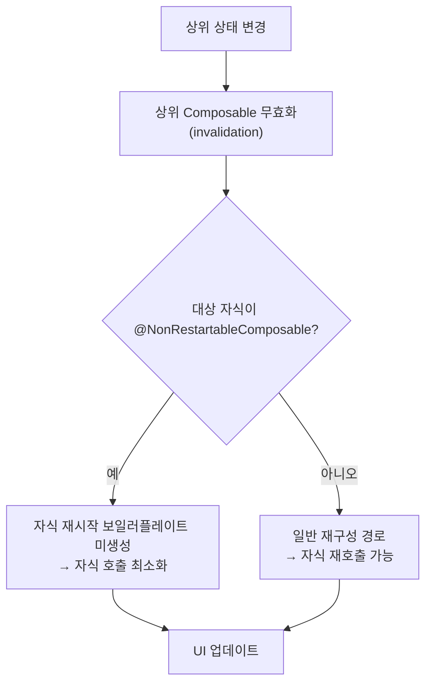

# @NonRestartableComposable

- **정의**: `@NonRestartableComposable` 어노테이션을 함수 또는 프로퍼티의 getter에 적용하면, 해당 Composable은 기본적으로 **재구성(recomposition)에 의해 재시작되지 않도록** 컴파일됩니다.  
  - 단, **인라인된 Composable**이나 **반환 타입이 `Unit`이 아닌 Composable**은 애초에 재시작이 불가하므로 모든 Composable이 기본적으로 재시작 가능한 것은 아닙니다.

### 동작 원리

- 이 어노테이션이 붙으면 컴파일러가 recomposition 중에 함수를 **재구성/생략하기 위한 보일러플레이트 코드를 생성하지 않습니다**.  
- 상위 Composable에 의해 **recomposition될 가능성이 낮은**, 로직이 거의 없는 **가벼운(leaf) UI**에 적합합니다.  
- 이 함수 스스로의 **무효화(invalidation)** 는 큰 의미가 없으며, **무효화 및 재구성은 본질적으로 상위 Composable**에서 트리거되어야 합니다.

### 사용 적합성

| 구분 | 케이스 | 비고 |
|---|---|---|
| 적합 | 순수 렌더링(입력만 소비, 내부 상태 없음) | 상위에서만 무효화됨 |
| 적합 | 정적/거의 변하지 않는 출력 | 비용 절감 효과 미미하지만 긍정적 |
| 부적합 | 내부에서 상태를 읽고 자주 갱신 | 상위/자체 무효화가 빈번 |
| 부적합 | 부수효과(side effects) 또는 조건부 렌더링이 많은 경우 | 재시작 불가가 디버깅/동작을 복잡하게 함 |

### 성능 관점

- 이 어노테이션은 **정확성(correctness)을 위해 거의 필요하지 않습니다**.  
- 다만 특정 상황에서 **재구성 오버헤드를 아주 약간 줄이는 최적화**로 사용할 수 있습니다.  
- 남용보다는, **분명한 근거가 있는 leaf-level, stateless, low-change UI**에 제한적으로 적용하세요.

### 예시

```kotlin
@Composable
fun Title(text: String) {
  // 일반적인 재시작 가능 Composable
  Text(text)
}
```

```kotlin
@NonRestartableComposable
@Composable
fun StaticSpacer(height: Dp) {
  // 로직이 거의 없는 가벼운 렌더링: 재시작 불가 최적화에 적합
  Spacer(Modifier.height(height))
}
```

```kotlin
@NonRestartableComposable
@Composable
fun CounterDisplay(count: Int) {
  // 입력만 소비하고 내부 상태/부수효과가 없음 → 후보가 될 수 있음
  Text("Count: $count")
}
```

```kotlin
@NonRestartableComposable
@Composable
fun NotIdealExample() {
  // 내부에서 상태를 읽고 자주 변한다면 적합하지 않음
  val state by remember { mutableStateOf(0) }
  Text("State: $state")
}
```

### 재구성 흐름 다이어그램



### 가이드라인

- **적용하세요**: leaf 수준, **stateless**, **입력만 소비**하는 단순 렌더링.
- **피하세요**: 내부 상태를 자주 읽거나 갱신, **부수효과** 또는 **조건부 렌더링**이 많은 경우.
- **목표**: 정확성 변경 없이, **미세한 재구성 오버헤드 감소**.

### 요약

- **핵심**: `@NonRestartableComposable`은 재구성 시 재시작 보일러플레이트를 생성하지 않아, 드문 경우에 **아주 소폭의 성능 최적화**를 제공.  
- **적합**: 상위에서만 무효화되고 자체 로직이 거의 없는 **leaf, stateless 렌더링**.  
- **부적합**: 내부 상태·부수효과가 많은 경우.  
- **정확성**: 기능적 정합성 확보를 위한 필수 요소가 아니며, **선별적 적용**이 바람직.