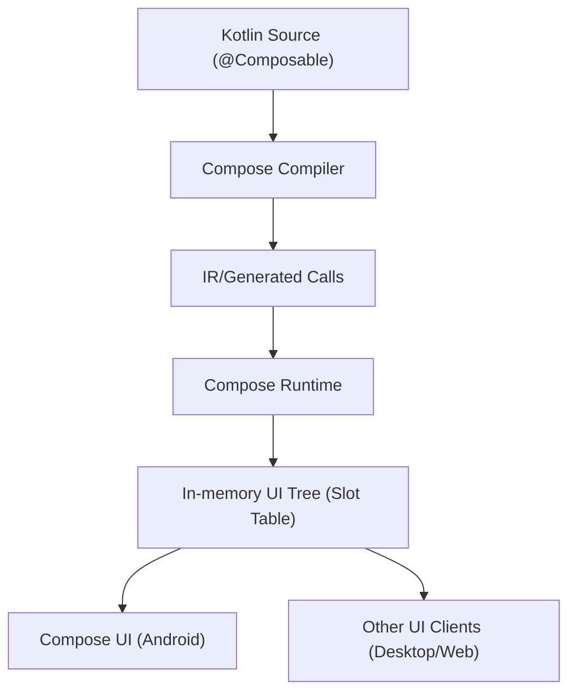

# 2. Compose 컴파일러 (The Compose Compiler)

> Jetpack Compose를 구성하는 여러 라이브러리 중에서도 `Compose Compiler`, `Compose Runtime`, `Compose UI`에 집중합니다.

## 개요

- **핵심**: `Compose Compiler`와 `Compose Runtime`은 Jetpack Compose의 본질적인 구성 요소입니다.
- **중요한 구분**: `Compose UI`는 아키텍처의 필수 요소가 아니라, **Runtime/Compiler를 사용하는 클라이언트 라이브러리** 중 하나입니다.
  - JetBrains가 개발 중인 데스크톱/웹용 클라이언트 라이브러리처럼, 다른 클라이언트도 `Runtime`과 `Compiler` 위에서 동작할 수 있습니다.

## 아키텍처 내 위치와 역할

`Compose UI`를 통해 우리는 `Composable` 트리의 **런타임 인메모리 표현**이 어떻게 제공되고, 그 표현이 **실제 UI 요소로 어떻게 구체화**되는지를 관찰할 수 있습니다. 아래 이미지는 전반 구조를 보여줍니다.


초심자 입장에서는 순서나 책임이 다소 추상적으로 느껴질 수 있습니다. 이 문서에서는 `Compose Compiler`가 **`Runtime`의 요구에 맞는 코드를 생성**하는 방식, **초기 composition**과 **후속 recomposition**의 트리거, **인메모리 트리 표현**의 제공과 **recomposition에서의 재사용**까지 핵심 흐름을 개념적으로 정리합니다.

## 구성요소 요약

| 구성요소 | 핵심 역할 | 사용처/비고 |
| --- | --- | --- |
| `Compose Compiler` | `@Composable` 코드를 컴파일 단계에서 변환하여 `Runtime`이 이해할 수 있는 호출로 생성 | Kotlin Compiler 플러그인 형태 |
| `Compose Runtime` | 인메모리 `Composable` 트리 관리, 상태 관찰, composition/recomposition 스케줄링 | 플랫폼 불문 공통 기반 |
| `Compose UI` | Runtime이 제공한 트리를 실제 Android UI로 실체화 | Android 클라이언트 라이브러리 |

## 동작 개요 (Mermaid)



## 예시 코드

컴파일러는 `@Composable` 함수를 **런타임 호출로 확장**해 상태 관찰과 재구성을 가능하게 합니다.

```kotlin
@Composable
fun Greeting(name: String) {
  Text(text = "Hello, $name")
}
```

## 더 학습하기

아래 문서들을 통해 각 주제를 심화 학습할 수 있습니다.

- **개념**
  - [Compose 컴파일러 (The Compose compiler)](./Compiler/README.md)
  - [Compose 어노테이션들 (Compose annotations)](./Annotations/README.md)
    - [@Composable](./AnnotationComposable/README.md)
    - [@ComposableCompilerApi](./AnnotationComposableCompilerApi/README.md)
    - [@InternalComposeApi](./AnnotationInternalComposeApi/README.md)
    - [@DisallowComposableCalls](./DisallowComposableCalls/README.md)
    - [@ReadOnlyComposable](./ReadOnlyComposable/README.md)
    - [@NonRestartableComposable](./NonRestartableComposable/README.md)
    - [@StableMarker](./StableMarker/README.md)
    - [@Immutable](./Immutable/README.md)
    - [@Stable](./Stable/README.md)
- **도구/버전/검사**
  - [컴파일러 확장 등록 (Registering Compiler extensions)](./CompilerExtensions/README.md)
  - [Kotlin 컴파일러 버전 (Kotlin Compiler Version)](./CompilerVersion/README.md)
  - [정적 분석 (Static Analysis)](./StaticAnalysis/README.md)
  - [정적 검사기 (Static Checkers)](./StaticCheckers/README.md)
  - [호출 검사 (Call checks)](./CallChecks/README.md)
  - [타입 검사 (Type checks)](./TypeChecks/README.md)
  - [선언 검사 (Declaration checks)](./DeclarationChecks/README.md)
  - [진단 억제기 (Diagnostic Suppression)](./DiagnosticSuppression/README.md)
  - [런타임 버전 검사 (Runtime Version Check)](./RuntimeVersionCheck/README.md)

## 요약
- **핵심 구성**: `Compose Compiler`와 `Compose Runtime`이 중심, `Compose UI`는 클라이언트.
- **역할 구분**: 컴파일러는 변환, 런타임은 상태/트리 관리, UI는 실체화.
- **흐름 이해**: composition과 recomposition 트리거, 인메모리 트리 재활용이 핵심.
- **확장성**: Runtime/Compiler는 Android 외 데스크톱/웹 등 다양한 클라이언트에 적용 가능.
