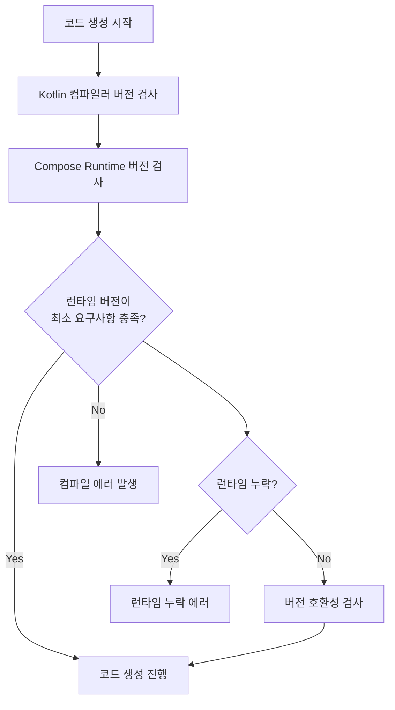

# 런타임 버전 검사 (Runtime Version Check)

**Jetpack Compose Compiler**의 코드 생성 과정에서 수행되는 런타임 버전 호환성 검사에 대해 알아봅니다.

## 개요

지금까지 모든 **정적 검사기**와 **진단 제지기**에 대해 살펴보았고, 이제 더 흥미로운 내용을 살펴보도록 하겠습니다. **코드 생성 직전**에 가장 먼저 하는 일은 사용된 `Compose Runtime` 버전을 확인하는 것입니다.

## 런타임 버전 검사의 목적

`Compose Compiler`에는 지원하는 **최소 버전**의 런타임이 필요하므로 런타임이 오래된 버전이 아닌지 확인하는 과정이 필요합니다.

### 주요 검사 항목

이 검사 과정에서 다음과 같은 사항들을 감지합니다:

- **런타임 누락**: 런타임이 프로젝트에 포함되지 않았는지 확인
- **버전 호환성**: 사용된 런타임 버전이 너무 오래되지 않았는지 확인

## 버전 호환성 매트릭스

| 검사 순서 | 대상 | 목적 |
|---------|------|------|
| 1차 | **Kotlin 컴파일러** | 컴파일러 호환성 확인 |
| 2차 | **Compose Runtime** | 런타임 호환성 확인 |

## 버전 지원 정책

각 `Compose Compiler`는 버전에 따라 지원하는 **최소 런타임 버전**이 있고, 최소 버전보다 높은 다중의 런타임을 지원합니다.

> **중요**: 이는 두 번째로 수행하는 버전 검사입니다. 첫 번째로는 `Kotlin 컴파일러`의 버전을 검사하고, 그 다음으로 `Compose Runtime`의 버전 검사를 수행합니다.

## 런타임 버전 검사 프로세스

## 요약

- **런타임 버전 검사**는 Compose Compiler의 코드 생성 직전에 수행되는 중요한 단계입니다
- **Kotlin 컴파일러 버전 검사** 후 **두 번째**로 실행되는 검사 과정입니다
- 런타임의 **누락**과 **버전 호환성**을 동시에 확인합니다
- 각 Compose Compiler 버전은 **최소 런타임 버전** 요구사항을 가지고 있습니다
- 호환되지 않는 런타임 사용 시 **컴파일 에러**가 발생합니다