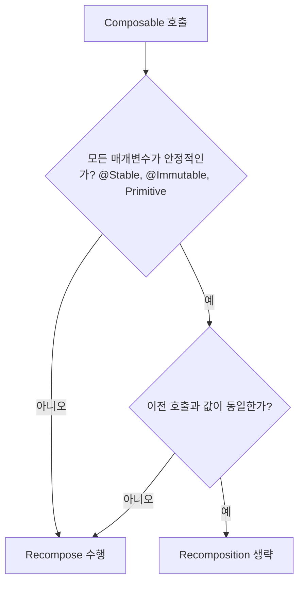

# @Stable

`@Stable`은 `@Immutable`보다 조금 더 가벼운 약속입니다. 적용 대상(타입, 함수, 프로퍼티)에 따라 의미가 달라집니다.

## 타입에 적용될 때의 의미
- 타입에 **가변성(mutable)** 이 존재함을 인정하면서도 `@StableMarker`에 의한 상속의 의미만을 지닙니다.
- 타입 자체가 불변이라면 `@Immutable`을 사용해야 합니다.
- 참고: 위의 **`@StableMarker`** 요구 사항을 다시 확인해 두세요.

## 함수/프로퍼티에 적용될 때의 의미
- 동일 입력에 대해 **항상 동일 결과를 반환**(참조 투명성에 가까운 성질)한다고 컴파일러에 알립니다.
- 이 보장은 다음 경우에만 가능합니다.
  - 매개변수가 `@Stable` 또는 `@Immutable`로 마킹되어 있거나
  - 매개변수가 **기본 타입(primitive)** 인 경우

## Compose Runtime과의 관계
- `Composable` 함수의 모든 매개변수가 **안정적(Stable/Immutable/Primitive)** 으로 마킹되면, 컴파일러는 이전 호출과의 **값 비교**를 통해 동일하면 **recomposition을 생략**합니다.
- 이는 Compose의 **위치 기억법(positional memoization)** 기반 최적화와 연동됩니다.

## 언제 `@Stable`을 사용할까?
- public 프로퍼티 형태는 변하지 않지만, 객체가 완전한 불변으로 보기 어려운 경우
  - 예: 내부에 private한 가변 상태를 소유하거나, `MutableState`에 내부적으로 **프로퍼티 위임(property delegation)** 을 하고 외부에는 불변처럼 노출되는 타입

### 예시 (개념적인 예)
```kotlin
@Stable
class UserUiState(
  private var _name: MutableState<String>
) {
  val name: String get() = _name.value
}
```

## 주의 사항
- `@Stable`은 **Compose Compiler/Runtime의 데이터 변화 가정** 위에서 **최적화의 숏컷(shortcut)** 으로 동작합니다.
- **의미가 충족된다는 강한 확신이 없으면 사용하지 마세요.**
  - 잘못 사용하면 컴파일러에 **오정보**를 제공하여 **런타임 오류**로 이어질 수 있습니다.
- 어노테이션은 전반적으로 **신중하게 사용**하는 것을 권장합니다.

## `@Immutable` vs `@Stable`

| **항목** | **`@Immutable`** | **`@Stable`** |
| --- | --- | --- |
| 타입 가변성 | 불변(내부/외부 모두 변경 불가) | 내부 가변 가능(외부는 안정적 계약 유지) |
| 의미 | 값이 절대 변하지 않음 | 관찰 가능한 계약이 안정적임 |
| 컴파일러(현재) | 스마트 recomposition 최적화에 동일하게 활용 | 스마트 recomposition 최적화에 동일하게 활용 |
| 사용 예 | 완전 불변 데이터 모델 | 내부적으로 `MutableState` 위임 등 |
| 주의 | 불필요한 남발 지양 | 의미 보장이 없으면 사용 금지 |

## Recomposition 결정 흐름 (개요)



> 참고: **`@Immutable`** 과 **`@Stable`** 은 서로 다른 의미의 약속이지만, **오늘날 Compose Compiler는 스마트 recomposition 및 생략 최적화를 위해 두 어노테이션을 실질적으로 같은 방식으로 취급**합니다. 향후 Compose의 변화에 따라 두 어노테이션의 **차별적 활용 가능성**이 열려 있으므로, 의미에 맞게 **각각을 분리하여 사용**하는 것이 중요합니다.

---

## 요약
- **`@Stable`**: 불변은 아니지만 관찰 가능한 계약이 안정적임을 약속. 타입/함수/프로퍼티에 따라 의미가 다름.
- **컴파일러 최적화**: 안정적 매개변수와 값 동일성이 충족되면 **recomposition 생략**.
- **사용 시점**: 내부적으로 상태 위임 등으로 외부에는 안정적 계약을 제공하는 타입에 적합.
- **주의**: 의미 보장이 없으면 사용 금지. 잘못 사용 시 **런타임 오류** 위험.