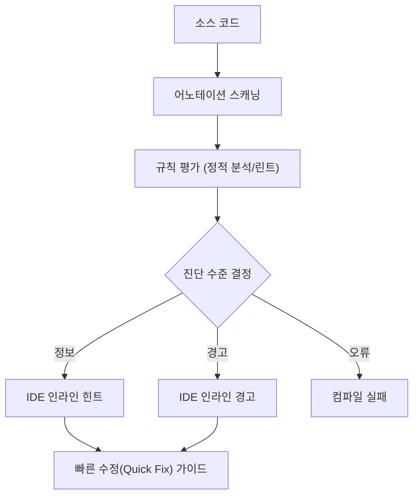

# 정적 분석 (Static Analysis)

Jetpack Compose 컴파일러 플러그인은 빌드 초기 단계에서 **정적 분석**을 수행해 `@Composable` 등 **라이브러리 어노테이션**의 사용이 **런타임 기대치에 맞게** 적용되었는지 검증합니다. 이는 일반적인 **린팅(linting)** 흐름을 따르며, 문제를 빠르게 발견하고 IDE와 긴밀히 연동되어 **인라인 경고/오류**로 즉시 피드백을 제공합니다.

> 핵심: 정적 분석은 컴파일러의 `프론트엔드(frontend)` 단계에서 수행되어, 개발자에게 가능한 한 빠른 **피드백 루프**를 제공합니다.

## 왜 정적 분석이 필요한가
- **빠른 피드백**: 컴파일 전 단계에서 즉시 오류를 노출해 수정 비용을 낮춥니다.
- **일관성 보장**: `@Composable`, `@Stable`, `@Immutable`, `@ReadOnlyComposable` 등의 **규약 준수**를 강제합니다.
- **런타임 안전성**: 런타임 크래시로 이어질 수 있는 **호출 컨텍스트 오류**를 사전에 차단합니다.

## 동작 개요 (Mermaid)


## 무엇을 검사하나
- **어노테이션 규약**: `@Composable` 호출 컨텍스트의 **적합성**(예: `@Composable`이 아닌 컨텍스트에서의 호출 금지)
- **불변성 계약**: `@Stable`, `@Immutable`의 **정확한 선언 및 사용** 여부
- **읽기 전용 계약**: `@ReadOnlyComposable` 함수가 **부수효과 없이 상태만 읽는지**
- **재시작/스킵 가능성 힌트**: 컴파일러 최적화를 방해하는 **패턴 탐지**

### 예시 1: `@Composable` 호출 컨텍스트 오류
```kotlin
  fun render() {
    // 오류: @Composable 컨텍스트 밖에서 호출
    Greeting("World")
  }

  @Composable
  fun Greeting(name: String) {
    Text(text = "Hello $name")
  }
```

가능한 수정:
```kotlin
  @Composable
  fun RenderScreen() {
    Greeting("World")
  }
```

### 예시 2: `@Stable` 모델 정의 점검
```kotlin
  @Stable
  data class UiState(
    val title: String,
    val count: Int
  )
```

## 진단 수준과 의미
| 수준 | 의미 | 전형적 사례 |
|---|---|---|
| 정보(Info) | 성능/구조 개선에 유용한 힌트 | 과도한 `recomposition` 유발 가능성 |
| 경고(Warning) | 잘못된 패턴의 **가능성** | `@ReadOnlyComposable`에서 I/O 시도 |
| 오류(Error) | 규약 위반으로 **컴파일 불가** | 비-`@Composable` 컨텍스트에서 `@Composable` 호출 |

## IDE 통합과 리포팅
- 컴파일러 플러그인은 내부 `컨텍스트 트레이스(context trace)`를 통해 **정확한 소스 위치**에 진단을 연결합니다.
- IntelliJ/Android Studio 플러그인과 통합되어 **입력 즉시 인라인 표기** 및 **Quick Fix** 제안을 제공합니다.

## 베스트 프랙티스
- **호출 규약 준수**: `@Composable`은 반드시 **Composable 스코프**에서 호출합니다.
- **데이터 모델 안정화**: 자주 전달되는 모델에는 `@Stable` 또는 `@Immutable`을 검토합니다.
- **부수효과 분리**: 상태 읽기 전용은 `@ReadOnlyComposable`로 구분하고, I/O는 `LaunchedEffect` 등 **사이드이펙트 API**로 분리합니다.

## 참고 코드 스니펫
```kotlin
  @Composable
  fun Counter(initial: Int) {
    var count by remember { mutableStateOf(initial) }
    Column {
      Text(text = count.toString())
      Button(onClick = { count++ }) { Text("+1") }
    }
  }
```

## 요약
- 정적 분석은 Compose **컴파일러 프론트엔드**에서 수행되어 빠른 **피드백 루프**를 제공합니다.
- `@Composable` 등 **어노테이션 규약 준수**와 **호출 컨텍스트**를 점검해 **런타임 오류를 사전 차단**합니다.
- 진단은 IDE에 **인라인 정보/경고/오류**로 표시되며, **Quick Fix**를 통해 수정 흐름을 단축합니다.