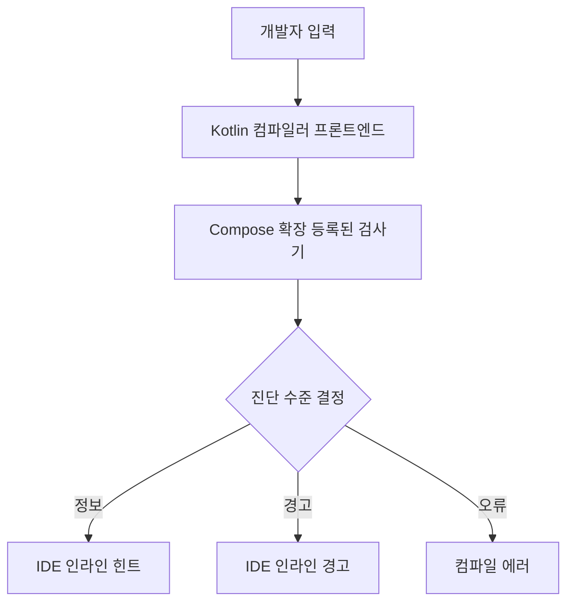

# 정적 검사기 (Static Checkers)

`Jetpack Compose`는 컴파일러 **익스텐션**을 통해 개발 시점에 코드의 옳고 그름을 즉시 알려주는 `정적 검사기`를 제공합니다. 이 검사기들은 **함수 호출**, **타입**, **선언** 등을 점검해 라이브러리의 올바른 사용을 보장하고, 위반 시 즉시 IDE에 **인라인 경고/오류**로 보고합니다.

> 핵심: 정적 검사기는 Kotlin 컴파일러의 **프론트엔드(frontend)** 단계에서 실행되는 **경량 검사기**로, 타이핑 중에도 빠른 피드백을 제공합니다.

## 왜 필요한가
- **가이드 제공**: 라이브러리가 해결하려는 문제에 대한 **명확한 가이드**를 코드 수준에서 제공합니다.
- **규약 준수 보장**: `@Composable` 함수의 요구 사항 등 **사용 규약**을 자동 검증합니다.
- **즉시 피드백**: 위반 사항을 IDE에 **즉시 표시**해 수정 비용을 낮춥니다.

## 동작 흐름 (Mermaid)


## 무엇을 검사하나
- **함수 호출 규약**: `@Composable` 호출 컨텍스트의 적합성 등
- **타입/선언 규약**: 어노테이션 및 선언의 일관성
- **Deprecated 호출**: 더 이상 사용되지 않는 API의 사용 탐지
- **계약(contracts)**: 함수 계약 위반 여부
- **클로저(closure) 캡처(capture)**: 람다 캡처에 따른 제약 확인
- **중위 호출(infix calls)**: 잘못된 중위 호출 패턴
- **코루틴 호출**: `suspend`/`@Composable` 맥락 적합성
- **연산자 호출**: 오용된 연산자 오버로드 사용

### 검사 범주 요약 (표)
| 검사 범주 | 설명/예시 |
|---|---|
| 함수 호출 | 비-`@Composable` 컨텍스트에서의 `@Composable` 호출 금지 |
| 타입/선언 | `@Stable`, `@Immutable` 등 계약 준수 점검 |
| Deprecated | 더 이상 사용되지 않는 API 사용 경고 |
| 계약(contracts) | 호출 전제조건/사후조건 위반 탐지 |
| 클로저 캡처 | 불필요/위험한 캡처 패턴 감지 |
| 중위 호출 | 잘못된 infix 사용 패턴 리포트 |
| 코루틴 | `suspend` 호출의 컨텍스트 적합성 검증 |
| 연산자 | 오용된 `operator` 오버로드 사용 경고 |

## IDE와 성능 특성
- 모든 검사기는 **프론트엔드 단계**에서 실행되어 **매우 빠름**.
- 타이핑 중 무거운 분석을 지양하는 **경량 검사기** 설계로 **UX 저하(버벅임)** 를 방지.

## 예시: 잘못된 `@Composable` 호출 컨텍스트
```kotlin
  fun render() {
    // 오류: @Composable 컨텍스트 밖에서 호출
    Greeting("World")
  }

  @Composable
  fun Greeting(name: String) {
    Text(text = "Hello $name")
  }

  // 올바른 수정
  @Composable
  fun RenderScreen() {
    Greeting("World")
  }
```

## 베스트 프랙티스
- **호출 규약 준수**: `@Composable`은 반드시 `Composable` 스코프에서 호출.
- **데이터 모델 안정화**: 빈번히 전달되는 모델은 `@Stable`/`@Immutable` 검토.
- **부수효과 분리**: I/O 등은 `LaunchedEffect` 등 **사이드이펙트 API**로 분리.

## 관련 문서
- [정적 분석 (Static Analysis)](../StaticAnalysis/README.md)
- [Compose 컴파일러 개요](../README.md)

## 요약
- 정적 검사기는 Compose **컴파일러 프론트엔드**에서 동작하는 **경량 분석기**로 빠른 피드백을 제공합니다.
- `@Composable` 등 **사용 규약**을 자동 검증해 **런타임 문제를 사전에 차단**합니다.
- 진단은 IDE에 **정보/경고/오류**로 인라인 표시되며, 즉시 수정 흐름을 돕습니다.