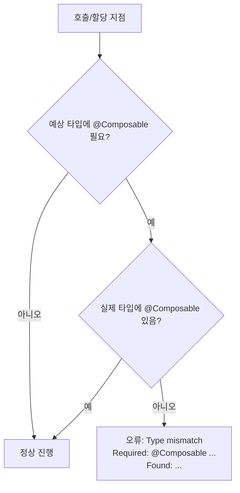

# 타입 검사 (Type checks)

Jetpack Compose에서는 함수뿐 아니라 `함수 타입(function type)`에도 `@Composable` 어노테이션을 명시적으로 붙일 수 있습니다. 이를 위해 Compose Compiler는 `타입 추론` 과정에서 `@Composable`의 유무를 정밀하게 검사합니다. 예상 타입에 `@Composable`이 필요하지만 실제 타입에 어노테이션이 빠져 있다면, 컴파일러는 명확한 **타입 불일치(Type mismatch) 오류**를 보고합니다. 이는 `함수 호출 검사`와 유사하며, 오류 메시지에는 `추론된 타입`과 `예상 타입`이 함께 출력되어 차이를 분명히 보여줍니다.

> 핵심: 예상 타입이 `@Composable`을 요구하는데 실제 타입이 일반 함수 타입이면, Compose Compiler가 컴파일 타임에 오류를 발생시킵니다.

## 왜 필요한가
- **UI 트리 일관성**: `@Composable` 함수는 `Composition`과 `Recomposition`에 참여합니다. 잘못된 타입 연결은 UI 상태 추적을 무너뜨릴 수 있습니다.
- **정확한 호출 컨텍스트 보장**: `@Composable` 컨텍스트 외부에서 컴포저블을 호출하지 못하도록 방지합니다.
- **타입 안전성 강화**: 런타임이 아닌 컴파일 타임에 문제를 조기에 발견합니다.

## 작동 방식 개요
- **예상 타입 분석**: 변수/파라미터/반환 타입이 `@Composable` 함수 타입인지 검사
- **실제 타입 대조**: 전달/할당된 값의 타입이 `@Composable`을 포함하는지 확인
- **오류 보고**: 불일치 시 `Required: @Composable ... / Found: ...` 형태로 메시지 출력

### 검사 포인트 요약
| 검사 포인트 | 설명 |
| --- | --- |
| 파라미터 타입 | 매개변수가 `@Composable () -> Unit` 혹은 `@Composable (T) -> R`인지 |
| 프로퍼티/필드 | `val content: @Composable () -> Unit`처럼 보관되는 함수 타입 |
| 반환 타입 | 함수가 `@Composable` 함수 타입을 반환하는지 |
| 제네릭/타입 별칭 | `typealias`나 제네릭 경로로 전파되는 `@Composable` 여부 |

### 타입 검사 플로우


## 예제

### 1) 파라미터에 컴포저블 함수 타입 요구
```kotlin
  import androidx.compose.runtime.Composable

  fun Screen(content: @Composable () -> Unit) {
    // ... UI 트리에서 content를 호출
    content()
  }

  fun notComposable() { /* 일반 함수 */ }

  fun usage() {
    // 컴파일 오류: Type mismatch
    // Required: @Composable () -> Unit
    // Found: () -> Unit
    Screen(::notComposable)
  }
```

### 2) 올바른 전달: 람다를 `@Composable`로 작성
```kotlin
  import androidx.compose.runtime.Composable

  fun Screen(content: @Composable () -> Unit) {
    content()
  }

  @Composable
  fun Hello() { /* ... */ }

  @Composable
  fun UsageOK() {
    Screen { Hello() }
  }
```

### 3) 프로퍼티에 보관되는 컴포저블 함수 타입
```kotlin
  import androidx.compose.runtime.Composable

  class Holder(
    val content: @Composable (Int) -> Unit
  )

  fun bad(): (Int) -> Unit = { /* 일반 함수 */ }

  // 컴파일 오류: Required @Composable (Int) -> Unit / Found (Int) -> Unit
  val holder = Holder(bad())
```

## 제네릭과 타입 별칭

### 타입 별칭에 `@Composable` 포함
```kotlin
  import androidx.compose.runtime.Composable

  typealias Content = @Composable () -> Unit

  fun Page(body: Content) { body() }

  fun plain() { /* 일반 함수 */ }

  // 오류: Required Content(@Composable () -> Unit) / Found () -> Unit
  val x = Page(::plain)
```

### 제네릭으로 전달되는 컴포저블 함수 타입
```kotlin
  import androidx.compose.runtime.Composable

  fun <T> Boxed(render: @Composable (T) -> Unit, value: T) {
    render(value)
  }

  @Composable
  fun RenderInt(v: Int) { /* ... */ }

  fun use() {
    Boxed(render = ::RenderInt, value = 10) // OK
  }
```

## 흔한 오류와 해결
- **@Composable 누락**: 예상 타입이 `@Composable`인데 일반 함수 타입 전달
  - 해결: 전달하는 람다/함수에 `@Composable`을 붙이거나, `@Composable` 컨텍스트 내 람다로 작성
- **타입 별칭/제네릭 전파 누락**: 별칭 정의나 제네릭 경로 중간에 `@Composable`이 빠짐
  - 해결: 별칭 정의와 제네릭 시그니처에 `@Composable`을 명시해 의도를 드러냄
- **컨텍스트 밖에서의 호출**: `@Composable`이 아닌 함수에서 컴포저블을 직접 호출
  - 해결: `@Composable` 함수 안으로 호출을 옮기거나 적절한 콜백 경계를 재설계

## 베스트 프랙티스
- `API 시그니처`에 의도를 드러내기: `@Composable` 함수 타입은 타입 선언부에서 분명히 표시
- `typealias` 적극 활용: 반복되는 `@Composable` 함수 타입에 가독성 향상
- `일반 콜백`과 `컴포저블 콜백`을 구분: 혼동을 줄여 컴파일 오류를 예방
- 오류 메시지의 `Required/Found`를 그대로 따라가며 호출부와 선언부를 동시에 점검

## 참고 자료
- [Compose Compiler 공식 문서](https://developer.android.com/jetpack/compose/compiler?hl=ko)

## 요약
- `@Composable` 함수 타입은 타입 시스템 차원에서 엄격히 검사된다.
- 예상 타입이 `@Composable`을 요구하는데 일반 함수 타입을 전달하면 컴파일 오류가 발생한다.
- 파라미터/프로퍼티/반환/제네릭/타입 별칭 경로 모두에서 `@Composable` 유무를 일관되게 유지해야 한다.
- 반복되는 시그니처는 `typealias`로 추상화하고, 오류 메시지의 `Required/Found`를 기준으로 호출부와 선언부를 점검하라.