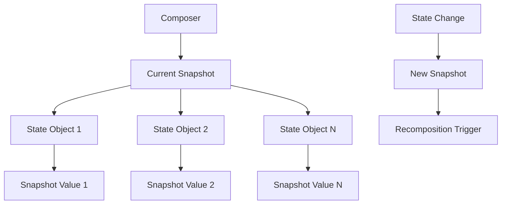

# 현재 상태 스냅샷에 접근 (Accessing the current State snapshot)

Jetpack Compose Runtime에서 **상태 스냅샷(State Snapshot)** 은 컴포지션의 핵심 메커니즘 중 하나입니다. 이는 상태의 일관성을 보장하고 recomposition을 효율적으로 관리하기 위한 중요한 시스템입니다.

## 개념 개요

**Composer**는 현재 스냅샷에 대한 참조를 가지고 있으며, 이는 현재 스레드에 대한 **가변적인 상태(Mutable State)** 및 기타 **상태 객체들**이 반환하는 값의 스냅샷과 유사합니다.

### 스냅샷의 특성

- **불변성 보장**: 모든 상태 객체는 스냅샷에서 명시적으로 변경되지 않는 한, 스냅샷이 생성되었을 때와 동일한 값을 유지합니다.
- **스레드 안전성**: 각 스레드는 독립적인 스냅샷을 가지므로 동시성 문제를 방지합니다.
- **일관성**: 하나의 컴포지션 패스 동안 모든 상태 읽기는 동일한 스냅샷을 기준으로 합니다.

## 작동 원리



### 스냅샷 생성 과정

1. **초기 스냅샷**: Composer가 시작될 때 현재 상태의 스냅샷이 생성됩니다.
2. **상태 읽기**: 컴포지션 중 모든 상태 읽기는 이 스냅샷을 기준으로 합니다.
3. **일관성 유지**: 컴포지션이 진행되는 동안 상태 값이 변경되어도 현재 스냅샷의 값은 불변입니다.

## 실제 활용 예시

```kotlin
@Composable
fun Counter() {
    var count by remember { mutableStateOf(0) }
    
    // 여기서 count 읽기는 현재 스냅샷의 값을 기준으로 합니다
    Text("Count: $count")
    
    Button(onClick = { 
        count++ // 새로운 스냅샷이 생성되고 recomposition을 트리거합니다
    }) {
        Text("Increment")
    }
}
```

## 주요 특징

| 특징 | 설명 |
|------|------|
| **스냅샷 격리** | 각 컴포지션 패스는 독립적인 스냅샷에서 실행 |
| **원자적 읽기** | 하나의 컴포지션에서 모든 상태 읽기는 동일한 시점의 값 |
| **변경 추적** | 상태 변경 시 자동으로 새로운 스냅샷 생성 |
| **성능 최적화** | 불필요한 recomposition 방지 |

## 관련 개념

- **Snapshot System**: 상태 스냅샷의 전체 시스템 아키텍처
- **Recomposition**: 상태 변경으로 인한 UI 재구성 과정
- **State Management**: Compose에서의 상태 관리 패턴

## 요약

- **Composer**는 현재 스냅샷에 대한 참조를 통해 상태의 일관성을 보장합니다
- **스냅샷**은 특정 시점의 모든 상태 값을 불변으로 캡처합니다
- **상태 객체**들은 스냅샷 내에서 명시적 변경 없이는 동일한 값을 유지합니다
- **스레드 안전성**과 **컴포지션 일관성**을 제공하는 핵심 메커니즘입니다
- **성능 최적화**와 **상태 관리의 단순화**에 기여합니다