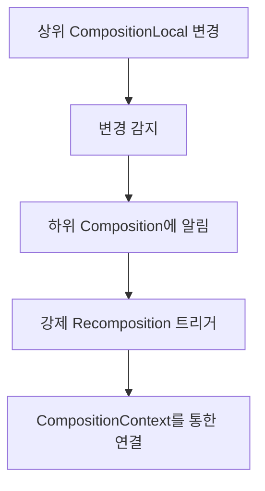

# Composition에 대한 추가 정보 (Additional information about the Composition)

> `Composition`의 고급 기능과 `Recomposer`와의 협력을 통한 효율적인 상태 관리

`Composition`은 단순한 UI 상태 관리자가 아닌, 복잡한 `recomposition` 최적화와 상태 동기화를 수행하는 핵심 컴포넌트입니다.

## Invalidation 처리와 상태 플래그

`Composition`은 **recomposition**을 위해 보류 중인 `invalidation`을 인지하고 있으며, `isComposing` 플래그를 통해 현재 composition을 수행 중인지 여부도 알고 있습니다.

### 주요 동작 방식

- **즉시 적용**: 현재 composition을 수행 중일 때 invalidation을 즉시 적용
- **연기 처리**: composition을 수행하지 않는 경우에는 invalidation을 연기
- **Recomposition 제어**: `Recomposer`가 `isComposing` 플래그를 통해 recomposition을 적절히 버릴 수 있음

```kotlin
// 개념적 동작 흐름
if (isComposing) {
    applyInvalidationImmediately()
} else {
    deferInvalidation()
}
```

## ControlledComposition 변형

런타임은 `ControlledComposition`이라는 composition의 변형에 의존하는데, 이는 **외부에서 제어할 수 있도록** 몇 가지 추가적인 기능을 제공합니다.

### 핵심 기능

| 기능 | 설명 | 사용 사례 |
|------|------|-----------|
| `composeContent` | 컨텐츠 구성 제어 | 초기 composition 수행 |
| `recompose` | 재구성 제어 | 필요에 따른 명시적 재구성 |
| **Invalidation 조율** | Recomposer와의 협력 | 효율적인 업데이트 스케줄링 |

`Recomposer`는 필요할 때 composition에서 이러한 작업을 트리거할 수 있습니다.

## 관찰 중인 객체의 변경 감지

`Composition`은 자신이 **관찰하는 일련의 객체들**을 감지할 수 있는 방법을 제공합니다.

### 변경 감지 메커니즘



- **자동 감지**: 관찰 중인 객체들이 변경될 때 recomposition을 강제
- **계층적 연결**: 상위 composition에서 `CompositionLocal`이 변경되면 하위 composition에서 recomposition 강제
- **컨텍스트 기반**: composition들은 상위 `CompositionContext`를 통해 연결

## Composition 중 오류 처리

종종 composition 수행 중 오류가 발견되는 경우 **composition을 중단**할 수 있습니다.

### 오류 처리 과정

1. **오류 감지**: Composition 수행 중 예외 상황 발견
2. **전체 재설정**: `Composer`와 해당 참조 및 스택 등 모든 것을 재설정
3. **상태 복구**: 안전한 상태로 되돌리기

> 이는 안정성을 보장하기 위한 **Fail-Safe** 메커니즘입니다.

## Composer의 최적화 전략cd

`Composer`는 효율적인 recomposition을 위해 다음과 같은 **스마트 최적화**를 수행합니다:

### 최적화 규칙

- ✅ **재사용 금지**: Composer를 재사용하지 않음
- ✅ **무효 제공자 없음**: recomposition을 요구하기 때문
- ✅ **조건부 건너뛰기**: `currentRecomposeScope`가 recomposition을 요구하지 않는 경우 건너뛰기

```kotlin
// 개념적 로직
if (!currentRecomposeScope.requiresRecomposition) {
    skipRecomposition()
} else {
    performRecomposition()
}
```

### 향후 개선사항

> 스마트 recomposition에 관한 더 자세한 내용은 향후 업데이트에서 다룰 예정입니다.

## 요약

- `Composition`은 `invalidation` 처리와 `isComposing` 플래그를 통해 효율적인 상태 관리를 수행합니다
- `ControlledComposition` 변형을 통해 `Recomposer`와 협력하여 외부 제어가 가능합니다
- 관찰 중인 객체의 변경을 감지하여 필요한 경우에만 `recomposition`을 트리거합니다
- 오류 발생 시 안전한 상태로 재설정하는 **Fail-Safe** 메커니즘을 제공합니다
- `Composer`는 다양한 최적화 전략을 통해 불필요한 recomposition을 방지합니다