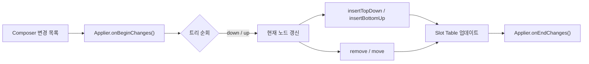

# 변경 사항 적용하기 (Applying the changes)

> `Applier`는 `Composer`가 기록한 변경 목록을 실제 UI/노드 트리에 **구체화(materializing)** 하는 구성 요소입니다. 이 과정에서 `Slot Table`이 업데이트되고 `Composition`에 반영됩니다.

## 개요

- `Composer`는 실행 중 수집한 변경을 변경 목록으로 기록합니다.
- `Applier`는 변경 목록을 실행하여 실제 노드 트리에 **삽입/이동/삭제**를 수행합니다.
- 결과적으로 `Slot Table`과 `Composition`의 상태가 최신으로 유지됩니다.

## Applier란?

런타임은 `Applier`의 구체 구현과는 **독립적**입니다. 이는 클라이언트 라이브러리가 구현하는 계약(인터페이스)에 의존하기 때문입니다. `Applier`는 플랫폼 통합 지점으로, **유스케이스**에 따라 전혀 다른 구현이 존재할 수 있습니다.

가장 먼저 보이는 것은 인터페이스 선언문의 제네릭 타입 매개변수 `N` 입니다. `N`은 적용 대상이 되는 노드의 타입을 결정합니다. 이 덕분에 Compose는 다양한 노드 트리와 상호 운용할 수 있습니다. `Applier`는 트리를 탐색하며 노드의 **삽입/제거/이동**을 수행하지만, 노드의 구체 타입이나 최종 삽입 방식은 **노드 구현**에 위임됩니다.

## `Applier` 인터페이스

```kotlin
  interface Applier<N> {
    val current: N
    fun onBeginChanges() {}
    fun onEndChanges() {}
    fun down(node: N)
    fun up()
    fun insertTopDown(index: Int, instance: N)
    fun insertBottomUp(index: Int, instance: N)
    fun remove(index: Int, count: Int)
    fun move(from: Int, to: Int, count: Int)
    fun clear()
  }
```

### 메서드 요약

| 메서드 | 설명 |
| --- | --- |
| `current` | 현재 변경을 적용 중인 노드 참조 |
| `onBeginChanges()` / `onEndChanges()` | 변경 적용의 시작/종료 훅(Hook) |
| `down(node)` / `up()` | 트리 탐색: 자식으로 내려가거나 부모로 올라감 |
| `insertTopDown()` / `insertBottomUp()` | 상향/하향 단계에서의 노드 삽입 |
| `remove(index, count)` | 현재 노드의 하위에서 지정 범위 제거 |
| `move(from, to, count)` | 하위 노드의 위치 이동 |
| `clear()` | 루트 기준으로 모든 노드 제거 및 초기화 |

## 적용 흐름과 트리 순회

`Applier`는 모든 노드를 방문하며 변경을 적용하는 동안 현재 노드 참조를 항상 유지합니다. 트리는 **하향(Top-Down)** 또는 **상향(Bottom-Up)** 으로 순회할 수 있으며, 상황에 따라 적절한 방향에서 삽입이 수행됩니다.



## 추가 노트

- `clear()`는 루트 기준 전체 트리를 비우고, 이후 새 `Composition`에 사용할 준비를 합니다.
- `Applier`는 노드 연산을 제공하지만, 노드의 실제 적용 방식은 각 **플랫폼/노드 타입 구현**에 위임됩니다.

## 요약
- `Applier`는 `Composer`의 변경 목록을 실제 트리에 적용해 **구체화**합니다.
- 제네릭 `N`으로 다양한 노드 타입과 **상호 운용**합니다.
- 하향/상향 순회와 다양한 삽입/이동/삭제 연산으로 `Slot Table`과 `Composition`을 **일관**되게 유지합니다.