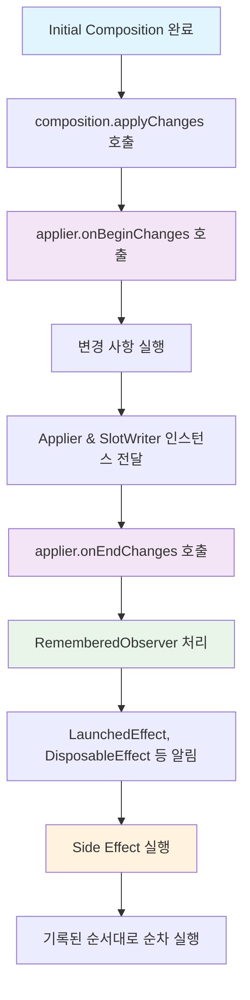

# 초기 Composition 후 변경 사항 적용 (Applying changes after initial Composition)

초기 **Composition**이 완료된 후, Jetpack Compose는 변경 사항을 실제 UI 트리에 적용하는 중요한 프로세스를 수행합니다. 이 과정은 **Applier**, **RememberedObserver**, 그리고 **Side Effect**의 순차적인 실행으로 구성됩니다.

## 변경 사항 적용 프로세스 개요

초기 composition 이후 `Applier`는 `composition.applyChanges()` 프로세스 중에 기록된 모든 변경 사항을 적용하라는 알림을 받습니다.

### 주요 단계

1. **변경 사항 적용 시작**: `applier.onBeginChanges()` 호출
2. **변경 사항 실행**: 모든 변경 사항을 실행하고 필요한 **Applier** 및 **SlotWriter** 인스턴스를 각 변경 사항에 전달
3. **변경 사항 적용 완료**: `applier.onEndChanges()` 호출

## Applier의 역할

**Applier**는 Compose의 변경 사항을 실제 UI 트리에 적용하는 핵심 컴포넌트입니다.

### 주요 메서드

| 메서드 | 역할 |
|-------|------|
| `onBeginChanges()` | 변경 사항 적용 시작을 알림 |
| `onEndChanges()` | 모든 변경 사항 적용 완료를 알림 |

## RememberedObserver와 생명주기 관리

등록된 모든 **RememberedObserver**를 처리하여 `RememberedObserver` 인터페이스를 구현하는 모든 클래스가 composition에 들어가거나 나갈 때 알림을 받을 수 있습니다.

### RememberedObserver를 구현하는 주요 컴포넌트

- **`LaunchedEffect`**: 코루틴 기반 side effect 관리
- **`DisposableEffect`**: 리소스 해제가 필요한 side effect 관리

이러한 컴포넌트들은 composition 내의 **Composable 생명주기**에 대한 효과를 제한할 수 있습니다.

## Side Effect 실행

모든 변경 사항이 적용되고 RememberedObserver 처리가 완료된 후, 모든 **사이드 이펙트**들이 기록된 순서대로 실행됩니다.

## 전체 프로세스 흐름

## 요약

- **변경 사항 적용**: `composition.applyChanges()` 프로세스를 통해 초기 composition 후 변경 사항을 실제 UI에 적용
- **Applier 역할**: `onBeginChanges()`와 `onEndChanges()` 메서드로 변경 사항 적용 프로세스를 관리
- **생명주기 관리**: RememberedObserver를 통해 composition 진입/탈출 시점에 적절한 알림 제공
- **Side Effect 처리**: 모든 변경 사항 적용 완료 후 기록된 순서대로 사이드 이펙트 실행
- **순차적 실행**: Applier → RememberedObserver → Side Effect 순서로 체계적인 프로세스 진행