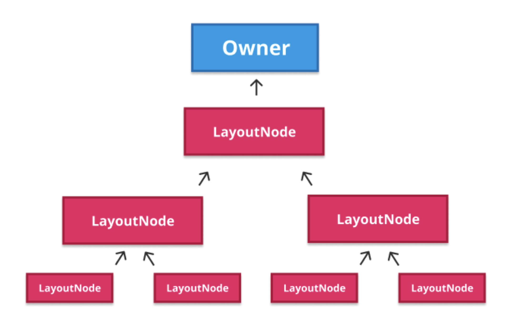
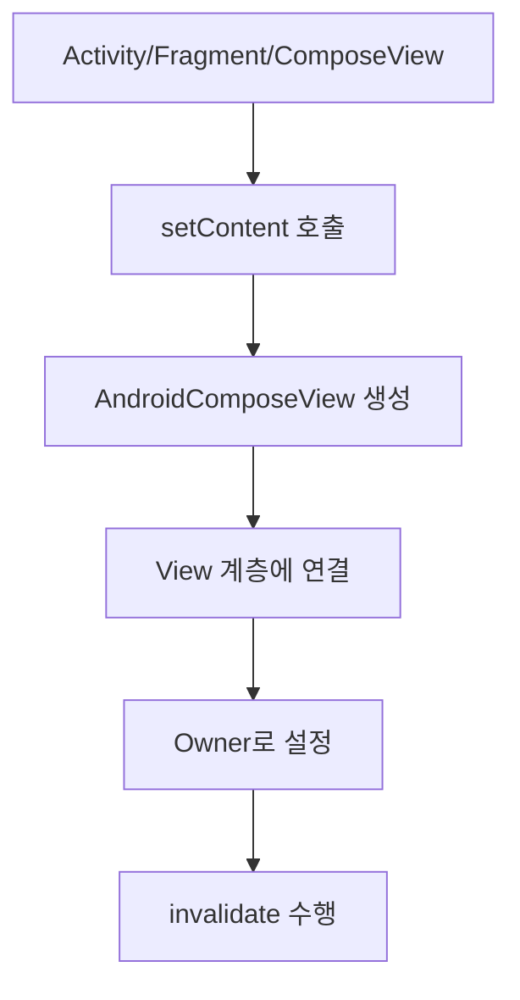

# 노드 연결 및 그리기 (Attaching and drawing the nodes)

> **핵심 질문**: "트리에 노드를 삽입(부모에 연결)하는 것이 궁극적으로 우리가 보는 화면에 어떻게 나타나게 되나요?"

**답변**: 노드는 **스스로 연결하고 그리는 방법**을 알고 있습니다.

이 문서에서는 **`LayoutNode`** 가 어떻게 화면에 그려지는지, 그리고 **`Owner`** 의 역할이 무엇인지에 대해 간략하게 살펴보겠습니다.

## LayoutNode의 노드 삽입 과정

**`LayoutNode`** 는 Android UI를 위해 특별히 설계된 노드 타입입니다. **`UiApplier`** 구현체가 `LayoutNode`에게 삽입을 위임하면, 다음 4단계 과정을 거칩니다:

### 1. 삽입 조건 검증
- 부모 노드가 존재하지 않는지 등의 조건을 확인합니다.
- 노드 삽입이 가능한 상태인지 검증합니다.

### 2. Z-Index 자식 목록 무효화 (Invalidation)
- **Z 인덱스**별로 정렬된 자식 목록을 `invalidate` 합니다.
- 이는 모든 자식 노드를 **Z 인덱스 순서**(낮은 값부터)대로 정렬하여 저장하는 병렬 목록입니다.
- `invalidate`를 통해 필요할 때마다 목록이 **재생성 및 재정렬**됩니다.

### 3. 부모 노드 및 Owner 연결
- 새 노드를 **부모 노드**와 **`Owner`** 에 연결합니다.
- 이 과정을 통해 노드가 화면에 표시될 수 있게 됩니다.

### 4. 최종 무효화 (Final Invalidation)
- 연결 작업 완료 후 **최종 `invalidate`** 를 수행합니다.
- 이를 통해 변경사항이 UI에 반영됩니다.

## Owner의 역할

**`Owner`** 는 Compose에서 핵심적인 역할을 담당하는 컴포넌트입니다:

### 주요 특징
- **트리의 루트**에 위치하며, **Composable 트리**를 Android의 기본 **View 시스템**과 연결합니다
- **Android와의 얇은 통합 계층** 역할을 수행합니다
- 실제로는 **`AndroidComposeView`**(표준 View)에 의해 구현됩니다

### 담당 기능
- **레이아웃 (Layout)**
- **그리기 (Drawing)**  
- **입력 처리 (Input)**
- **접근성 (Accessibility)**

### 연결 요구사항
- **`LayoutNode`** 는 화면에 표시되기 위해 반드시 **`Owner`** 와 연결되어야 합니다
- 해당 `Owner`는 **부모의 `Owner`와 동일**해야 합니다
- 노드 연결 후 `Owner`를 통해 **`invalidate`** 를 호출하여 **Composable 트리를 렌더링**합니다

## 통합 지점 (Integration Point)

**최종 통합**은 `Owner`가 설정될 때 발생합니다:

### 발생 시점
- **`Activity`**, **`Fragment`**, 또는 **`ComposeView`** 에서 **`setContent`** 를 호출할 때
- 이 시점에서 **`AndroidComposeView`** 가 생성되어 **View 계층**에 연결됩니다
- **`Owner`** 로 설정되어 필요에 따라 **`invalidate`** 를 수행할 수 있게 됩니다

## 요약

- **`LayoutNode`** 는 Android UI를 위한 특별한 노드 타입으로, **4단계 삽입 과정**을 거칩니다
- **`Owner`** 는 Compose 트리와 Android View 시스템을 연결하는 **핵심 통합 계층**입니다
- **`AndroidComposeView`** 가 실제 `Owner` 구현체로 동작하며, 레이아웃/그리기/입력/접근성을 담당합니다
- **`setContent`** 호출 시 `AndroidComposeView`가 생성되어 View 계층에 연결되고 `Owner`로 설정됩니다
- 노드 삽입은 **조건 검증 → Z-Index 무효화 → Owner 연결 → 최종 무효화** 순서로 진행됩니다