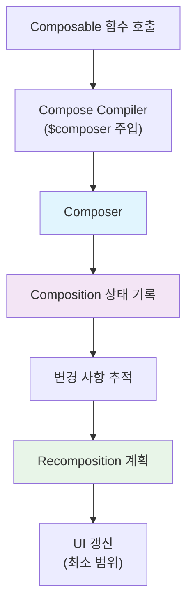

# Composer (The Composer)

**Composer**는 Jetpack Compose에서 `Composable` 함수와 `Compose Runtime` 사이의 핵심적인 연결 고리 역할을 합니다. 컴파일러가 자동으로 주입하는 `$composer` 매개변수를 통해 UI 상태 변경을 추적하고 관리합니다.

## Composer란?

`Composer`는 **컴파일러가 주입하는 컨텍스트**로, 다음과 같은 핵심 기능을 수행합니다:

- **`Composition` 기록 및 갱신**: UI 트리 상태를 메모리에 유지하고 관리
- **변경 사항 추적**: `Composable` 함수 실행 중 발생한 변경을 감지
- **Recomposition 최적화**: 필요한 최소 범위만 다시 그리도록 조절

## 동작 원리

### 컴파일러 변환 과정

```kotlin
// 개발자가 작성한 코드
@Composable
fun Greeting(name: String) {
    Text(text = "Hello, $name")
}

// 컴파일러가 변환한 코드 (개념적)
fun Greeting(name: String, $composer: Composer, key: Int, changed: Int) {
    $composer.startReplaceableGroup(key)
    Text("Hello, $name", $composer, /* flags ... */)
    $composer.endReplaceableGroup()
}
```

### 작업 흐름



## 주요 특징

| 특징 | 설명 |
|------|------|
| **자동 주입** | 컴파일러가 모든 `Composable` 함수에 자동으로 `$composer` 매개변수를 추가 |
| **상태 추적** | 함수 실행 중 발생하는 모든 변경 사항을 실시간으로 기록 |
| **효율적 갱신** | 변경된 부분만 선택적으로 `Recomposition`을 수행 |
| **그룹 관리** | `startReplaceableGroup()`과 `endReplaceableGroup()`로 범위 구분 |

## 핵심 개념

### Composition과의 관계

- **`Composition`**: 런타임이 관리하는 UI 트리의 상태 표현
- **`Composer`**: `Composition`을 조작하는 도구
- **`Recomposition`**: `Composer`가 계획하고 실행하는 선택적 UI 갱신

### 변경 추적 메커니즘

> `Composer`는 각 `Composable` 함수의 실행 범위를 그룹으로 구분하여 관리합니다. 이를 통해 어떤 부분이 변경되었는지 정확히 추적하고, 해당 범위만 다시 그릴 수 있습니다.

## 실제 사용 예시

```kotlin
@Composable
fun Counter() {
    var count by remember { mutableStateOf(0) }
    
    // 내부적으로 $composer가 이 변경을 추적
    Button(
        onClick = { count++ }
    ) {
        Text("Count: $count") // count 변경 시만 이 Text가 recompose됨
    }
}
```

위 코드에서 `count` 값이 변경될 때, `Composer`는:
1. 변경 사항을 감지
2. 영향받는 범위를 계산 (`Text` 부분만)
3. 해당 범위만 선택적으로 `Recomposition` 수행

## 참고사항

> `$composer`가 어떻게 주입되는지에 대한 자세한 내용은 **Compose 컴파일러** 챕터에서 다루므로, 여기서는 런타임에서의 역할에 집중하여 설명했습니다.

## 요약

- **`Composer`** 는 `Composable` 함수와 `Compose Runtime` 사이의 핵심 연결고리
- **컴파일러가 자동 주입**하는 `$composer` 매개변수를 통해 동작
- **상태 변경 추적**과 **효율적인 Recomposition** 관리를 담당
- **그룹 단위로 범위를 구분**하여 최소한의 UI 갱신만 수행
- **Composition 상태 기록**과 **변경 사항 추적**이 핵심 기능