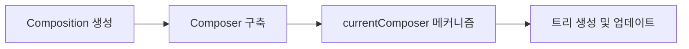
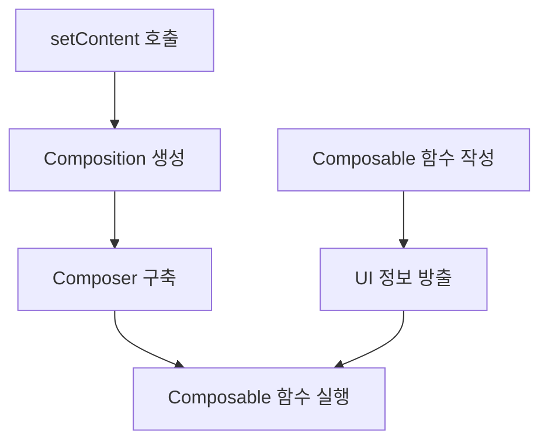

# Composition

> **핵심 개념**: `Composition`은 **`Composer`** 를 소유하고 관리하는 주체로, UI 트리의 생성과 업데이트를 담당합니다.

이전 섹션에서 **`Composer`** 에 대한 많은 흥미로운 세부 사항들을 살펴보았습니다. **슬롯 테이블**에 값을 쓰고 읽기 위한 변경 사항 기록, **Composition 중 `Composable` 함수 실행** 시 방출되는 변경사항, 그리고 마지막에 적용되는 **기록된 변경사항**에 대해 다뤘습니다. 

하지만 아직 다루지 않은 핵심 질문들이 있습니다:
- **`Composition`을 생성하는 주체는 누구인가?**
- **어떻게, 언제** 이루어지는가?
- **어떤 단계**가 연관되어 있는가?

## Composer와 Composition의 관계

### 일반적인 오해
`Composer`가 **`Composition`에 대한 참조**를 가지고 있다고 해서, `Composer`가 `Composition`을 생성하고 소유한다고 생각할 수 있습니다.

### 실제 관계
**실제로는 그 반대입니다!** 



| 구성 요소 | 역할 |
|-----------|------|
| **`Composition`** | `Composer`를 **생성하고 소유**하는 주체 |
| **`Composer`** | `currentComposer` 메커니즘을 통해 접근 가능한 **실행 엔진** |

### 동작 과정
1. **`Composition`** 이 생성됩니다
2. `Composition`이 **`Composer`를 스스로 구축**합니다
3. `Composer`는 **`currentComposer` 메커니즘**을 통해 접근할 수 있게 됩니다
4. `Composer`는 `Composition`이 관리하는 **트리를 생성하고 업데이트**합니다

## Jetpack Compose Runtime 진입점

클라이언트 라이브러리는 **두 가지 진입점**을 통해 **Jetpack Compose Runtime**에 접근할 수 있습니다:

### 1. Composable 함수 작성
```kotlin
@Composable
fun MyComposable() {
    // Composable 함수 작성
}
```
- **관련된 모든 정보를 방출**합니다
- 해당 함수들의 **활용 사례를 런타임과 연결**합니다
- 하지만 **`Composition` 프로세스 없이는 실행되지 않습니다**

### 2. setContent 호출
```kotlin
setContent {
    MyComposable()
}
```
- **대상 플랫폼과의 통합 계층** 역할을 합니다
- 이를 통해 **`Composition`이 생성되고 시작**됩니다
- **`Composable` 함수들이 실제로 실행**될 수 있게 합니다

### 진입점 비교

| 진입점 | 역할 | 특징 |
|--------|------|------|
| **`Composable` 함수** | UI 선언 | 정보 방출, 런타임 연결 |
| **`setContent`** | 실행 트리거 | `Composition` 생성 및 시작 |



## 핵심 포인트

- **`Composition`** 이 **`Composer`** 를 소유하고 관리합니다
- **`Composable` 함수**는 UI 선언을 담당하지만, **실행을 위해서는 `Composition`이 필요**합니다
- **`setContent`** 는 `Composition`을 생성하고 시작하는 **플랫폼 통합 계층**입니다

## 요약

- **`Composition`** 은 `Composer`를 소유하고 관리하는 **핵심 주체**입니다
- **두 가지 진입점**을 통해 Compose Runtime에 접근할 수 있습니다: **`Composable` 함수 작성**과 **`setContent` 호출**
- **`Composable` 함수**는 UI 정보를 방출하지만, **`setContent`** 를 통한 `Composition` 생성이 있어야 실행됩니다
- **`currentComposer` 메커니즘**을 통해 `Composer`에 접근하여 **트리 생성 및 업데이트**를 수행합니다
- `Composition` → `Composer` → `Composable` 실행의 **계층적 구조**를 이해하는 것이 중요합니다