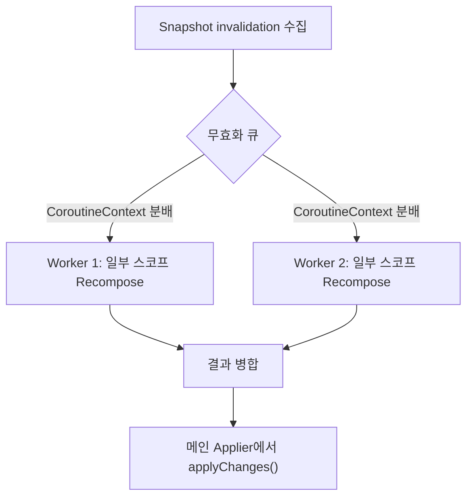

# Recomposition의 동시성 (Concurrent Recomposition)

> `Recomposer`는 필요 시 하나의 스레드가 아닌 여러 작업으로 `Recomposition`을 동시에 수행할 수 있습니다. 기본 Compose UI는 이 기능을 직접 사용하지 않지만, 다른 클라이언트/라이브러리에서는 상황에 맞게 활용할 수 있습니다.

## 개요
- **목적**: 상태 `invalidation`이 누적될 때, 영향을 받은 `Composition`/`RecomposeScope`들을 병렬로 처리해 대기 시간을 줄입니다.
- **기본 흐름**: 상태 변화를 관찰 → 무효화 수집 → 제공된 `CoroutineContext`를 통해 여러 작업으로 `Recomposition` 실행 → 결과를 모아 한 번에 `applyChanges()`.
- **핵심 차이**: 기존 `runRecomposeAndApplyChanges()`는 내부 컨텍스트에서 순차적으로 작업하지만, `runRecomposeConcurrentlyAndApplyChanges()`는 외부에서 전달한 `CoroutineContext`를 사용해 `Recomposition` 계산을 동시에 진행합니다.

## 핵심 API

> `runRecomposeConcurrentlyAndApplyChanges(recomposeCoroutineContext: CoroutineContext)`

설명:
- 스냅샷 `invalidation`을 대기/수집한 뒤, 전달된 컨텍스트로 파생된 자체 `CoroutineScope`를 만들어 필요한 `Recomposition` 작업들을 동시에 실행합니다.
- 계산된 변경은 수집 이후 메인 `Applier` 컨텍스트에서 일괄 `applyChanges()`로 반영됩니다.

### 시그니처 (개념적)

```kotlin
  suspend fun Recomposer.runRecomposeConcurrentlyAndApplyChanges(
    recomposeCoroutineContext: CoroutineContext
  ) { /* ... */ }
```

### 사용 예시

```kotlin
  val recomposeDispatcher = Dispatchers.Default.limitedParallelism(4)
  val recomposeJob = Job()

  withContext(recomposeDispatcher + recomposeJob) {
    // 제공된 컨텍스트를 통해 동시 Recomposition 수행
    recomposer.runRecomposeConcurrentlyAndApplyChanges(coroutineContext)
  }
```

## 동작 방식
- **스냅샷 관찰/수집**: 상태 변경을 스냅샷 시스템이 포착하고 `invalidation` 목록을 만듭니다.
- **작업 분할**: 무효화된 `RecomposeScope`/`Composition`들을 제공된 `CoroutineContext` 상의 여러 작업으로 분배합니다.
- **동시 Recomposition**: 각 작업이 필요한 변경을 계산합니다. 이 단계는 서로 다른 스코프/컴포지션 단위로 병렬화됩니다.
- **변경 병합/적용**: 수집된 변경을 메인 `Applier` 문맥에서 순서 보장 하에 `composition.applyChanges()`로 반영합니다.

## 단일 vs 동시 Recomposition 비교

| 구분 | 단일 (`runRecomposeAndApplyChanges`) | 동시 (`runRecomposeConcurrentlyAndApplyChanges`) |
| --- | --- | --- |
| 실행 컨텍스트 | 내부 정의 컨텍스트 | 외부에서 전달된 `CoroutineContext` |
| 병렬성 | 없음(주로 순차) | 있음(여러 작업으로 분할) |
| 장점 | 단순, 예측 가능 | 대규모 무효화 처리 시 지연 감소 |
| 주의 | 대량 변경 시 병목 | 스냅샷/적용 단계의 일관성 보장 필요 |

## 다이어그램



## 주의 사항
- **Compose UI 기본값 아님**: 일반 UI 앱은 보통 단일 경로로 충분합니다. 특수한 프레임워크/툴링/서버 사이드 렌더러 류에서 유용할 수 있습니다.
- **스냅샷 일관성**: 동시에 계산하더라도 스냅샷 시스템과 `Applier` 적용 단계는 일관성 있게 조율되어야 합니다.
- **작업 크기 조절**: `limitedParallelism` 등으로 동시성 수준을 환경에 맞게 조정하세요.

## 참고 키워드
- `Recomposer`, `Recomposition`, `snapshot`, `invalidation`, `CoroutineContext`, `applyChanges()`

## 요약
- `Recomposer`는 전달된 `CoroutineContext`를 통해 `Recomposition` 계산을 동시에 수행할 수 있습니다.
- 동시 실행으로 대규모 무효화 처리의 지연을 줄이되, 최종 적용은 일관성 있게 한 번에 반영합니다.