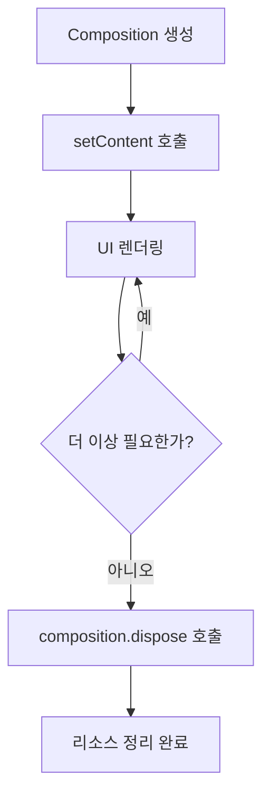

# Composition 생성하기 (Creating a Composition)

**Jetpack Compose**에서 `Composition`을 생성하는 방법과 다양한 사용 사례를 살펴보겠습니다.

## Android에서의 Composition 생성

Android 환경에서는 `ViewGroup.setContent` 호출을 통해 새로운 **Composition**을 생성할 수 있습니다.

```kotlin
// Wrapper.android.kt
internal fun ViewGroup.setContent(
  parent: CompositionContext,
  content: @Composable () -> Unit
): Composition {
  // ...
  val composeView = ...
  return doSetContent(composeView, parent, content)
}

private fun doSetContent(
  owner: AndroidComposeView,
  parent: CompositionContext,
  content: @Composable () -> Unit
): Composition {
  // ...
  val original = Composition(UiApplier(owner.root), parent) // Here!
  val wrapped = owner.view.getTag(R.id.wrapped_composition_tag)
    as? WrappedComposition ?: WrappedComposition(owner, original).also {
      owner.view.setTag(R.id.wrapped_composition_tag, it)
    }
  wrapped.setContent(content)
  return wrapped
}
```

### WrappedComposition의 역할

**WrappedComposition**은 `Composition`을 `AndroidComposeView`에 연결하는 **데코레이터 패턴**으로 구현되어 있습니다. 주요 역할은 다음과 같습니다:

- 안드로이드 뷰 시스템에 직접 연결
- 키보드 가시성 변경, 접근성 등을 추적하기 위한 제어된 이펙트 시작
- 안드로이드 `Context` 정보를 `CompositionLocal` 형태로 제공
  - Android `Context`
  - `Configuration`
  - `LifecycleOwner`
  - `SavedStateRegistryOwner`
  - Owner View

> 이를 통해 모든 `@Composable` 함수에서 기존 안드로이드와 관련된 많은 것들이 암시적으로 사용 가능해집니다.

### UiApplier의 중요성

`Composition`에 전달된 **UiApplier** 인스턴스는 트리의 루트 `LayoutNode`를 가리키며 시작됩니다.

- `Applier`는 노드의 **방문자 패턴**이므로 루트 노드부터 시작
- 클라이언트 라이브러리가 `Applier`의 구현을 선택할 책임을 가짐

### setContent 메서드

`composition.setContent(content)`는 Composition의 내용을 설정하는 핵심 메서드입니다.

- Content에서 제공하는 모든 정보로 Composition을 업데이트
- UI 트리 구성의 시작점


## VectorPainter에서의 Composition 사용

`VectorPainter`는 화면에 벡터 그래픽을 그리는 데 사용되며, 자신만의 **Composition**을 생성하고 유지합니다.

```kotlin
// VectorPainter.kt
@Composable
internal fun RenderVector(
  name: String,
  viewportWidth: Float,
  viewportHeight: Float,
  content: @Composable (viewportWidth: Float, viewportHeight: Float) -> Unit
) {
  // ...
  val composition = composeVector(rememberCompositionContext(), content)

  DisposableEffect(composition) {
    onDispose {
      composition.dispose() // composition은 반드시 dispose 되어야 합니다!
    }
  }
}

private fun composeVector(
  parent: CompositionContext,
  composable: @Composable (viewportWidth: Float, viewportHeight: Float) -> Unit
): Composition {
  val existing = composition
  val next = if (existing == null || existing.isDisposed) {
    Composition(VectorApplier(vector.root), parent) // Here!
  } else {
    existing
  }
  composition = next
  next.setContent {
    composable(vector.viewportWidth, vector.viewportHeight)
  }
  return next
}
```

### VectorApplier의 특징

다른 `Applier` 전략이 사용되었다는 점에 주목해야 합니다:

- 벡터 트리의 루트 노드를 가리키는 `VectorApplier` 사용
- 루트 노드는 `VNode` 타입
- UI가 아닌 벡터 그래픽을 위한 전용 Applier 구현

## SubcomposeLayout에서의 활용

**SubcomposeLayout**은 측정 단계에서 내용을 하위 구성할 수 있도록 자체적인 Composition을 유지하는 Layout입니다.

- 자식 노드들의 composition을 위해 부모 노드를 측정해야 할 때 유용
- 동적 레이아웃 구성이 필요한 경우 사용

## CompositionContext의 역할

Composition이 생성될 때마다 상위의 `CompositionContext`가 전달될 수 있습니다:

| 특징 | 설명 |
|------|------|
| **Nullable** | `null`일 수도 있음 |
| **논리적 연결** | 새로운 composition을 기존 composition에 연결 |
| **공유 기능** | invalidation 및 CompositionLocal 공유 |

## Recomposition Context

Composition 생성 시 **recomposition context**를 전달할 수 있습니다:

- 변경 사항 적용과 트리 구체화를 위해 Applier에서 사용하는 `CoroutineContext`
- 제공되지 않을 경우: `EmptyCoroutineContext` 사용 (기본값)
- Android에서는 `AndroidUiDispatcher.Main`에서 recomposition 실행

## Composition의 생명주기 관리



### 중요한 원칙

- **생성과 폐기**: Composition이 생성되면 반드시 `composition.dispose()`로 폐기해야 함
- **스코프**: Composition은 소유자에게 스코프됨
- **생명주기 연동**: 때로는 생명주기 관찰자와 연동하여 자동으로 dispose 처리

## 요약

- **Composition 생성**은 Android에서 `ViewGroup.setContent`를 통해 이루어짐
- **WrappedComposition**은 데코레이터 패턴으로 Android View 시스템과 연결
- **다양한 Applier**를 통해 UI, 벡터, 커스텀 노드 트리 지원 (UiApplier, VectorApplier 등)
- **VectorPainter**와 **SubcomposeLayout**은 각자의 용도에 맞는 Composition을 생성
- **CompositionContext**를 통한 논리적 연결과 상태 공유 지원
- **생명주기 관리**가 중요하며, 사용 후 반드시 dispose 필요