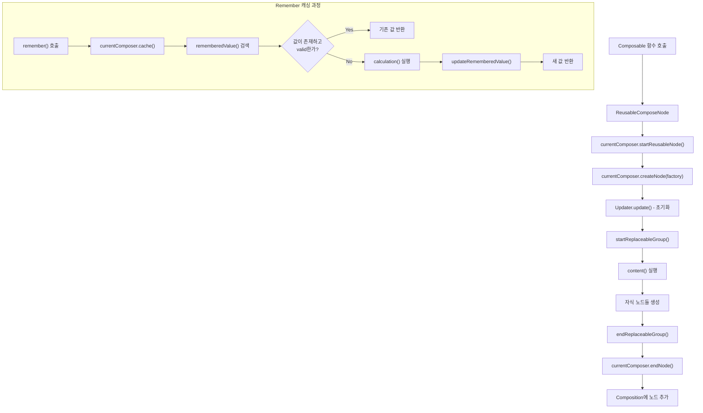

# Composer 키우기 (Feeding the Composer)

**Compose Runtime**에서 트리의 메모리 표현에 노드가 어떻게 추가되는지 살펴봅시다. `Layout` **Composable**을 통해 이해할 수 있으며, Layout은 **Compose UI**에서 제공하는 모든 UI 컴포넌트의 기반이 됩니다.

## Layout Composable의 구조

```kotlin
@Suppress("ComposableLambdaParameterPosition")
@Composable inline fun Layout(
  content: @Composable () -> Unit,
  modifier: Modifier = Modifier,
  measurePolicy: MeasurePolicy
) {
  val density = LocalDensity.current
  val layoutDirection = LocalLayoutDirection.current
  ReusableComposeNode<ComposeUiNode, Applier<Any>>(
    factory = ComposeUiNode.Constructor,
    update = {
      set(measurePolicy, ComposeUiNode.SetMeasurePolicy)
      set(density, ComposeUiNode.SetDensity)
      set(layoutDirection, ComposeUiNode.SetLayoutDirection)
    },
    skippableUpdate = materializerOf(modifier),
    content = content
  )
}
```


## ReusableComposeNode의 동작 원리

`Layout`은 **LayoutNode**를 `composition`에 방출하기 위해 `ReusableComposeNode`를 사용합니다. 이는 즉각적으로 노드를 생성하고 추가하는 것처럼 보이지만, 실제로는 **적절한 시기에** composition의 현재 위치에서 노드를 생성, 초기화 및 삽입하는 방법을 **런타임에게 지시**하는 것입니다.

### ReusableComposeNode 구현

```kotlin
@Composable
inline fun <T, reified E : Applier<*>> ReusableComposeNode(
  noinline factory: () -> T,
  update: @DisallowComposableCalls Updater<T>.() -> Unit,
  noinline skippableUpdate: @Composable SkippableUpdater<T>.() -> Unit,
  content: @Composable () -> Unit
) {
  // ...
  currentComposer.startReusableNode()
  // ...
  currentComposer.createNode(factory)
  // ...
  Updater<T>(currentComposer).update() // initialization
  // ...
  currentComposer.startReplaceableGroup(0x7ab4aae9)
  content()
  currentComposer.endReplaceableGroup()
  currentComposer.endNode()
}
```


### 핵심 동작 원리

> **중요**: `currentComposer` 인스턴스에 모든 것을 위임하는 형태를 주목해주세요.

**ReusableComposeNode**의 핵심 특징:
- **교체 가능한 그룹**: Composable 함수의 본문을 감싸기 위해 사용
- **자식 노드 관리**: `content` 람다 내부에서 방출된 모든 자식들은 이 교체 가능한 그룹의 자식으로 저장
- **위임 패턴**: 모든 노드 관리 작업을 `currentComposer`에 위임

## Remember Composable 함수

다른 모든 **Composable 함수**에 대해서도 동일한 방출 작업이 수행됩니다. `remember`를 예로 살펴보겠습니다.

```kotlin
@Composable
inline fun <T> remember(calculation: @DisallowComposableCalls () -> T): T =
  currentComposer.cache(invalid = false, calculation)
```


`remember` **Composable 함수**는 제공된 람다식에 의해 반환된 값을 `composition`에 **캐싱(기억)** 하기 위해 `currentComposer`를 사용합니다. `invalid` 매개변수는 사전에 값이 저장되었더라도 값을 **강제로 업데이트**합니다.

### Composer의 cache 함수 구현

```kotlin
@ComposeCompilerApi
inline fun <T> Composer.cache(invalid: Boolean, block: () -> T): T {
  return rememberedValue().let {
    if (invalid || it === Composer.Empty) {
      val value = block()
      updateRememberedValue(value)
      value
    } else it
  } as T
}
```

### Cache 함수의 동작 과정

1. **값 검색**: `composition`(슬롯 테이블)에서 기존 값을 검색
2. **조건 확인**: 값이 없거나 `invalid`가 `true`인 경우
3. **값 생성**: 새로운 값을 생성하고 `updateRememberedValue`로 업데이트 예약
4. **값 반환**: 기존 값이 있으면 그대로 반환

## Composer 동작 흐름

다음 다이어그램은 **Composer**가 어떻게 노드를 생성하고 관리하는지 보여줍니다:



## 요약

- **Composer 키우기**는 Compose Runtime에서 UI 노드가 생성되고 관리되는 핵심 메커니즘입니다
- `Layout` Composable은 `ReusableComposeNode`를 통해 **LayoutNode**를 composition에 방출합니다
- `ReusableComposeNode`는 즉시 노드를 생성하지 않고, **적절한 시기에 생성하는 방법을 런타임에 지시**합니다
- `currentComposer`가 모든 노드 생성, 초기화, 삽입 작업을 담당하는 **위임 패턴**을 사용합니다
- **교체 가능한 그룹**을 통해 Composable 함수의 본문과 자식 노드들을 관리합니다
- `remember` 함수는 `currentComposer.cache()`를 통해 값을 **슬롯 테이블에 캐싱**하고 재사용합니다
- **Cache 함수**는 기존 값 검색 → 조건 확인 → 값 생성/반환의 과정으로 동작합니다