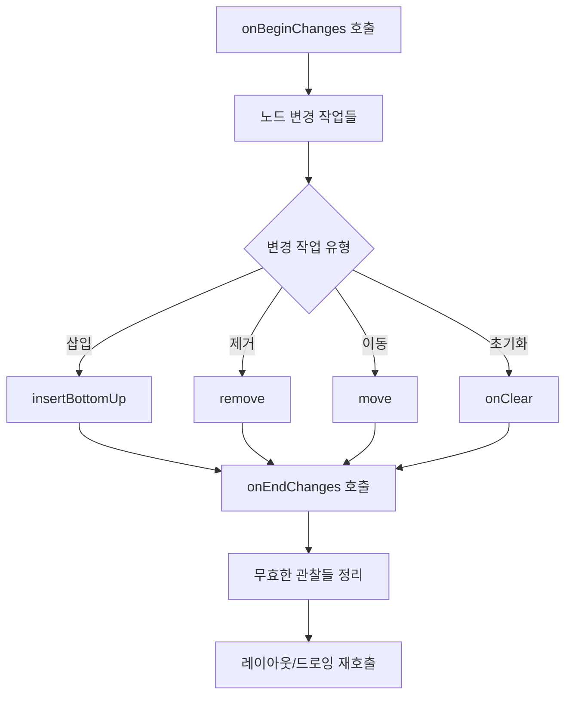

# 변경 사항이 적용되는 방식 (How changes are applied)

## 개요

클라이언트 라이브러리는 **`Applier`** 인터페이스에 대한 구현을 제공하며, 그중 하나가 Android UI에서 사용되는 **`UiApplier`** 입니다. `UiApplier`는 "노드 적용"의 의미를 내포하며, 특정 유즈 케이스에 대해 우리가 디바이스의 스크린에서 볼 수 있는 구성 요소를 어떻게 생성하는지 완벽한 예시로서 살펴볼 수 있습니다.

## UiApplier 구현체

막상 구현체를 살펴보면 별로 거창하지 않습니다.

```kotlin
internal class UiApplier(
    root: LayoutNode
) : AbstractApplier<LayoutNode>(root) {

    override fun insertTopDown(index: Int, instance: LayoutNode) {
        // Ignored.
    }

    override fun insertBottomUp(index: Int, instance: LayoutNode) {
        current.insertAt(index, instance)
    }

    override fun remove(index: Int, count: Int) {
        current.removeAt(index, count)
    }

    override fun move(from: Int, to: Int, count: Int) {
        current.move(from, to, count)
    }

    override fun onClear() {
        root.removeAll()
    }

    override fun onEndChanges() {
        super.onEndChanges()
        (root.owner as? AndroidComposeView)?.clearInvalidObservations()
    }
}
```

## 주요 구현 특징

### 1. LayoutNode 타입 특화
가장 먼저 볼 수 있는 것은 **`Applier`** 인터페이스의 제네릭 타입 `N`이 **`LayoutNode`** 로 바뀌었다는 것입니다. 이는 렌더링될 UI 노드를 나타내기 위해 Compose UI가 선택한 노드 타입입니다.

### 2. AbstractApplier 상속
다음으로 주목해야 할 점은 **`AbstractApplier`** 를 상속받는 형태입니다. 이는 방문한 노드를 스택에 저장하는 기본 구현체입니다. 

- **트리 탐색**: 트리 하단에서 새 노드를 방문할 때마다 이를 스택에 추가
- **방문자 패턴**: 방문자(visitor)가 위로 이동할 때마다 마지막으로 방문한 노드를 스택 상단에서 제거
- **공통 스펙**: 여러 Applier 간에 공통적으로 사용되는 스펙을 추상 클래스로 제공

### 3. 노드 삽입 전략

Android의 경우 노드 삽입이 **상향식(Bottom-Up)** 으로만 수행되기 때문에, `UiApplier`에서 `insertTopDown`이 어떻게 무시되는지 확인할 수 있습니다.

> **중요**: 노드 선택 전략은 둘 다 선택하는 것이 아니라 둘 중 하나를 선택하는 것이 중요합니다. 새 하위 항목이 삽입될 때마다 중복되는 노드 알림을 방지하려면 상향식 전략이 더 적합합니다.

## 노드 조작 방법

노드를 **삽입**, **제거** 또는 **이동**하는 방법은 모두 노드 자체에 위임됩니다. `LayoutNode`는 Compose UI가 UI 노드를 모델링하는 방법이므로 상위 노드와 하위 노드에 관한 모든 것을 알고 있습니다.

| 작업 | 설명 | 의미 |
|------|------|------|
| **삽입(Insert)** | 노드를 주어진 위치의 새 부모 노드에 연결 | 여러 자식 노드를 가질 수 있음 |
| **이동(Move)** | 부모 노드의 자식 노드들을 재정렬 | 기존 관계는 유지하면서 순서만 변경 |
| **제거(Remove)** | 목록에서 해당 노드를 제거 | 완전한 연결 해제 |

## 변경 사항 적용 라이프사이클



변경 사항 적용이 끝나면, **`onEndChanges()`** 를 호출할 수 있으며, 이는 최종적인 요구사항을 루트 노드 소유자에게 위임합니다.

### 라이프사이클 주요 포인트:
- 변경 사항을 적용하기 전에 항상 **`onBeginChanges()`** 가 먼저 호출됨
- **`onEndChanges()`** 는 마지막에 호출해야 함
- `onEndChanges()` 호출 시점에서 모든 보류 중인 **무효해진 관찰들이 해제**됨

> **스냅샷 관찰**: 읽고 의존하는 값이 변경될 때 자동으로 레이아웃이나 화면에 그리는 작업을 다시 호출하기 위함입니다. 트리에서 노드가 추가되거나 삽입되거나 교체되거나 이동되는 것이 레이아웃 크기의 측정이나 구성 등에 어떻게 영향을 미칠 수 있는지 고려해야 합니다.

## 요약

- **`UiApplier`** 는 Android UI에서 Compose의 노드 변경사항을 실제 UI에 적용하는 핵심 구현체
- **`LayoutNode`** 타입으로 특화되어 Android UI 렌더링에 최적화됨
- **`AbstractApplier`** 를 상속하여 공통 노드 탐색 로직 재사용
- **상향식 노드 삽입** 전략으로 중복 알림 방지 및 성능 최적화
- 노드 **삽입/제거/이동** 작업을 `LayoutNode`에 위임하여 캡슐화
- **라이프사이클 관리**를 통해 변경사항 적용 전후의 상태를 체계적으로 관리
- **스냅샷 시스템**과 연동하여 자동 리컴포지션 및 UI 업데이트 지원