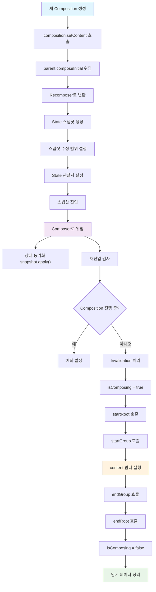

# 초기 Composition 과정 (The initial Composition process)

## 개요

새로운 **composition**이 생성될 때마다 항상 `composition.setContent(content)`에 대한 호출이 따르며, 이는 실제로 composition이 처음 구축되는 곳입니다. 이 과정에서 **슬롯 테이블**은 관련 데이터로 채워집니다.

## setContent() 호출 과정

이 호출은 초기 **composition 프로세스**를 트리거하기 위해 상위 composition에 위임됩니다. `composition`과 `Subcomposition`이 상위 **CompositionContext**를 통해 어떻게 연결되는지 이해하는 것이 중요합니다.

**Composition.kt에서의 setContent 구현:**

```kotlin
override fun setContent(content: @Composable () -> Unit) {
    // ...
    this.composable = content
    parent.composeInitial(this, composable) // `this` is the current Composition
}
```


## Composition 계층 구조

- **Subcomposition**의 경우: 상위 composition은 다른 composition이 됩니다
- **루트 composition**의 경우: 상위는 **Recomposer**가 됩니다

> 초기 composition을 수행하는 로직은 어떤 경우든 항상 **Recomposer**에 의존합니다. 이는 Subcomposition의 경우 루트 composition에 도달할 때까지 지속적으로 `composeInitial` 호출을 상위 요소에 위임하기 때문입니다.

따라서 `parent.composeInitial(composition, content)`에 대한 호출은 `recomposer.composeInitial(composition, content)`로 변환될 수 있으며, 여기서 초기 composition을 구축하기 위해 몇 가지 중요한 작업을 수행합니다.

## Recomposer의 주요 작업

**Recomposer**는 초기 composition 구축을 위해 다음과 같은 중요한 작업들을 수행합니다:


### 1. State 스냅샷 생성

- 모든 **State 객체**의 현재 값을 **스냅샷**으로 취합합니다
- 해당 값들은 다른 스냅샷의 잠재적인 변경 사항으로부터 분리됩니다  
- 이 스냅샷은 가변적이지만 **동시성에 대한 안전성**을 갖추고 있습니다
- State 객체에 대한 모든 변경 사항은 해당 State 객체에 대해서만 발생하고, 이후 단계에서 모든 변경 사항을 전역 공유 상태와 **원자적**으로 동기화하므로, 다른 기존의 State 스냅샷에 영향을 주지 않고 안전하게 수정할 수 있습니다


### 2. 스냅샷 수정 범위

- 이 변경 가능한 스냅샷의 State 값들은 `snapshot.enter(block: () -> T)`를 호출할 때 전달된 블록에서만 수정될 수 있습니다


### 3. State 관찰자 설정

- 스냅샷을 취할 때, **Recomposer**는 언급된 State 객체들에 대해 읽거나 쓰기 위한 **관찰자들**을 전달합니다
- 이를 통해 Composition은 영향을 받은 **recomposition 범위**를 사용됨으로 플래그하여, 때가 되면 recomposition할 수 있습니다


### 4. 스냅샷 진입

- `composition.composeContent(content)`와 같은 블록에 `snapshot.enter(block)` 블록을 전달함으로써 스냅샷에 들어갑니다
- **여기가 composition이 실제로 일어나는 곳입니다**
- 스냅샷에 들어가는 행동은 Recomposer에게 composition 중에 읽거나 쓴 모든 State 객체들이 추적될 것임을 알려줍니다


### 5. Composer로 위임

- **Composition 프로세스는 Composer에게 위임됩니다**

### 6. 상태 동기화

- Composition이 완료되면, State 객체의 모든 변경 사항은 현재 State 스냅샷에만 적용됩니다
- 해당 변경 사항을 **전역 상태에 전파**하기 위해 `snapshot.apply()`를 통해 이루어집니다


> 이것이 초기 composition과 관련된 대략적인 순서입니다. 상태 스냅샷 시스템에 관한 모든 내용은 5장의 스냅샷 시스템에서 훨씬 더 자세히 다룰 예정입니다.

## Composer의 실제 Composition 과정

이제 **Composer에게 위임된 실제 composition 과정들**을 자세히 살펴보겠습니다. 대략적으로 아래의 현상들이 발생합니다:


### 1. 재진입 검사
- Composition이 이미 진행 중인 경우 새로 시작할 수 없습니다
- 이 경우 새로운 composition은 폐기되고 예외가 발생합니다
- **새로운 composition에 재진입하는 것은 지원되지 않습니다**

### 2. Invalidation 처리
- 보류 중인 **invalidation**이 있는 경우, 해당 invalidation들을 Composer가 유지하는 invalidation 목록으로 복사합니다
- `RecomposeScope`의 invalidation을 기다립니다

### 3. Composition 시작 준비
- Composition이 시작될 예정이므로 `isComposing` 플래그를 `true`로 변경합니다

### 4. 루트 초기화
- Composition을 시작하기 위해 `startRoot()`를 호출합니다
- 이는 **슬롯 테이블**에서 composition의 루트 그룹을 시작하고 다른 필요한 필드와 구조를 초기화합니다

### 5. 그룹 시작
- 슬롯 테이블에서 content의 그룹을 시작하기 위해 `startGroup`을 호출합니다

### 6. Content 실행
- **content 람다식을 호출하여 모든 변경 사항을 방출합니다**

### 7. 그룹 종료
- 슬롯 테이블에서 그룹을 끝내기 위해 `endGroup`을 호출합니다

### 8. Composition 종료
- `endRoot()`를 호출하여 composition을 끝냅니다
- Composition이 완료되었으므로 `isComposing` 플래그를 `false`로 변경합니다

### 9. 정리 작업
- 임시 데이터를 유지하는 다른 구조들을 삭제합니다

## 초기 Composition 과정 플로우



## 요약

- **초기 Composition 과정**은 `composition.setContent(content)` 호출로 시작되며, 상위 composition에 위임하여 최종적으로 **Recomposer**에 의해 처리됩니다
- **Recomposer**는 State 스냅샷 생성, 관찰자 설정, 스냅샷 진입 등 6가지 주요 작업을 수행하여 안전한 composition 환경을 구축합니다
- **State 스냅샷 시스템**은 동시성 안전성을 보장하며, `snapshot.enter()` 블록 내에서만 State 수정이 가능합니다
- **Composer**는 실제 composition 과정을 담당하며, 재진입 검사부터 정리 작업까지 9단계의 체계적인 프로세스를 통해 UI를 구성합니다  
- **슬롯 테이블**은 composition 데이터를 저장하는 핵심 구조로, `startRoot()`, `startGroup()`, `endGroup()`, `endRoot()` 호출을 통해 관리됩니다
- Composition 중에 읽거나 쓴 모든 **State 객체**들은 추적되어 향후 recomposition 시점을 결정하는 데 활용됩니다
- `isComposing` 플래그를 통해 composition 상태를 관리하며, **재진입을 방지**하여 안정성을 보장합니다