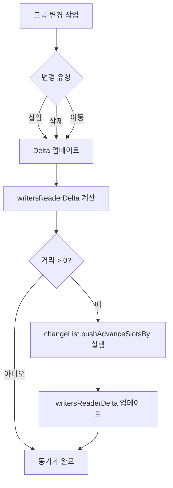

# 구독자와 작성자의 동기화 유지 (Keeping reader and writer in sync)

## 개요

**구독자(Reader)** 와 **작성자(Writer)** 의 동기화 유지는 **Jetpack Compose Runtime**의 로우 레벨에서 이루어지는 중요한 작업입니다.

## 동기화가 필요한 이유

특정 그룹을 `삽입`, `삭제` 또는 `이동`할 수 있으므로, **작성자**의 그룹 위치는 변경 사항이 적용될 때까지 일시적으로 **구독자**의 위치와 다를 수 있습니다.

### Delta 개념

이러한 차이를 추적하기 위해 **델타(Delta)** 를 유지 관리해야 합니다. 델타는 다음과 같은 특징을 가집니다:

- 삽입, 삭제, 이동 등의 작업에 따라 업데이트됨
- Compose 소스코드 문서에 따르면: *"작성자와 구독자의 현재 슬롯 위치를 정확하게 일치시키기 위해 이동해야 하는 실현되지 않은 거리"* 를 반영

## 구현 세부사항

### ComposerChangeListWriter 클래스

구독자와 작성자 간의 동기화 유지 작업은 Compose Runtime 라이브러리의 [`ComposerChangeListWriter`](https://cs.android.com/androidx/platform/frameworks/support/+/androidx-main:compose/runtime/runtime/src/commonMain/kotlin/androidx/compose/runtime/changelist/ComposerChangeListWriter.kt) 클래스에서 수행됩니다.

### 핵심 변수 및 함수

해당 클래스에는 `writersReaderDelta` 변수가 존재하며, 구독자와 작성자 간의 슬롯 위치를 지속적으로 계산하는 함수들이 구현되어 있습니다.

#### 델타 관리 함수들

```kotlin
private var writersReaderDelta: Int = 0

fun moveReaderRelativeTo(location: Int) {
    // Ensure the next skip will account for the distance we have already travelled.
    writersReaderDelta += location - reader.currentGroup
}

fun moveReaderToAbsolute(location: Int) {
    writersReaderDelta = location
}
```

위 함수들은 구독자와 작성자 간의 **격차를 추적**하기 위해 `Composer`에 의해 지속적으로 호출됩니다.

#### 동기화 실현 함수

그룹의 생성이 시작되거나 값에 업데이트가 발생할 때마다 다음 `realizeOperationLocation` 함수를 실행하여 구독자와 작성자 간의 거리 간격을 정확하게 일치시킵니다.

```kotlin
private fun realizeOperationLocation(forParent: Boolean = false) {
    val location = if (forParent) reader.parent else reader.currentGroup
    val distance = location - writersReaderDelta
    runtimeCheck(distance >= 0) {
        "Tried to seek backward"
    }
    if (distance > 0) {
        changeList.pushAdvanceSlotsBy(distance)
        writersReaderDelta = location
    }
}
```

## 동기화 프로세스



## 요약

- **구독자와 작성자의 동기화**는 Jetpack Compose Runtime의 핵심 기능으로, 그룹의 삽입/삭제/이동 시 발생하는 위치 차이를 관리합니다
- **Delta 메커니즘**을 통해 두 컴포넌트 간의 위치 차이를 추적하고 동기화합니다
- **ComposerChangeListWriter 클래스**에서 `writersReaderDelta` 변수와 관련 함수들을 통해 실시간으로 동기화를 유지합니다
- **realizeOperationLocation 함수**는 실제 동기화 작업을 수행하여 구독자와 작성자의 슬롯 위치를 정확하게 일치시킵니다
- 이러한 메커니즘을 통해 Compose는 **효율적이고 안정적인 UI 상태 관리**를 보장합니다
