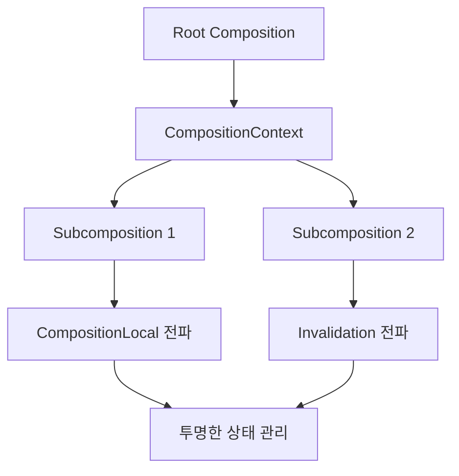

# CompositionContext를 이용한 Composition 연결 (Linking Compositions via CompositionContext)

## 개요

`CompositionContext`는 **Jetpack Compose**에서 `composition`과 `subcomposition` 트리를 연결하는 핵심 메커니즘입니다. 

> **CompositionContext**는 단일 composition에는 존재하지 않지만, composition과 subcomposition 트리에서 중요한 역할을 담당합니다.

## Subcomposition 개념

### 정의
`Subcomposition`은 독립적인 **invalidation**을 지원하기 위해 현재 컨텍스트에서 별도의 composition을 구성하려는 의도로 생성된 **인라인 타입의 composition**입니다.

### 연결 메커니즘
- **상위 CompositionContext 참조**를 통해 상위 composition과 연결
- **CompositionContext**가 composition과 subcomposition을 하나의 트리로 연결
- `CompositionLocal` 및 `invalidation`이 마치 단일 composition에 속한 것처럼 **투명하게 트리 아래로 전파**
- **CompositionContext 자체**도 슬롯 테이블에 그룹의 한 유형으로 기록됨

## rememberCompositionContext 함수

### 구현
```kotlin
@Composable 
fun rememberCompositionContext(): CompositionContext {
    return currentComposer.buildContext()
}
```

### 동작 원리
- 슬롯 테이블의 현재 위치에 새 composition을 **기억**하거나, 이미 기억된 경우 이를 **반환**
- **Subcomposition 생성**을 위한 일반적인 방법

## 사용 사례

`rememberCompositionContext`를 통해 subcomposition을 생성하는 주요 컴포넌트들:

| 컴포넌트 | 설명 |
|----------|------|
| `VectorPainter` | 벡터 그래픽을 위한 별도 composition |
| `Dialog` | 대화상자를 위한 독립적인 composition |
| `SubcomposeLayout` | 동적 레이아웃을 위한 하위 composition |
| `Popup` | 팝업 창을 위한 별도 composition |
| `AndroidView` | Android View를 Composable 트리에 통합하는 wrapper |

## Composition 트리 구조



## 요약

- **CompositionContext**는 composition과 subcomposition을 연결하는 핵심 메커니즘입니다
- **Subcomposition**은 독립적인 invalidation을 위한 별도의 composition입니다
- `rememberCompositionContext()` 함수를 통해 subcomposition을 생성할 수 있습니다
- **CompositionLocal과 invalidation**이 트리 전체에 투명하게 전파됩니다
- **VectorPainter, Dialog, SubcomposeLayout, Popup, AndroidView** 등에서 활용됩니다